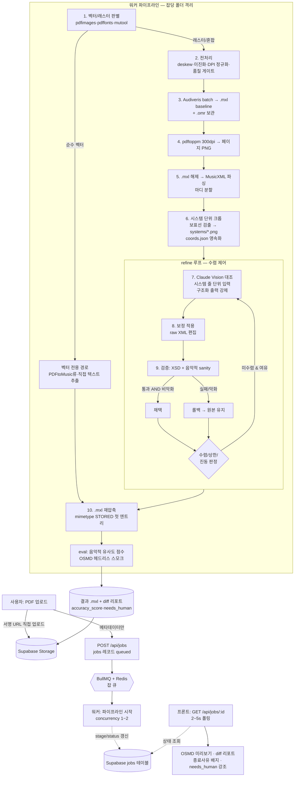

# PDF 악보 → MXL 변환 웹앱 · 바이브코딩 프롬프트 설계서 **v2 (정확도 강화판)**

> 원본 설계서를 토대로 **변환 정확도**를 끌어올리는 데 초점을 맞춰 더 구체적·단계적으로 재설계한 v2입니다.
> Audiveris(구조 OMR) + Claude Vision(의미 보정) 하이브리드에 **① PDF 전처리 ② 시스템(보표 줄) 단위 대조 ③ 2단계 검증(XSD+음악적 sanity) ④ 평가(eval) 하니스**를 더했습니다.
> Claude Code / Cursor / Windsurf에 **Phase 단위로 붙여넣어** 진행하세요. 본문의 기술 사실(Audiveris CLI·Claude Vision API·MusicXML 검증·OMR 정확도 기법)은 2026-06 기준 공식 문서로 교차검증했습니다.
> 무엇이 새로 강화됐는지는 바로 아래 **§0**에 표로 요약돼 있습니다.

---

## 0. 이 설계서 사용법 + v2(정확도 강화판)에서 달라진 점

이 설계서는 **읽고 끝내는 문서가 아니라, Phase 단위로 잘라서 AI 코딩 도구(Claude Code / Cursor / Windsurf)에 그대로 붙여넣는 작업 지시서**다. 사용 규칙은 단호하게 지킬수록 결과가 좋다.

**문서 사용법 (4원칙)**

1. **Phase 단위 복붙.** 각 Phase의 `[프롬프트 — Phase N]` 블록을 통째로 복사해 AI 도구에 붙여넣는다. 한 번에 여러 Phase를 몰아 넣지 않는다. 컨텍스트가 흐려지고 검증 불가능한 큰 덩어리가 나온다.
2. **완료 판정 통과 전 다음 Phase 금지.** 각 Phase 끝의 **완료 판정** 체크리스트가 전부 통과해야 다음으로 넘어간다. "대충 돌아가는 것 같다"는 통과가 아니다. 판정은 `docker build 성공`, `테스트 green`처럼 눈으로 확인 가능한 기준만 둔다.
3. **인프라부터.** 반드시 **Phase 0(도커/Audiveris) → Phase 0.5(전처리) → ...** 순서로 간다. UI(Phase 6)를 먼저 만들고 싶은 유혹을 참아라. 변환 엔진이 없는 화면은 데모일 뿐 앱이 아니다.
4. **불확실은 불확실로 둔다.** 이 문서는 리서치로 교차검증된 사실만 단정한다. CLI 플래그/버전처럼 "공식 문서에서 확인" 주석이 달린 항목은, AI에게 시킬 때도 **"공식 문서로 확인 후 적용"**을 같이 지시한다.

**v2(정확도 강화판)에서 신규/강화된 점**

원본은 "Audiveris + Claude Vision 하이브리드"라는 골격은 옳았지만, **정확도를 좌우하는 디테일이 비어 있었다.** v2는 그 빈틈을 메운다. 핵심은 *"입력 품질을 끌어올리고, Claude에게 더 작은 단위로 보여주고, 모든 보정을 측정·검증한다"* 세 가지다.

| # | 항목 | 신규/강화 | 한 줄 효과 |
|---|------|:---:|------|
| G1 | **전처리 Phase 0.5 신설** | 신규 | 스캔본 deskew·이진화·DPI 정규화로 **OMR 입력 품질 자체**를 올려 정확도 상한을 끌어올림 |
| G2 | **벡터/래스터 판별을 맨 앞으로** | 강화 | 순수 벡터 PDF는 OMR을 건너뛰고 전용 경로로 분기 → 불필요한 OMR 오류를 원천 차단 |
| G3 | **Audiveris 파라미터 튜닝 명시** | 강화 | interline 20px·grayscale·OCR 언어 등 검증된 설정으로 OMR baseline 자체를 개선 |
| G4 | **시스템(보표 줄) 단위 슬라이싱** | 신규·핵심 | Claude에 페이지 전체가 아닌 **한 줄씩** 크롭해 입력 → 작은 음표 대조 정확도 급상승 |
| G5 | **좌표 기반 매핑 자료구조** | 신규 | `픽셀 bbox ↔ partId+measureNumber`를 명시 자료구조로 영속화 → 대조 정확도의 기반 |
| G6 | **구조화 출력 + 캐싱 + 배치** | 강화 | tool use/JSON schema 강제로 파싱 실패 제거, prompt caching·Message Batches로 비용 절감 |
| G7 | **검증 강화(XSD + 음악적 sanity)** | 강화 | 스키마 통과뿐 아니라 **마디 수·박자 합·파트 수 보존**까지 이중 확인 → 보정이 구조를 깨면 롤백 |
| G8 | **eval 하니스(음악적 유사도 지표)** | 신규 | "크래시 없음"을 넘어 MV2H·TEDn·OMR-NED로 정확도를 **수치화** + 회귀 스냅샷 |
| G9 | **실패 모드 트리아지 표** | 신규 | 증상→원인→조치 표 + 자가 점검 체크리스트로 디버깅 시간 단축 |
| G10 | **Phase별 "정확도 영향" + "검증 명령"** | 강화 | 각 Phase에 복붙 가능한 검증 셸/테스트를 붙여 막연함 제거 |

> **정직한 한계 (원본 계승):** 이 파이프라인의 목표는 "보통 95~99% 자동, 남는 1~5%는 `needs_human`으로 정직하게 노출"이다. **100% 동일한 자동 수렴은 약속하지 않는다.** OMR도 Claude Vision도 완벽한 심판이 아니기 때문이다(근거: Audiveris는 손글씨·복잡 악보에 약하고, Claude Vision은 공식 문서에서 "작은 객체 다수의 정확한 카운팅"이 약점임을 명시).

---

## 1. 왜 이 앱이 "단순 OMR 래퍼"가 아닌가

원본의 6대 전제를 계승하되, **각 전제를 무시했을 때 실제로 터지는 실패**를 한 줄씩 붙였다. 이 표가 "왜 굳이 이렇게 복잡하게 만드는가"에 대한 답이다.

| # | 전제 (검증됨) | 무시하면 생기는 구체적 실패 |
|---|------|------|
| 1 | **Audiveris는 Java(JVM) 앱.** npm 라이브러리가 아니고 브라우저에서 못 돈다. 서버에서 CLI subprocess로 실행한다. (5.5+ 설치본은 JRE를 번들로 포함) | 프론트엔드에서 `import audiveris` 하려다 막히고, "왜 안 되지"로 며칠을 태운다. 결국 서버 subprocess 구조로 전면 재작성. |
| 2 | **Audiveris는 Tesseract OCR을 라이브러리로 호출**(가사/텍스트 인식). 언어 데이터(tessdata)와 `TESSDATA_PREFIX` 경로가 핵심. 그래서 Docker가 사실상 필수. | tessdata 누락 시 `"No OCR is available"` 빌드/런타임 오류(실제 다수 보고: issue #698/#675/#628). 가사가 통째로 비거나 변환이 죽는다. |
| 3 | **OMR은 느리다**(페이지당 수십 초~분, CPU·JVM 힙 집약). 동기 HTTP 요청 안에서 못 돌린다 → 잡 큐 + 상태 폴링 필수. | HTTP 핸들러 안에서 동기 실행하면 게이트웨이 타임아웃(504), 서버리스 함수 시간 제한 초과, 동시 요청 몇 개에 서버가 멈춘다. |
| 4 | **OMR→MusicXML은 손실(lossy) 변환.** ⚠️*"lossy"라는 공식 문구는 미확인이나*, Audiveris의 full-fidelity 표현은 `.omr` 프로젝트 파일이고 MusicXML은 export 포맷이다 → 그래서 `.omr`을 보관하고 Claude 보정 레이어를 둔다. | 보정 없이 OMR 출력을 그대로 내보내면 코드기호·가사·오인식 음표가 그대로 남아 "쓸 수 없는 MXL"이 된다. 차별점이 사라진다. |
| 5 | **Claude Vision은 Audiveris의 대체가 아니다.** 역할 분담: **Audiveris = 음표·마디·박자·조표 등 구조 뼈대(baseline)**, **Claude Vision = 원본 이미지 대조로 코드/가사/명백한 오인식 교정(correction layer).** | Claude에게 백지에서 악보를 받아쓰게 시키면 음표 카운팅이 어긋난다(공식: 작은 객체 다수 카운팅은 부정확). 구조는 OMR이, 의미 보정만 Claude가 해야 한다. |
| 6 | **결과물은 `.mxl` 파일이다.** Claude가 찾은 오류를 사람용 리포트로 끝내면 안 되고, **MusicXML에 반영해 `.mxl`로 재압축**해야 진짜 변환 앱이다. | 리포트만 뽑으면 "오류 목록을 손으로 고치세요" 앱이 된다. 사용자는 고친 `.mxl`을 기대하고 왔다. |

**한 문장 요약:** 단순 OMR 래퍼는 위 6개 중 하나만 어겨도 "데모는 되는데 실무엔 못 쓰는 앱"이 된다. 이 설계서는 6개를 모두 지키는 구조를 강제한다.

---

## 2. 정확도-우선 설계 원칙 (v2 핵심)

정확도는 우연히 좋아지지 않는다. 아래 9개 원칙을 구조로 못 박아야 올라간다. 각 원칙은 리서치로 확인된 근거에 기반한다.

1. **입력 품질이 곧 정확도 상한이다 → 전처리를 가장 먼저.**
   OMR 정확도는 입력 이미지에서 이미 결정된다. **두 보표선 간격(interline)이 약 20px**, **300DPI(작은 기호는 400DPI)**, **흑백 이진화보다 grayscale**가 검증된 최적값이다(Audiveris 공식). 흐릿하거나 200DPI 미만이면 뒤에서 무슨 보정을 해도 한계가 낮다.

2. **역할 분리를 엄수한다 — Audiveris=구조, Claude=대조.**
   Audiveris는 전통 CV + ML 파이프라인으로 음표·마디·박자의 *구조 뼈대*를 잘 잡는다. Claude Vision은 *원본 이미지와의 의미 대조*(코드기호 누락, 가사, 명백한 오인식)에 강하다. 이 경계를 흐리면(예: Claude에게 음표를 새로 세게 함) 둘 다 잘하는 영역을 버리고 둘 다 약한 영역으로 들어간다.

3. **Claude에는 페이지가 아니라 "시스템(보표 줄)" 단위로 보낸다.**
   공식 문서가 "작은 객체 다수의 정확한 카운팅은 부정확할 수 있다"고 명시한다. 한 페이지를 통째로 보내면 음표가 뭉개진다. **한 줄(system)씩 크롭**해 밀집도를 낮추면 대조 정확도가 급상승한다. 이것이 v2의 단일 최대 정확도 레버다.

4. **해상도 티어를 의식해 모델을 고른다.**
   `claude-sonnet-4-6`은 standard 티어로 long edge가 **1568px로 자동 다운스케일**된다 → 빽빽한 악보에서 가독성 손실. 1차 대조는 sonnet으로 전 페이지, **저신뢰·고밀도 줄만** high-res 티어(**2576px**)인 `claude-opus-4-8`로 승격한다. 크롭(원칙 3)을 함께 쓰면 sonnet에서도 다운스케일 손실을 줄일 수 있다.

5. **모든 보정은 검증 + 롤백을 통과한 뒤에만 채택한다.**
   MusicXML raw 편집은 위험하다(요소 순서 고정, harmony/lyric 삽입 위치 규칙). 보정 적용 후 **MusicXML 4.0 XSD 검증 + 음악적 sanity 체크**를 모두 통과해야 채택하고, 깨지면 **보정을 버리고 Audiveris 원본 + 경고**를 반환한다. 잘못된 보정 > 무보정.

6. **더 나빠지지 않을 때만 반복한다(단조 개선 가드).**
   refine 루프는 무한 수렴이 보장되지 않고 Claude는 완벽한 심판이 아니다. **검증 통과 AND 품질 점수 비악화일 때만** 새 보정을 채택하고, 악화하면 롤백 후 종료한다. 진동(되돌림 2회)이 감지되면 해당 마디를 freeze하고 `needs_human`으로 넘긴다.

7. **정확도는 측정한다(eval).**
   "크래시 없음"은 정확도가 아니다. **MV2H / TEDn / OMR-NED** 같은 음악적 유사도 지표로 ground-truth 대비 점수를 내고, 회귀 세트(벡터1·깨끗한 스캔2·가사+코드1·다성부1)로 스냅샷을 비교한다. 측정하지 않으면 "고쳤다"가 환상일 수 있다.

8. **구조화 출력을 강제한다(파싱 실패 = 정확도 손실).**
   "JSON만 출력하라"는 system 프롬프트 지시는 가장 약하다(모델이 preamble을 붙일 수 있음). **Structured Outputs(`output_config.format`) 또는 strict tool use**로 스키마를 강제하면 파싱 단계에서 새는 보정이 사라진다.

9. **불확실은 숨기지 말고 `needs_human`으로 노출한다.**
   Claude Vision의 좌표/카운팅은 근사값이고, OMR도 손글씨·다성에 약하다. 신뢰도 `low`·진동·검증 실패는 자동 채택하지 말고 **UI에 종료 사유 배지와 함께 강조 표시**한다. 정직한 95~99% 자동 + 1~5% 사람 검수가 100% 자동 약속보다 낫다.

---

## 3. 절대 규칙 & 기술 스택

### 절대 규칙 (위반 시 정확도/보안이 깨진다)

```text
[원본 절대 규칙 — 계승]
1. Audiveris는 서버 사이드 subprocess로만 실행한다.
   (브라우저/Edge/서버리스 직접 실행 금지. JVM 앱이라 브라우저 불가.)
2. OMR은 비동기 잡으로만 처리한다.
   (HTTP 핸들러 안에서 동기 실행 금지 → 타임아웃·서버 멈춤.)
3. Claude API 키(ANTHROPIC_API_KEY)는 서버에만 둔다.
   (프론트 번들 노출 절대 금지.)
4. 최종 .mxl는 MusicXML 4.0 XSD 검증을 통과해야 사용자에게 노출한다.
5. 보정 실패(검증 깨짐) 시: 보정을 버리고 Audiveris 원본 .mxl + 경고를 반환한다.
   (잘못된 보정 > 무보정.)
6. MusicXML 편집 전용 라이브러리는 없다고 가정한다.
   → fast-xml-parser 등으로 raw XML을 직접 조작하되 preserveOrder:true 필수.

[v2 추가 규칙 — 정확도 강화]
7. 전처리 산출물도 보관한다.
   (preprocessed/ 의 deskew·이진화 결과를 잡 폴더에 영속화 — 재현·디버깅·eval용.)
8. 시스템(보표 줄) 크롭 좌표는 자료구조로 영속화한다.
   (coords.json: 픽셀 bbox ↔ partId+measureNumber. 휘발시키지 말 것 — 대조 정확도의 기반.)
9. Claude 구조화 출력은 system 프롬프트가 아니라 tool use / JSON schema로 강제한다.
   ("JSON-only" 지시 방식 채택 금지 — 가장 약함.)
10. 음악적 sanity 체크 통과도 "검증"의 일부다.
    (XSD 통과 + 마디 수·박자 합·파트 수 보존을 모두 만족해야 채택.)
11. 원본 고해상도 이미지를 항상 보관한다.
    (Claude 입력용 리사이즈/크롭은 사본으로. 원본 고해상도는 pages/page-NN.png(300dpi)로 보관해 systems/ 크롭의 소스로 삼는다.)
12. .mxl 재압축 시 mimetype을 STORED(비압축)·extra-field 없이 첫 엔트리로 둔다.
    (W3C 규약. yazl은 compress:false, Python zipfile은 ZIP_STORED.)
```

### 기술 스택 (원본 + v2 추가행)

> ⚠️ **버전 주의:** 리서치 시점(2026-06) Audiveris **안정 버전은 5.10.2**다. 원본의 "5.4" 전제는 구버전이며, **5.5+ 설치본은 JRE 번들 포함**이다. 도커 베이스 JDK 버전은 빌드 방식에 따라 다르니(5.7+는 Java 24, 5.8.1+는 Java 25) **채택 직전 릴리스 노트로 재확인**한다.

| 레이어 | 선택 | 이유 / 검증된 주의 |
|------|------|------|
| 프론트 | **Next.js 15 App Router + TypeScript** | App Router Route Handler는 **본문 크기 한계 설정 불가** → 대용량 PDF는 Next를 거치지 말고 Supabase 서명 URL로 직접 업로드. |
| 미리보기 | **OpenSheetMusicDisplay (OSMD, 내부 VexFlow)** | `ssr:false` 동적 import 필수. **`.mxl`(Blob) 직접 `osmd.load()` 가능** → 수동 unzip 불필요. |
| OMR 엔진 | **Audiveris 5.10.x CLI batch** | `-batch -transcribe -export -output <dir>`. `-export`는 `-transcribe`를 암시. 멀티 movement면 **.mxl이 여러 개** 나옴(주의). |
| OCR | **Tesseract (Audiveris가 라이브러리로 호출) + 언어팩** | 별도 실행파일 불필요. 핵심은 **tessdata + TESSDATA_PREFIX**. 언어 추가: `-constant org.audiveris.omr.text.Language.defaultSpecification=eng+...`. (버전 4.x/5.x 혼재 — build.gradle로 확인) |
| PDF→이미지 | **poppler-utils (`pdftoppm`) 300dpi** | 작은 기호 많으면 400dpi. ⚠️*Audiveris의 PDF용 poppler/ghostscript 의존 공식 문구는 미확인*이나 PDF 직접 입력은 지원됨. |
| **전처리 (G1)** | **OpenCV / ImageMagick / ScanTailor Advanced / unpaper** | **v2 추가.** deskew·적응형 이진화(Sauvola/Wolf)·노이즈 제거·DPI 정규화. `--without-deskew`처럼 **전처리가 오히려 해가 될 때**도 있으니 토글 가능하게. |
| **벡터/래스터 판별 (G2)** | **pdfimages / pdffonts / mutool** | **v2 추가.** `pdfimages -list`로 임베드 이미지 0개면 순수 벡터 확정. 순수 벡터는 **PDFtoMusic Pro류 별도 경로**(스캔 PDF엔 작동 안 함, Pro만 MusicXML). |
| 보정 AI | **Claude API (Messages, 이미지 입력)** | 기본 `claude-sonnet-4-6`($3/$15, standard 1568px), 승격 `claude-opus-4-8`($5/$25, high-res 2576px). **모델 ID는 이 두 개만**, 추측 금지. |
| 구조화 출력 (G6) | **Structured Outputs / strict tool use** | **v2 강화.** `output_config.format` 또는 `strict:true` tool. ⚠️`output_config.format`은 Citations·prefill과 비호환(400). |
| 비용 절감 (G6) | **Prompt Caching + Message Batches** | **v2 강화.** 안정 접두부(시스템·스키마) 캐시 ≈ input의 0.1×. Batches는 **표준가 50% 할인**(단 1P Claude API만, Bedrock/Vertex 미지원). |
| **XSD 검증 (G7)** | **xmllint --schema (MusicXML 4.0 XSD)** | **v2 추가.** 배포 XSD의 `xml.xsd` import를 **로컬로 패치**하면 ~15s→~0.04s. 오프라인은 `--nonet`. DTD는 4.0부터 deprecated. |
| sanity/시맨틱 검증 (G7) | **music21 파싱 라운드트립** | **v2 추가.** XSD가 못 잡는 박자 합·마디 수 보존을 파싱→재내보내기로 점검. |
| **eval (G8)** | **MV2H / TEDn(olimpic-icdar24) / OMR-NED / MusicDiff** | **v2 추가.** 음악적 유사도 수치화 + 회귀 스냅샷. ground-truth는 MusicXML/**kern으로 확보. |
| 잡 큐 | **BullMQ + Redis** (1차 대안: Supabase 폴링) | **CPU 바운드라 concurrency 낮게(1~2) + 샌드박스 프로세서 + 워커 수평 확장**. `attempts` + exponential backoff. |
| 저장/DB | **Supabase (Storage + Postgres)** | `service_role` 키는 **워커 전용**(클라이언트 노출 금지). 업로드는 `createSignedUploadUrl`, 결과는 `createSignedUrl`(만료 지정). |
| 진행률 | **저빈도(2~5s) 폴링** (후속 최적화로 SSE) | OMR은 수십 초~분 단위라 폴링이 인프라 단순·서버리스 친화적. SSE는 체감 지연 줄이는 후속. |
| 실행 | **Docker (JDK + Audiveris + Tesseract + poppler)** | **Audiveris(Java)는 Node 워커와 이미지 분리** 또는 멀티스테이지로 Java 동봉. 공유 볼륨으로 PDF/.mxl 교환. |

---

## 4. 시스템 아키텍처



**파이프라인 단계 요약 (v2 — 10단계)**

| 단계 | 이름 | 하는 일 | 정확도 영향 |
|---|------|------|------|
| 1 | **판별** | 벡터/래스터/혼합 판별, 순수 벡터는 전용 경로 분기 | 잘못된 OMR 경로를 원천 차단(G2) |
| 2 | **전처리** | deskew·적응형 이진화·노이즈 제거·DPI 정규화 + 품질 게이트(너무 흐릿하면 경고) | **입력 품질 = 정확도 상한**(G1) |
| 3 | **Audiveris OMR** | batch로 구조 baseline `.mxl` 생성, `.omr` 보관 | 음표·마디·박자 뼈대의 정확도 |
| 4 | **렌더** | `pdftoppm` 300dpi 페이지 PNG(원본 보관) | Claude 대조용 시각 소스 품질 |
| 5 | **파싱** | `.mxl` 해제 → fast-xml-parser 파싱 → 마디 분할 | 보정 적용의 정확한 타깃 확보 |
| 6 | **시스템 크롭** | 보표선 검출 → 줄 단위 PNG + `coords.json`(bbox↔measure) | **Claude 대조 정확도의 핵심 레버**(G4·G5) |
| 7 | **Vision 대조** | 시스템 줄 단위 입력, 구조화 출력으로 보정 JSON | 작은 음표 대조 정확도↑(G3·G6) |
| 8 | **적용** | missing_chords/lyrics/wrong_notes를 raw XML에 반영 | 리포트가 아닌 실제 보정 |
| 9 | **검증** | XSD 4.0 + 음악적 sanity(마디·박자·파트 보존), 실패시 롤백 | 보정이 구조를 깨면 무효화(G7) |
| 10 | **재압축 + eval** | 표준 `.mxl` 재압축, OSMD 스모크, 음악적 유사도 점수 기록 | 출력 무결성 + 정확도 측정(G8) |

> 7~9는 **refine 루프**로 반복될 수 있다(수렴/상한/진동/검증실패 중 하나로 종료). 순수 벡터 경로는 2~9를 건너뛰고 10으로 직행한다.

---

## 5. 데이터 모델 & 폴더 구조

### Supabase `jobs` 테이블 (원본 + v2 컬럼)

```sql
create table public.jobs (
  -- 원본 컬럼
  id                uuid primary key default gen_random_uuid(),
  created_at        timestamptz not null default now(),
  status            text not null default 'queued'
                      check (status in ('queued','processing','done','failed')),
  stage             text
                      check (stage in ('detect','preprocess','audiveris',
                                       'render','crop','vision','apply',
                                       'validate','repack','eval')),
  source_path       text not null,            -- Storage 내 input.pdf 경로
  result_mxl_path   text,                     -- 최종 .mxl Storage 경로
  pdf_kind          text default 'unknown'
                      check (pdf_kind in ('vector','raster','mixed','unknown')),
  page_count        int,
  report            jsonb,                    -- diff 리포트(채택/롤백/needs_human)
  error             text,
  cost_usd          numeric(10,4) default 0,  -- 누적 Claude 비용

  -- v2 추가 컬럼
  preprocess        jsonb,                    -- 전처리 메타: deskew각, 이진화법,
                                              --   입력/정규화 DPI, interline_px,
                                              --   품질게이트 통과여부·경고
  accuracy_score    numeric(5,4),             -- eval 점수(예: 1 - OMR_NED, 0~1)
  needs_human_count int default 0,            -- 사람 검수 필요 마디 수
  engine            text default 'audiveris'  -- 사용 엔진/경로
                      check (engine in ('audiveris','pdftomusic','oemer','homr'))
);

-- 워커는 service_role로 갱신, 클라이언트는 RLS로 자기 잡만 조회
alter table public.jobs enable row level security;
-- (예시 RLS: user_id 컬럼을 둘 경우 using (user_id = auth.uid()))
```

> **주의:** 위 `stage` enum은 §4의 10단계와 정렬했다(원본 5종보다 세분화). `accuracy_score`의 정의(1−OMR_NED 등)는 eval 구현(Phase 7)에서 확정하고, ground-truth 없는 실사용 잡에서는 `null`로 둔다.

### 컨테이너 작업 폴더 (잡당 격리, 원본 + v2 추가)

```text
/work/<jobId>/
├── input.pdf                        # 업로드 원본
├── detect.json                      # [v2] 판별 결과(pdf_kind, pdfimages/pdffonts 근거)
│
├── preprocessed/                    # [v2] 전처리 산출물 (영속 — 규칙 7)
│   ├── page-01.deskewed.png         #   deskew + 적응형 이진화 + DPI 정규화 결과
│   ├── page-02.deskewed.png
│   └── preprocess.json              #   deskew각·이진화법·DPI·interline_px·품질게이트·warnings
│
├── original/                        # [v2] 전처리 전 원본 렌더 보관 (Phase 0.5, 규칙 11)
│   ├── page-01.png
│   └── ...
│
├── audiveris-out/
│   └── input/
│       ├── input.mxl                # OMR baseline (멀티 movement면 여러 .mxl)
│       └── input.omr                # full-fidelity 프로젝트 파일 (보관 — 규칙 4)
│
├── pages/                           # pdftoppm 300dpi 페이지 PNG
│   ├── page-01.png                  #   원본 고해상도 (보관 — 규칙 11)
│   └── page-01.claude.png           #   Claude 입력용 리사이즈 사본(필요시)
│
├── systems/                         # [v2] 시스템(보표 줄) 단위 크롭 PNG (G4)
│   ├── p01-sys01.png                #   한 줄씩 — Claude 대조 입력
│   ├── p01-sys02.png
│   └── ...
│
├── coords.json                      # [v2] 좌표 매핑 자료구조 (영속 — 규칙 8, G5)
│                                    #   픽셀 bbox ↔ {partId, measureNumber 범위}
│
├── parsed/
│   └── score.musicxml               # .mxl 해제 + 파싱 대상
│
├── corrected/
│   ├── score.musicxml               # 보정 적용본(검증 통과시)
│   └── score.mxl                    # 최종 재압축(mimetype STORED 첫 엔트리)
│
├── eval/                            # [v2] 평가 산출물 (G8)
│   ├── score.json                   #   MV2H/TEDn/OMR-NED 등 지표값
│   └── snapshot/                    #   회귀 스냅샷(이전 실행 대비 diff)
│
└── report.json                      # diff 리포트(채택/롤백/needs_human/종료사유)
```

> **coords.json 권장 형태(자료구조):**
> ```ts
> interface SystemCrop {
>   page: number;                 // 1-based 페이지 번호
>   systemIndex: number;          // 페이지 내 system 순번
>   bbox: { x: number; y: number; w: number; h: number };  // 원본 PNG 픽셀 좌표
>   imagePath: string;            // systems/p01-sys01.png
>   measures: Array<{ partId: string; measureNumber: number }>;  // 이 줄에 속한 마디들
> }
> type Coords = { dpi: number; systems: SystemCrop[] };
> ```
> bbox는 보표선 검출(수평 투영 프로파일 또는 형태학)로 산출하되, **deskew를 먼저 해야 투영 프로파일이 정확**하다(스큐에 민감). MusicXML의 `<print new-system/new-page>`와 measure `width`로 "어느 마디가 어느 줄"인지 교차 확인한다. 다만 OMR 출력은 `default-x/y`·`width`를 생략하는 경우가 많아, **이미지 처리 기반 bbox를 1순위, MusicXML 좌표를 보조**로 쓰는 편이 견고하다.

---

## 6. 단계별 빌드 (Phase 0 → 7)

아래 각 Phase의 프롬프트 블록을 Claude Code/Cursor/Windsurf에 그대로 복붙해 진행한다. **첫 Phase(Phase 0)를 시작할 때는 §1(전제·절대 규칙), §2(아키텍처·파이프라인), §3(데이터 모델·폴더 구조)을 프롬프트와 함께 한 번에 전달**해 AI가 전체 그림을 갖고 작업하게 한다. 이후 Phase는 직전 산출물이 존재한다는 전제로 이어 붙이면 된다.

> 모델 ID는 본문 전체에서 `claude-sonnet-4-6`(기본 검증), `claude-opus-4-8`(저신뢰 페이지 승격)만 사용한다. 추측 모델명 금지.

---

### Phase 0 — 인프라: Audiveris 실행 컨테이너 (최우선)

이 앱의 정확도와 안정성은 전부 "Audiveris가 컨테이너 안에서 재현 가능하게 도는가"에서 출발한다. Phase 0이 흔들리면 그 위 모든 Phase가 무너지므로, **여기서는 UI도 API도 만들지 않고 오직 도커 이미지 하나가 `sample.pdf → sample.mxl`을 뱉어내게 하는 것**에만 집중한다.

리서치로 확정된 사실:
- Audiveris 최신 안정 버전은 **5.10.x 대**(원본 설계서의 5.4는 구버전). 5.5부터 OS별 설치 프로그램에 **JRE가 번들**되며, 최근 빌드는 **Java 24~25 + Gradle 9.x**를 사용한다. 소스 빌드 시 JDK가 필요하다.
- 검증된 배치 플래그: `-batch`, `-transcribe`, `-export`(transcribe 포함), `-output <DIR>`, `-sheets`, `-step`, `-force`, `-save`, `-swap`, `-constant KEY=VALUE`(구명칭 `-option`도 지원). 입력은 **PDF/TIFF/JPG/PNG/BMP** 직접 가능.
- OCR은 **Tesseract 라이브러리**로 호출되며 **tessdata 언어 파일 + `TESSDATA_PREFIX` 경로**가 핵심. 리눅스 빌드에서 "No OCR is available" 오류가 잦으니 언어팩과 경로를 반드시 검증한다.

아래는 그대로 붙여넣는 프롬프트다.

```text
[프롬프트 — Phase 0] Audiveris OMR 실행 컨테이너 구축

(이 프롬프트와 함께 §1 전제·절대 규칙, §2 아키텍처·파이프라인, §3 데이터 모델·폴더 구조를 먼저 읽어라.)

# 목표
Audiveris 5 CLI를 헤드리스(batch)로 실행하는 단일 Docker 이미지를 만든다.
이 단계에서는 웹/API/워커 코드를 만들지 말고, 컨테이너 안에서
sample.pdf -> sample.mxl 변환이 재현되는 것만 보장한다.

# 절대 규칙(재확인)
- Audiveris는 서버 사이드 subprocess로만 실행한다(브라우저/서버리스 직접 실행 금지).
- Audiveris는 AGPLv3다. 우리 코드와 링크하지 말고, 독립 바이너리를 CLI로 호출(subprocess)만 한다.

# 베이스 이미지 & 패키지
- 베이스: eclipse-temurin:21-jdk (Debian 계열). 빌드가 더 높은 JDK를 요구하면
  에러 메시지에 맞춰 21->24 등으로 올린다(아래 "버전 주의" 참고).
- apt-get으로 설치: git, tesseract-ocr, tesseract-ocr-eng, poppler-utils,
  fontconfig, fonts-freefont-ttf, libfreetype6, ca-certificates, unzip.
  (poppler-utils는 이후 Phase 0.5/2의 pdftoppm/pdfimages/pdffonts에 쓴다.)
- 한국어 가사 악보까지 노린다면 tesseract-ocr-kor도 추가(언어 많을수록 OCR이 느려지니 필요한 것만).

# Audiveris 설치 (소스 빌드 경로 — 가장 재현성 높음)
- 공식 저장소를 클론하고 gradle wrapper로 빌드한다:
    git clone --depth 1 --branch <확인된_안정_태그> https://github.com/Audiveris/audiveris.git /opt/audiveris-src
  * <확인된_안정_태그>는 https://github.com/Audiveris/audiveris/releases 에서 최신 안정 태그를 확인해 박아 넣어라(예: 5.x 형식). 태그를 추측하지 말 것.
- 빌드:
    cd /opt/audiveris-src && ./gradlew clean build -x test
  * gradlew가 요구하는 JDK 버전이 베이스보다 높으면 베이스 태그를 올린다(빌드 로그가 정확히 알려준다).
- 빌드 산출물에서 실행 가능한 배포본을 만든다:
    ./gradlew distZip   (또는 installDist)
  * 산출 zip을 /opt/audiveris 에 풀고, 실행 스크립트 경로(bin/Audiveris)를 확인한다.
  * distZip/installDist 산출 경로는 build/distributions/ 또는 build/install/ 아래다. 실제 생성 경로를 ls로 확인하고 박아라(추측 금지).

# PATH 래퍼
- /usr/local/bin/audiveris 에 래퍼 스크립트를 만들어 환경변수까지 고정한다:
    #!/usr/bin/env bash
    exec java \
      -Djava.awt.headless=true \
      -Xmx2g \
      -jar /opt/audiveris/lib/audiveris.jar "$@"
  * 실제 배포본이 'bin/Audiveris' 런처를 제공하면 그 런처를 호출하는 형태로 바꿔라.
    (런처 내부에서 이미 클래스패스를 구성하므로 -jar 대신 'exec /opt/audiveris/bin/Audiveris "$@"' 가 더 안전)
  * chmod +x 로 실행권한 부여.
- 목적: 어디서 호출하든 'audiveris -batch -export ...' 한 줄로 동작하게 만든다.

# Headless / 폰트
- 반드시 -Djava.awt.headless=true 로 실행(GUI 없는 컨테이너에서 AWT 초기화 충돌 방지).
- fontconfig + fonts-freefont-ttf 를 설치해 심볼/폰트 누락으로 인한 렌더 예외를 예방한다.
  (Audiveris가 fontconfig/freefont에 의존한다는 공식 명문은 미확인이나, 헤드리스 Java 컨테이너의
   일반적 폰트 누락 문제를 막는 안전책이다.)

# OCR 경로
- ENV TESSDATA_PREFIX=/usr/share/tesseract-ocr/5/tessdata
  * 이 경로는 베이스 이미지의 tesseract 버전에 따라 다르다. 컨테이너에서
    'dpkg -L tesseract-ocr-eng | grep tessdata' 로 eng.traineddata 실제 위치를 확인해 박아라(추측 금지).
- 빌드 후 컨테이너 안에서 'audiveris -help'가 OCR 경고 없이 떠야 한다.

# 산출물 파일
- /docker/Dockerfile.audiveris
- /docker/run-audiveris.sh   (입력 PDF 경로와 출력 폴더를 받아 audiveris -batch -export 를 호출하는 헬퍼)
- /samples/sample.pdf        (간단한 단성부 1~2페이지 악보. 없으면 더미 안내 주석)
- /docker/README.md          (build/run 명령, 버전 주의, 라이선스 주의)

# run-audiveris.sh 사양
- 인자: $1=입력 PDF 절대경로, $2=출력 디렉터리(잡 폴더)
- 실행:
    audiveris -batch -export -output "$2" -- "$1"
  * -export 는 -transcribe 를 암시적으로 포함한다(중복 지정 불필요).
  * 멀티 movement면 .mxl 이 여러 개 생성될 수 있음을 stdout에 경고로 남겨라(상세 처리는 Phase 1).
- 출력 폴더 안에 <radix>/<radix>.mxl 형태로 떨어지는지 ls로 확인하는 라인 포함.

# 검증 스텝(빌드 마지막에 self-check)
1) audiveris -help 가 정상 출력 & "No OCR is available" 류 경고 없음.
2) run-audiveris.sh 로 sample.pdf -> sample.mxl 생성.
3) 생성된 .mxl 의 첫 4바이트가 zip 시그니처(PK\x03\x04)인지 확인(file 또는 hexdump).

# 버전 주의(중요)
- 추측한 태그/플래그/JDK 버전을 단정하지 말 것. 다음은 반드시 실제 확인:
  * Audiveris 안정 태그 -> releases 페이지
  * gradlew가 요구하는 JDK -> 빌드 로그
  * TESSDATA_PREFIX 실제 경로 -> dpkg -L
  * 배포본 실행 런처 경로 -> build/distributions 또는 build/install 아래 ls
- 위 4개는 "확인 후 박아넣기". 확인 전에는 코드에 TODO 주석으로 남겨라.
```

**산출물**
- `/docker/Dockerfile.audiveris`
- `/docker/run-audiveris.sh`
- `/samples/sample.pdf`
- `/docker/README.md` (build/run 명령, 버전·경로 확인 체크리스트, AGPLv3 주의)

**완료 판정**(전부 체크되어야 다음 Phase로)
- [ ] `docker build -f docker/Dockerfile.audiveris -t omr-audiveris .` 가 에러 없이 성공한다.
- [ ] 컨테이너 안에서 `audiveris -help` 가 정상 출력되고 **"No OCR is available" 경고가 없다**.
- [ ] `run-audiveris.sh` 로 `sample.pdf → <radix>.mxl` 가 생성된다.
- [ ] 생성된 `.mxl` 첫 4바이트가 `50 4B 03 04`(PK 시그니처)다.
- [ ] 그 `.mxl` 를 **MuseScore에서 열어 악보가 표시**된다(사람이 1회 육안 확인).

> AGPLv3 주의: Audiveris는 AGPL-3.0이다. 우리 애플리케이션 코드와 정적/동적 링크하지 말고, **독립 실행 바이너리를 CLI subprocess로만 호출**한다(이 경계가 라이선스 안전선이다).

**검증 명령**(복붙 가능)
```bash
# 1) 이미지 빌드
docker build -f docker/Dockerfile.audiveris -t omr-audiveris .

# 2) CLI & OCR 헬스체크 (OCR 경고가 없어야 정상)
docker run --rm omr-audiveris audiveris -help

# 3) 샘플 변환 (호스트의 /samples 를 마운트해 결과를 host에 받음)
docker run --rm \
  -v "$PWD/samples:/work/in" \
  -v "$PWD/out:/work/out" \
  omr-audiveris \
  bash /docker/run-audiveris.sh /work/in/sample.pdf /work/out

# 4) 산출물 확인: .mxl 존재 + zip(PK) 시그니처 확인
ls -R out
# PK\x03\x04 == 50 4b 03 04 이면 정상 .mxl
find out -name '*.mxl' -exec sh -c 'printf "%s -> " "$1"; head -c 4 "$1" | xxd' _ {} \;
```

**정확도 영향**: 직접적 정확도 향상은 없지만 **재현성의 토대**다. 특히 `TESSDATA_PREFIX`/언어팩이 빠지면 가사·텍스트 OCR이 통째로 죽어 이후 Claude 보정이 메울 수 없는 구멍이 생긴다. 여기서 OCR 헬스체크를 통과시키는 것이 가사 정확도의 하한선을 지킨다.

---

### Phase 0.5 — PDF 전처리 & 입력 품질 게이트 (v2 신설, 정확도의 출발점)

**왜 필요한가.** OMR 정확도에는 천장이 있고, 그 천장은 **입력 이미지 품질**이 결정한다. Audiveris 공식 스캔 가이드는 "두 보표선 사이 간격(interline)이 약 20px가 되도록" 해상도를 맞추라고 권하며, 통상 **300 DPI(작은 기호는 400 DPI)**, 그리고 스캐너에서 1-bit 흑백으로 굳히지 말고 **grayscale로 넘겨 Audiveris의 적응형 이진화에 맡기라**고 명시한다. 즉 흐릿하거나 기울었거나 저해상도인 PDF를 그대로 OMR에 던지면, 그 뒤에 Claude Vision을 아무리 정교하게 붙여도 "원본에 없는 정보"를 복원할 수는 없다. 보정은 오인식을 고치는 것이지 사라진 픽셀을 만들어내는 게 아니다.

**그래서 파이프라인 맨 앞에 두 가지를 둔다.** ① **벡터/래스터 판별을 가장 먼저** 해서, 표보 소프트웨어가 만든 순수 벡터 PDF는 래스터 OMR로 망치지 말고 고품질 경로(이상적으로는 PDFtoMusic Pro류 — 단 이건 상용·벡터 전용)로 분기하거나 최소한 고해상도 렌더로 우대한다. ② 래스터(스캔/사진)는 **deskew → DPI 정규화 → grayscale → 적응형 이진화 → 노이즈/배경 제거**로 OMR 입력 자체의 품질을 끌어올린다. ③ 그리고 **품질 게이트**: 너무 흐리거나 저해상도면 jobs에 경고 플래그를 달아 사용자에게 "이 결과는 신뢰도가 낮을 수 있다"고 정직하게 알린다. (주의: oemer 개발자도 지적하듯 deskew가 **오히려 해가 될 때**가 있으니, 측정값 기반으로 조건부 적용하고 원본을 항상 보관한다.)

```text
[프롬프트 — Phase 0.5] PDF 전처리 & 입력 품질 게이트

# 목표
업로드된 PDF를 OMR에 넣기 전에 (1) 벡터/래스터 판별로 경로를 분기하고,
(2) 래스터는 OMR 친화적으로 전처리하며, (3) 입력 품질을 측정해 경고 플래그를 남긴다.
산출은 preprocessed/page-*.png (또는 정규화된 PDF) + qualityReport(JSON).

# 절대 규칙
- 원본은 절대 덮어쓰지 않는다(원본 PDF/원본 렌더 PNG는 항상 보관).
- 전처리는 "측정 -> 조건부 적용"이다. 무조건 deskew/이진화를 적용하지 말 것
  (deskew가 멀쩡한 페이지를 오히려 망칠 수 있다 — 측정된 skew가 임계 이상일 때만).

# 1) 벡터/래스터 판별 (파이프라인 최선두)
- poppler/mupdf 기반 신호를 조합한다:
  * pdffonts input.pdf    -> 임베드 폰트(=텍스트 글리프) 존재 여부
  * pdfimages -list input.pdf -> 임베드 비트맵 목록/해상도/색공간
  * (가능하면) mutool show / mutool info 로 페이지 객체가 비트맵 XObject뿐인지, 벡터 경로/텍스트가 있는지
- 판정 규칙(휴리스틱):
  * pdfimages 추출 결과 0개 + pdffonts에 실제 폰트 존재 => 'vector' (표보SW 생성 가능성)
  * 페이지마다 큰 비트맵 1장(300~600dpi)뿐 + 텍스트 거의 없음 => 'raster' (스캔/래스터화)
  * 혼재/모호 => 'unknown' (보수적으로 raster 경로 + 경고)
- jobs.pdf_kind 에 vector|raster|unknown 기록.

# 2-A) 벡터 경로
- 벡터로 판정되면:
  * pdftoppm 으로도 처리는 가능하되, 고해상도(예: 400dpi)로 렌더해 OMR 친화 PNG 생성.
  * report에 hint를 남긴다: "순수 벡터 PDF는 PDFtoMusic Pro(상용, 벡터 전용)로
    직접 변환 시 OMR보다 정확할 수 있음" (자동 연동은 하지 않음 — 안내만).
  * 장기 옵션 자리만 마련: detectPdfKind 결과가 vector면 향후 별도 추출 경로로 분기 가능하게 enum 분리.

# 2-B) 래스터 전처리 (OMR 입력 품질 향상)
- 렌더: pdftoppm -r 300 (작은 기호 많으면 -r 400) -png input.pdf preprocessed/page
  * 목표는 interline ~20px. 너무 낮으면 디테일 손실, 500dpi 초과는 낭비.
- 색공간: grayscale 유지(1-bit로 굳히지 말 것 — Audiveris 적응형 이진화에 맡긴다).
  필요 시 ImageMagick: convert in.png -colorspace Gray out.png
- deskew(조건부): skew 각도를 측정(예: ImageMagick -deskew, 또는 OpenCV로 보표선 각도 추정)해
  |angle| 이 임계(예: 0.5도) 이상일 때만 보정. unpaper 로 가장자리 검은 영역/원근/회전 정리 가능.
- 노이즈/배경: unpaper 또는 ImageMagick 형태학 연산으로 점 노이즈/배경 얼룩 제거.
- 이진화는 "전처리 산출물"이 아니라 측정/게이트 용도로만 시험 적용:
  * Otsu(전역, 빠름) vs Sauvola/Wolf(국소 적응, 저대비/불균일 배경에 강함) 비교는 평가용.
  * 실제 OMR 입력으로는 grayscale PNG를 넘기는 것을 기본으로(위 색공간 규칙).
- 도구는 실제 존재하는 것만 사용: poppler-utils(pdftoppm/pdfimages/pdffonts),
  ImageMagick(convert/identify, -deskew), unpaper, (선택) OpenCV(파이썬). ScanTailor류는 GUI라 배치 부적합.

# 3) 품질 게이트(측정 -> 경고)
- 페이지별로 측정:
  * 유효 해상도/픽셀 크기(identify), 추정 interline(보표선 간격, OpenCV 수평 투영 프로파일로 근사)
  * 대비(히스토그램 표준편차/동적범위), skew 각도, blur 지표(라플라시안 분산 등)
- 임계 미달이면 qualityReport.warnings 에 사유 코드 추가:
  * LOW_DPI(추정 interline < ~15px), LOW_CONTRAST, HIGH_SKEW(보정 후에도 큼), BLURRY
- jobs 레코드의 preprocess(jsonb)에 측정값·경고를 기록한다(별도 boolean 컬럼 없이 preprocess.warnings로).
  사용자에게는 "낮은 품질 경고" 배지로 노출(상세는 Phase 6).

# 함수 시그니처
- /worker/src/pdfKind.ts
    export type PdfKind = 'vector' | 'raster' | 'unknown';
    export interface PdfKindResult {
      kind: PdfKind;
      signals: { embeddedFonts: number; embeddedImages: number; hasVectorPaths: boolean };
      hint?: string; // 예: 벡터면 PDFtoMusic 안내
    }
    export async function detectPdfKind(pdfPath: string): Promise<PdfKindResult>;

- /worker/src/preprocess.ts
    export interface PageQuality {
      page: number;
      dpiEstimate: number;
      interlinePx: number | null;
      contrast: number;
      skewDeg: number;
      blurVar: number;
      warnings: Array<'LOW_DPI'|'LOW_CONTRAST'|'HIGH_SKEW'|'BLURRY'>;
    }
    export interface PreprocessResult {
      images: string[];          // preprocessed/page-01.png ...
      originalImages: string[];  // 원본 렌더 보관 경로
      qualityReport: { pages: PageQuality[]; overallWarning: boolean };
    }
    // 벡터면 고해상도 렌더만, 래스터면 전처리까지 수행
    export async function preprocessForOmr(
      input: { pdfPath: string; kind: PdfKind; jobDir: string }
    ): Promise<PreprocessResult>;

# 산출물 파일
- /worker/src/pdfKind.ts
- /worker/src/preprocess.ts
- /worker/src/__tests__/preprocess.test.ts (판별/게이트 단위 테스트)
- 잡 폴더: preprocessed/page-*.png, original/page-*.png, preprocess.json

# 자가 검증
- 벡터 샘플 / 깨끗한 스캔 / 흐린 저해상 스캔 3종으로:
  * detectPdfKind 가 각각 vector/raster/raster 로 분류되는지
  * 흐린 샘플에서 warnings 에 LOW_DPI 또는 BLURRY 가 잡히는지
```

**산출물**
- `/worker/src/pdfKind.ts` — `detectPdfKind(pdfPath): Promise<PdfKindResult>`
- `/worker/src/preprocess.ts` — `preprocessForOmr({pdfPath, kind, jobDir}): Promise<PreprocessResult>`
- `/worker/src/__tests__/preprocess.test.ts`
- 잡 폴더 산출: `preprocessed/page-*.png`, `original/page-*.png`, `preprocess.json`

**완료 판정**
- [ ] 벡터/깨끗한 스캔/흐린 스캔 **3종 샘플**에서 `detectPdfKind` 가 각각 `vector / raster / raster` 로 분류된다.
- [ ] 래스터 샘플이 **grayscale·300(또는 400)DPI PNG**로 렌더되고, **원본 렌더가 `original/` 에 별도 보관**된다.
- [ ] skew가 임계 미만인 깨끗한 페이지에는 deskew가 **적용되지 않는다**(조건부 적용 확인).
- [ ] 흐린 저해상 샘플에서 `qualityReport` 의 `warnings` 에 `LOW_DPI` 또는 `BLURRY` 가 잡히고, `jobs.preprocess.warnings` 에 기록된다.
- [ ] 단위 테스트가 통과한다.

**정확도 영향**(이 Phase가 v2 정확도 강화의 출발점)
- 입력 품질은 OMR 정확도의 **상한**이다. interline ~20px·grayscale·deskew 정규화는 보표/기호 검출 단계의 오류를 근본에서 줄여, 이후 모든 보정 단계의 부담을 낮춘다.
- 벡터 PDF를 래스터 OMR로 망치지 않게 분기하는 것만으로 해당 부류의 정확도가 크게 오른다(벡터는 글리프가 정확하므로).
- 품질 게이트는 **정직성 장치**다. 못 고치는 입력을 "고친 척" 내보내지 않고, 사용자에게 경고로 알려 신뢰를 지킨다.

**검증 명령**(복붙 가능)
```bash
# 벡터/래스터 판별 신호 직접 확인
pdffonts samples/vector.pdf        # 임베드 폰트가 나오면 vector 신호
pdfimages -list samples/vector.pdf # 추출 이미지 0개면 vector 확정 신호
pdfimages -list samples/scan.pdf   # 큰 비트맵이 페이지당 1장이면 raster

# 래스터 전처리 렌더 (grayscale, 300dpi)
pdftoppm -r 300 -gray -png samples/scan.pdf /tmp/pre/page
identify -format "%f %wx%h %[colorspace]\n" /tmp/pre/page*.png

# skew 측정/보정 시험 (ImageMagick) — 적용 전후 비교
convert /tmp/pre/page-1.png -deskew 40% /tmp/pre/page-1.deskew.png
identify -verbose /tmp/pre/page-1.png | grep -i 'standard deviation'  # 대비 근사

# 전처리/판별 단위 테스트
cd worker && npm test -- preprocess
```

---

### Phase 1 — Audiveris 코어 래퍼 + 파라미터 튜닝 (백엔드, UI 없음)

이 단계의 목표는 단 하나다. **PDF 한 개를 받아서 `.mxl` 파일 경로 배열을 안정적으로 돌려주는 함수**를 만든다. UI도, 큐도, Claude도 아직 없다. Phase 0에서 만든 도커 컨테이너 안에서 Audiveris CLI를 `child_process.spawn`으로 호출하고, 그 결과를 신뢰할 수 있게 수집하는 얇고 단단한 래퍼다. 여기가 부실하면 위 모든 단계가 흔들린다.

핵심은 "Audiveris는 입력 파일명(radix) 기반으로 **자기 마음대로** 출력 폴더와 파일을 만든다"는 사실을 인정하고, **출력 경로를 추측하지 말고 실제로 스캔해서 찾는다**는 원칙이다. 멀티 movement이면 `.mxl`이 여러 개 나온다(리서치 확인). 이걸 크래시 없이 다루는 게 이 단계의 진짜 함정이다.

```text
[프롬프트 — Phase 1]
역할: 너는 Node.js/TypeScript 백엔드 엔지니어다. UI는 만들지 마라. Audiveris CLI를
child_process로 호출하는 코어 래퍼 모듈 하나만 만든다.

전제(반드시 지켜라):
- Audiveris는 서버 사이드 subprocess로만 실행한다. 브라우저/Edge/서버리스에서 직접 실행 금지.
- 동기 HTTP 핸들러 안에서 호출하지 않는다(이 모듈은 워커에서만 부른다). 이 단계에선 CLI 스크립트로만 검증.
- 출력 경로는 절대 하드코딩하거나 추측하지 마라. Audiveris가 실제로 만든 .mxl 파일을
  출력 디렉터리에서 재귀 스캔해서 찾는다.

만들 파일: /worker/src/audiveris.ts 와 그 단위테스트 /worker/src/audiveris.test.ts.

요구 시그니처(TypeScript, 타입 그대로):

  export interface AudiverisOptions {
    /** 처리할 sheet 선택. 예: "1 4-5". 미지정이면 전체. (-sheets) */
    sheets?: string;
    /** OCR 언어. tesseract 코드 plus-결합. 예: "eng", "kor+eng". 기본 "eng". */
    ocrLang?: string;
    /** -constant KEY=VALUE 쌍들. fully-qualified key. 정확도/출력 튜닝용. */
    constants?: Record<string, string>;
    /** subprocess 타임아웃(ms). 기본 600_000 (10분). */
    timeoutMs?: number;
    /** Audiveris 실행 파일 경로/이름. 기본 process.env.AUDIVERIS_BIN ?? "audiveris". */
    bin?: string;
    /** 추가 raw CLI 인자(escape hatch). */
    extraArgs?: string[];
  }

  export interface AudiverisResult {
    /** Audiveris가 만든 모든 .mxl 절대경로(정렬됨). 0개면 실패로 간주. */
    mxlPaths: string[];
    /** 대표 1개(보통 첫 movement). mxlPaths[0]과 동일하되 명시적. */
    primaryMxl: string;
    /** movement/page 분할로 .mxl이 2개 이상이면 true. UI에서 경고 배지용. */
    multipleOutputs: boolean;
    /** .omr 프로젝트 파일 경로들(있으면). 재export/디버깅용 보관. */
    omrPaths: string[];
    /** subprocess 종료코드. */
    exitCode: number;
    /** 수집한 stdout/stderr 전문(로그 보관). */
    stdout: string;
    stderr: string;
    /** 출력 루트 디렉터리(<jobDir>/audiveris-out). */
    outputDir: string;
  }

  export async function runAudiveris(
    inputPdfPath: string,
    jobDir: string,
    opts?: AudiverisOptions
  ): Promise<AudiverisResult>;

구현 규칙:
1) 출력 디렉터리: outputDir = path.join(jobDir, "audiveris-out"). 없으면 mkdir -p.
2) CLI 인자 조립(검증된 표준 플래그만 사용):
   audiveris -batch -transcribe -export -output <outputDir> [옵션들] -- <inputPdfPath>
   - -batch : GUI 없이 실행
   - -export : MusicXML(.mxl) export (내부적으로 -transcribe 포함하지만 명시적으로 같이 둠)
   - -output <DIR> : 출력 기본 폴더
   - -sheets <range> : opts.sheets 있을 때만 추가
   - OCR 언어: opts.ocrLang(또는 기본 "eng")을 아래 constant로 주입
       -constant org.audiveris.omr.text.Language.defaultSpecification=<lang>
   - opts.constants의 각 항목을 -constant KEY=VALUE 로 추가
   - 입력 경로는 -- 뒤에 둔다(공백/한글 경로 안전).
   ※ 주의: 일부 빌드는 -constant 대신 구명칭 -option 을 쓴다(둘 다 지원). 또
     "-export"가 압축 .mxl을 내는지 비압축을 내는지는 빌드 설정에 따라
     org.audiveris.omr.sheet.BookManager.useCompression 같은 constant로 갈릴 수 있으니,
     실제 산출물 확장자를 스캔으로 확인하라(추측 금지). 정확한 플래그/상수명은
     `audiveris -help` 와 공식 CLI 핸드북에서 재확인하라.
3) child_process.spawn 사용(shell:false). stdout/stderr를 청크로 모아 문자열로 보관하고,
   동시에 console로도 스트리밍(긴 OMR 진행 가시성). exec/execSync 금지(버퍼/escape 위험).
4) 타임아웃: opts.timeoutMs(기본 600_000) 경과 시 child.kill("SIGKILL") 후
   명확한 에러 throw(메시지에 타임아웃 ms, 마지막 stderr 200자 포함).
5) 종료 후 출력 수집:
   - outputDir을 재귀 스캔해 확장자 .mxl 전부 수집 → 정렬 → mxlPaths.
   - .omr 전부 수집 → omrPaths (디버깅/재export 보관, 삭제 금지).
   - mxlPaths.length === 0 이면 exitCode가 0이어도 실패로 간주하고 throw
     (stderr에 "No OCR is available" 류가 있으면 메시지에 그대로 노출 → Phase 0 회귀 신호).
   - multipleOutputs = mxlPaths.length > 1.
   - primaryMxl = mxlPaths[0].
6) 로깅: 실행한 전체 커맨드라인, exitCode, mxl 개수, 소요시간(ms)을 한 줄 요약 로그로 남겨라.

멀티 movement 함정(중요): Audiveris는 book 안에서 발견한 movement마다 .mxl을 1개씩
만든다. 따라서 멀티 movement PDF는 .mxl이 여러 개 나온다. 이때 throw하지 말고
mxlPaths 전부를 반환하고 multipleOutputs=true로 표시하라. 어느 걸 대표로 쓸지(primaryMxl)
와 "전체 N개" 목록은 호출자(Phase 5 파이프라인)가 결정/표시한다.

CLI 진입점도 만들어라: npm run omr 가
  node --import tsx /worker/src/cli-omr.ts <pdfPath>
형태로 동작하게. 인자로 받은 PDF에 대해 runAudiveris를 호출하고 결과(JSON 요약)를 출력.
jobDir은 임시 폴더(os.tmpdir() 하위)로 생성.

단위테스트(audiveris.test.ts) — Audiveris 실행 없이도 도는 테스트 우선:
- (a) 결과 .mxl의 첫 4바이트가 ZIP 시그니처 "PK\x03\x04"인지 검사하는 헬퍼 isZip(buf)을
  만들고 테스트. (.mxl은 zip이다.)
- (b) 가짜 outputDir에 더미 파일(input.mxl, input.omr, movement-2.mxl 등)을 깔고,
  출력 수집 로직이 mxl 2개/omr 1개를 정확히 모으고 multipleOutputs=true가 되는지
  (= 멀티movement no-crash) 검증. 실제 Audiveris 호출은 mock 또는 별도 integration 태그.
- (c) mxl 0개일 때 throw 하는지.
```

**산출물**
- `/worker/src/audiveris.ts` — `runAudiveris()` 코어 래퍼(위 시그니처).
- `/worker/src/audiveris.test.ts` — zip 시그니처 검사 + 멀티movement 수집 no-crash + 0개 throw.
- `/worker/src/cli-omr.ts` — `npm run omr` 진입점.
- `package.json` 스크립트: `"omr": "tsx worker/src/cli-omr.ts"`.

**완료 판정** (전부 체크 가능해야 통과)
- [ ] `npm run omr -- samples/sample.pdf` 가 0이 아닌 개수의 `.mxl` 절대경로를 출력한다.
- [ ] 반환된 각 `.mxl`의 첫 4바이트가 `PK\x03\x04`(ZIP)이다.
- [ ] `.omr` 파일이 `jobDir` 아래에 보관되어 있다(삭제되지 않음).
- [ ] 멀티 movement 샘플(있으면)에서 `.mxl`이 2개 이상 나와도 throw 없이 `multipleOutputs=true`로 반환된다.
- [ ] 출력이 0개면(또는 stderr에 `No OCR is available`) 명확한 에러로 실패하고, 메시지에 마지막 stderr 일부가 포함된다.
- [ ] `npm test` 가 통과한다(zip 시그니처/멀티movement/0개 케이스).

**정확도 영향**
- **OCR 언어 주입**: 가사/텍스트가 한국어 등 비영어면 `ocrLang`을 정확히 지정해야 텍스트 인식이 산다. 기본 constant는 `org.audiveris.omr.text.Language.defaultSpecification`(초기값 `eng`)이며 plus-결합(`kor+eng`)으로 다중 언어 지정. **언어를 너무 많이 넣으면 인식이 느려지니** 실제 필요한 언어만. (리서치 확인)
- **입력 품질이 곧 정확도**: Audiveris는 OMR 정확도가 **입력 해상도/이진화 품질에 직결**된다. 적정 기준은 **두 보표선 간격(interline)이 약 20px**, A4 기준 **300 DPI**(작은 기호는 400 DPI), 200 DPI 미만은 디테일 손실. 또 **흑백 1-bit보다 grayscale 입력을 선호**하라 — Audiveris가 자체 adaptive 이진화를 하므로 미리 1-bit로 굳히면 오히려 손해. 이 입력 품질 끌어올리기는 Phase 0.5(전처리)와 Phase 2(렌더 DPI)에서 보장한다. (리서치 확인)
- **`.omr` 보관**: `.omr`은 Audiveris의 full-fidelity 프로젝트 파일이다. 보관해 두면 파라미터만 바꿔 **재transcribe/재export**가 가능해 디버깅·재현·refine 루프에 유리하다. (리서치 확인)
- **sheets 범위**: 멀티페이지 대용량에서 `-sheets`로 범위를 좁히면 테스트 반복이 빨라진다(정확도 자체보단 반복 속도·비용 영향).

**검증 명령**
```bash
# 1) 변환 실행 + 결과 경로/개수 확인
npm run omr -- samples/sample.pdf

# 2) 산출 .mxl이 진짜 zip인지(첫 4바이트 PK\x03\x04) 확인
#    (npm run omr 출력의 primaryMxl 경로를 넣어라)
head -c 4 <primaryMxl경로> | xxd        # 504b 0304 면 OK

# 3) MuseScore/OSMD로 실제로 열리는지(스모크) — Phase 4에서 자동화하지만 수동 1회 확인 권장
#    .mxl을 MuseScore로 열어 마디가 보이면 통과

# 4) 단위테스트
npm test -- audiveris
```

---

### Phase 2 — 렌더 + MusicXML 파싱/마디 분할 + 시스템 단위 크롭 (v2 핵심)

이 단계가 **v2 전체의 정확도 엔진**이다. Phase 3에서 Claude Vision이 보는 이미지의 품질과 "그 이미지가 MusicXML의 어느 마디에 대응하는지"가 여기서 결정된다. 리서치가 분명히 말한다: **Claude는 빽빽한 작은 음표 카운팅에 약하고, 큰 이미지는 다운스케일되어 작은 음표가 뭉개진다.** 그래서 페이지 전체를 통째로 보내는 대신 **시스템(보표 줄) 단위로 잘라서** 보낸다. 작게 자를수록 음표 대조 정확도가 오른다.

세 가지를 만든다: (a) PDF→고해상 페이지 PNG 렌더 + Claude 입력용 리사이즈 사본, (b) `.mxl` 해제→MusicXML 파싱→`parts[].measures[]` 구조화 + 페이지↔마디 매핑, (c) **시스템 단위 좌표 크롭**과 그 좌표 영속화. (c)가 이 Phase의 심장이다.

```text
[프롬프트 — Phase 2]
역할: 너는 Node.js/TypeScript 백엔드 엔지니어다. UI 없음. 세 모듈을 만든다:
/worker/src/render.ts, /worker/src/musicxml.ts, /worker/src/systems.ts.

============ (a) 렌더: /worker/src/render.ts ============
export interface RenderedPage {
  pageNumber: number;            // 1-based
  fullPngPath: string;           // 고해상 원본(보관용)
  visionPngPath: string;         // Claude 입력용 리사이즈 사본
  width: number; height: number; // visionPng 픽셀 치수
}

export async function renderPages(
  inputPdfPath: string,
  jobDir: string,
  opts?: { dpi?: number; visionMaxEdge?: number }
): Promise<RenderedPage[]>;

규칙:
- poppler의 pdftoppm로 300dpi(opts.dpi ?? 300) PNG 렌더:
    pdftoppm -png -r 300 <input.pdf> <jobDir>/pages/page
  → page-01.png, page-02.png ... ( -png 은 자동 zero-pad ). 페이지 수를 세서 반환.
- 고해상 원본은 pages/page-NN.png 로 보관(절대 덮어쓰지 마라 — 좌표 크롭의 진실 원본).
- Claude 입력용 리사이즈: 긴 변이 opts.visionMaxEdge(기본 1568)를 초과하면 sharp로
  비율 유지 다운스케일한 사본을 pages/vision/page-NN.png 로 저장. 초과 안 하면 원본 복사.
  ※ 근거: standard 티어 모델(claude-sonnet-4-6)은 긴 변 1568px로 자동 다운스케일된다.
    너무 줄이면 음표가 뭉개지니, "페이지 전체"는 1568, "시스템 크롭"은 더 크게 보낼 수 있다
    (크롭은 면적이 작아 같은 px에서도 음표가 더 큼). high-res 티어(claude-opus-4-8)는 2576px.
- 반환 배열은 pageNumber 오름차순.

============ (b) 파싱: /worker/src/musicxml.ts ============
export interface MeasureRef {
  measureNumber: string;   // <measure number="..."> 그대로(문자열, "1","2","X1" 등 가능)
  partId: string;          // <part id="...">
  index: number;           // 해당 part 내 0-based 순번
  startsNewSystem: boolean;// 이 measure의 <print new-system="yes">
  startsNewPage: boolean;  // <print new-page="yes">
  node: unknown;           // fast-xml-parser 원시 노드 참조(직접 편집/좌표 추출용)
}
export interface ParsedScore {
  scoreType: "partwise" | "timewise";
  parts: { partId: string; measures: MeasureRef[] }[];
  rootDoc: unknown;        // preserveOrder 파싱 트리 전체(재직렬화용)
  millimeters?: number;    // <defaults><scaling><millimeters>
  tenths?: number;         // <defaults><scaling><tenths>  (tenths→mm 환산용)
}

export async function unzipMxl(mxlPath: string, outDir: string): Promise<string>;
//  .mxl(zip) 해제 → META-INF/container.xml 의 첫 <rootfile full-path>를 읽어
//  실제 MusicXML 파일의 절대경로를 반환. (rootfile 경로를 추측하지 말고 container.xml에서 읽어라)

export async function parseMusicXml(musicxmlPath: string): Promise<ParsedScore>;
//  fast-xml-parser를 preserveOrder:true, ignoreAttributes:false 로 파싱.
//  (preserveOrder 필수: note 자식은 고정 순서라 순서 보존 안 하면 Phase 4 재직렬화 때 스키마가 깨진다.)
//  score-partwise / score-timewise 판별. parts[].measures[] 채우기.
//  각 measure의 첫 <print> 요소에서 new-system/new-page 속성을 읽어 플래그 세팅.
//  <defaults><scaling>의 millimeters/tenths 추출(있으면).

export interface PageMeasureMap {
  pageNumber: number;
  // 이 페이지에 속한 (partId, measureNumber) 쌍들
  measures: { partId: string; measureNumber: string }[];
}
export function mapPagesToMeasures(score: ParsedScore, pageCount: number): PageMeasureMap[];
//  규칙: <print new-page="yes">가 나오는 measure에서 페이지 번호를 +1.
//   - 첫 measure는 page 1에서 시작.
//   - new-page 마커가 전혀 없으면(흔함): 전부 page 1로 두되, pageCount>1이면
//     "좌표 매핑은 systems.ts(이미지 기반)로 보강 필요" 플래그를 로그로 남겨라.
//  주의: MusicXML은 measure의 픽셀 박스를 직접 주지 않는다. 페이지 경계는 new-page로,
//   더 세밀한 위치는 systems.ts가 책임진다.

============ (c) v2 핵심: 시스템 단위 크롭 /worker/src/systems.ts ============
export interface SystemBox {
  systemId: string;        // 예: "p1-s1" (page1, system1)
  page: number;            // 1-based
  bbox: { x: number; y: number; w: number; h: number }; // 고해상 원본 PNG 픽셀 좌표
  measureRange: { partId: string; from: string; to: string }[]; // 이 시스템에 걸친 마디 범위
  source: "musicxml" | "image"; // 좌표를 어느 경로로 얻었는지
};

export async function sliceSystems(
  pages: RenderedPage[],
  score: ParsedScore,
  jobDir: string,
  opts?: { method?: "musicxml" | "image" | "auto" }
): Promise<SystemBox[]>;

좌표 산출은 두 경로를 모두 구현하고 auto로 폴백:

경로(i) MusicXML 기반 (method="musicxml"):
  - <defaults><scaling>의 millimeters/tenths로 tenths→mm 환산 비율을 구하고,
    pages[].width(픽셀)/페이지 폭(mm 또는 tenths)로 tenths→픽셀 스케일을 구한다.
  - <print new-system="yes"> 가 시스템 경계. 각 시스템 묶음의 상/하단 y는
    system-layout/staff 위치(default-y, system-distance 등 tenths)를 누적해 계산.
  - 단, default-x/default-y/width 가 생략된 파일이 흔하다(OMR 산출물은 신뢰도 편차 큼).
    값이 없으면 이 경로는 포기하고 경로(ii)로 폴백.

경로(ii) 이미지 처리 기반 (method="image", 폴백 기본):
  - 고해상 원본 PNG에 대해 수평 투영 프로파일(행별 흑 픽셀 합)을 구한다.
  - 피크 군집 = 보표선(staff line). 5선 묶음 = 하나의 staff, 인접 staff 묶음 = 하나의 system.
  - 각 system의 상/하단 y에 여백(예: interline의 4~6배)을 더해 bbox를 만든다. x는 페이지
    좌우 마진 추정(좌측 첫 검은 픽셀 ~ 우측 끝)으로.
  - ※ 수평 투영은 스큐(기울기)에 민감하다. Phase 0.5에서 deskew를 먼저 했다고 가정하되,
    안 됐으면 정확도가 떨어질 수 있음을 로그로 경고하라.
  - 구현: sharp로 grayscale+raw 픽셀 추출 후 JS로 투영 계산(외부 OpenCV 없이 가능).
    OpenCV(opencv4nodejs 등)를 쓸 수 있으면 morphology로 보표선 검출을 강화해도 좋다(선택).

method="auto"(기본): 경로(i)에 필요한 좌표(scaling+default-y 등)가 충분하면 (i),
  부족하면 (ii)로 폴백. 각 SystemBox.source에 실제 사용 경로를 기록.

영속화:
  - 각 시스템을 고해상 원본에서 crop하여 <jobDir>/systems/system-<id>.png 로 저장.
    (Claude 입력용으로 너무 크면 긴 변 기준 리사이즈 사본도 함께. 단 크롭은 면적이 작아
     같은 px에서도 음표가 크므로 페이지 전체보다 공격적으로 줄이지 마라.)
  - 전체 매핑을 <jobDir>/coords.json 으로 저장:
      { systems: SystemBox[], pages: PageMeasureMap[] }
    이 coords.json이 Phase 3 대조의 1차 근거다(systemId → 이미지 + 마디 범위).

테스트(systems.test.ts / musicxml.test.ts):
- parseMusicXml: 샘플 .mxl에서 parts.length>0 이고 각 part의 measures.length>0.
- unzipMxl: container.xml의 rootfile을 읽어 .musicxml 경로를 반환하고, 그 파일이 존재.
- mapPagesToMeasures: 반환 배열이 비어있지 않고, 모든 measure가 정확히 한 페이지에 배정됨
  (어느 measure도 0개 페이지/2개 페이지에 중복 배정되지 않음).
- sliceSystems: 반환 SystemBox 개수가 합리적 범위(1 <= systems <= 마디 총수)이고,
  각 bbox가 페이지 치수 안에 들어오며(0<=x, x+w<=pageWidth 등), systems/*.png 파일이
  개수만큼 생성됨. 좌표가 음수/페이지 초과면 실패.
```

**산출물**
- `/worker/src/render.ts` — `renderPages()`(고해상 보관 + vision 리사이즈 사본).
- `/worker/src/musicxml.ts` — `unzipMxl()`, `parseMusicXml()`, `mapPagesToMeasures()`(+ `MeasureRef`/`ParsedScore` 타입).
- `/worker/src/systems.ts` — `sliceSystems()`(2경로+auto 폴백), `systems/system-*.png`, `coords.json` 영속화.
- 테스트: `musicxml.test.ts`, `systems.test.ts`.

**완료 판정** (전부 체크 가능해야 통과)
- [ ] `renderPages()`가 `pages/page-NN.png`(고해상 원본)와 `pages/vision/page-NN.png`(긴 변 ≤ 1568px 사본)를 페이지 수만큼 만든다.
- [ ] `unzipMxl()`이 `META-INF/container.xml`의 **첫 `<rootfile full-path>`**를 읽어 실제 MusicXML 경로를 반환한다(경로 추측 금지).
- [ ] `parseMusicXml()` 결과에서 `parts.length > 0`, 모든 part의 `measures.length > 0`, `scoreType`이 `partwise`/`timewise` 중 하나다.
- [ ] `mapPagesToMeasures()` 결과가 비어있지 않고, **모든 마디가 정확히 한 페이지에 배정**된다(0개/중복 배정 없음).
- [ ] `sliceSystems()`가 `coords.json`과 `systems/system-*.png`를 생성하고, 시스템 개수가 `1 ≤ systems ≤ 총 마디수` 범위이며, **모든 bbox가 페이지 픽셀 치수 안**에 든다(음수·초과 없음).
- [ ] 각 `SystemBox`에 `source`("musicxml"|"image")가 기록되어, 어떤 좌표 경로로 잘렸는지 추적 가능하다.
- [ ] `npm test` 통과(파싱/매핑/크롭 케이스).

**정확도 영향**
- **시스템 단위 크롭이 v2 정확도의 핵심**: 리서치가 명시한 Claude 비전의 한계 — "작은 객체가 많을수록 카운팅 부정확", "큰 이미지는 다운스케일되어 작은 음표가 뭉개짐" — 를 정면으로 회피한다. 페이지 전체 대신 보표 줄 하나만 보내면 같은 토큰 예산에서 **음표가 훨씬 크게** 보여 대조 정확도가 급상승한다. 이것이 Phase 3 보정 품질의 상한을 결정한다.
- **`preserveOrder:true` 필수**: `<note>`의 자식은 `(pitch|rest) → duration → ... → notations → lyric → ...` **고정 순서**다. `<harmony>`도 `(root|numeral) → kind(필수) → inversion? → bass? → degree*` 고정 순서다. 순서를 보존하지 않고 파싱·재직렬화하면 **MusicXML XSD 검증이 깨진다**(Phase 4 롤백 유발). 여기서 순서를 지켜야 Phase 4의 패치가 살아남는다. (리서치 확인)
- **좌표 신뢰도 편차 인정**: MusicXML은 measure의 픽셀 박스를 직접 주지 않으며, OMR 산출물은 `default-x/y`·`width`를 생략하거나 추정값이라 신뢰도 편차가 크다. 그래서 **이미지 처리 경로(수평 투영/보표선 검출)를 기본 폴백**으로 둔다. 단 수평 투영은 **스큐에 민감**하므로 Phase 0.5의 deskew가 선행돼야 정확하다. (리서치 확인)
- **고해상 원본 보존**: 크롭과 좌표 계산의 진실 원본은 항상 `pages/page-NN.png`(300dpi)다. Claude로 보내는 리사이즈 사본과 분리 보관해야, 좌표가 어긋나거나 더 크게 다시 자를 필요가 생겨도 원본에서 재크롭할 수 있다.
- **DPI 300의 근거**: 두 보표선 간격(interline)이 약 20px가 되는 300dpi(A4)가 OMR/대조 모두의 표준 적정선. 작은 기호가 많으면 400dpi까지 올려 크롭 선명도를 높일 수 있다(메모리/시간과 트레이드오프). (리서치 확인)

**검증 명령**
```bash
# 1) 렌더: 고해상 원본 + vision 사본이 생기는지
npm run dev:render -- samples/sample.pdf   # render.ts 단독 CLI(있으면). 없으면 테스트로 대체
ls pages/ pages/vision/                     # page-01.png ... 가 보이면 OK

# 2) vision 사본의 긴 변이 1568 이하인지 확인(sharp metadata 또는 file 명령)
#    (테스트에서 width/height 단언으로 자동화 권장)

# 3) 파싱 + 매핑 + 크롭 일괄 테스트
npm test -- musicxml
npm test -- systems

# 4) coords.json 육안 점검: systemId/page/bbox/measureRange가 채워졌는지
cat <jobDir>/coords.json | jq '.systems[0]'

# 5) 크롭 결과 육안 확인: 보표 줄 하나가 깔끔히 잘렸는지
ls <jobDir>/systems/      # system-p1-s1.png ... 를 열어 보표 1줄이 들어왔는지 확인
```

---

### Phase 3 — Claude Vision 보정 레이어 (구조화 출력 · 시스템 단위 대조 · 티어링)

이 단계가 v2의 핵심 차별점이다. Audiveris가 만든 구조 뼈대(baseline)를, **원본 악보 이미지를 ground truth로 삼아** Claude Vision으로 대조해 누락 코드기호·가사·명백한 오인식 음표를 구조화 JSON으로 회수한다. 여기서 만든 보정 JSON은 다음 Phase 4에서 MusicXML에 실제로 반영된다 — 사람용 리포트로 끝내지 않는다.

가장 중요한 설계 결정 하나: **입력 단위를 "페이지 전체"가 아니라 "시스템(보표 줄) 단위"로 좌표 크롭해서 보낸다.** 공식 문서가 명시한 두 가지 한계 때문이다.

1. `claude-sonnet-4-6`은 standard 해상도 티어라서 long edge가 1568px를 넘으면 **처리 전 자동 다운스케일**된다. 빽빽한 풀페이지 악보를 그대로 보내면 음표머리·임시표·작은 텍스트가 뭉개진다.
2. 공식 비전 문서가 "작은 객체가 많을 때 정확한 카운팅은 신뢰도가 낮다"고 명시한다. 한 줄(시스템) 단위로 잘라 밀집도를 낮추면 음표 대조 정확도가 급상승한다.

> Phase 2에서 만든 `systems/` PNG 크롭과 `coords.json`(픽셀 bbox ↔ partId+measureNumber 매핑)을 그대로 입력으로 쓴다. 좌표 자료구조가 없다면 Phase 2로 돌아가 먼저 만든다 — 이 단계의 정확도는 전적으로 그 매핑에 의존한다.

#### 환각 억제가 1순위 설계 목표다

OMR 보정에서 가장 위험한 실패 모드는 "Claude가 멀쩡한 부분을 틀렸다고 보고하고, Phase 4가 그걸 반영해 정상 음표를 망가뜨리는 것"이다. 따라서 프롬프트는 정확도보다 **환각 억제**를 먼저 설계한다. 핵심 기법 4가지:

| 기법 | 구현 |
|---|---|
| 역할 고정 | "원본 이미지가 진실(ground truth). Audiveris 데이터의 **오류만** 보고하라. 데이터가 이미지와 일치하면 아무것도 보고하지 마라." |
| 불확실 = 침묵 | "확실하지 않으면 보고하지 말고 `confidence`를 낮춰라. 추측 금지." |
| 작업 범위 한정 | "음표를 새로 발명하지 마라. 한 마디의 음표 개수를 세려 하지 마라(공식적으로 비전의 약점). 명백한 누락 코드/가사, 명백히 다른 음높이만 보고하라." |
| 구조화 출력 강제 | tool use 입력 스키마로 JSON 형태를 강제(자유 서술로 답하면 환각·preamble이 끼어든다). |

#### 구조화 출력은 tool use(strict)로 강제한다

공식 문서 기준, "system 프롬프트로 JSON-only 지시"는 가장 약한 방법(모델이 어기거나 preamble을 붙임)이다. 가장 견고한 것은 **스키마 강제**다. 두 선택지 모두 `claude-sonnet-4-6`/`claude-opus-4-8`에서 지원된다:

- **strict tool use**: 도구 정의에 `strict: true`(최상위 필드, `tool_choice`가 아님) + `input_schema`에 `additionalProperties: false` + `required`. `tool_use.input`이 스키마에 정확히 검증된다.
- 보정 결과를 "도구 호출 형태"로 받는 게 자연스러우므로 이 단계는 strict tool use를 채택한다.

스키마(시스템 1개당 반환):

```ts
// /worker/src/vision.ts 내 도구 정의
const VERIFY_TOOL = {
  name: "report_corrections",
  description:
    "원본 악보 이미지와 Audiveris 추출 데이터를 대조해 발견한 오류만 보고한다. " +
    "이미지가 진실이다. 확실하지 않으면 보고하지 말고 confidence를 낮춰라.",
  strict: true, // ← tool_choice가 아니라 도구 정의의 최상위 필드
  input_schema: {
    type: "object",
    additionalProperties: false,
    properties: {
      missing_chords: {
        type: "array",
        items: {
          type: "object",
          additionalProperties: false,
          properties: {
            measure: { type: "integer", description: "이 시스템의 실제 마디 번호" },
            beat: { type: "number", description: "코드가 놓이는 박(선택, 모르면 생략)" },
            chord: { type: "string", description: "예: Cmaj7, G/B, F#m7b5" },
          },
          required: ["measure", "chord"],
        },
      },
      missing_lyrics: {
        type: "array",
        items: {
          type: "object",
          additionalProperties: false,
          properties: {
            measure: { type: "integer" },
            syllable_index: { type: "integer", description: "마디 내 음절 순서(선택)" },
            text: { type: "string" },
          },
          required: ["measure", "text"],
        },
      },
      wrong_notes: {
        type: "array",
        items: {
          type: "object",
          additionalProperties: false,
          properties: {
            measure: { type: "integer" },
            voice: { type: "integer", description: "성부(선택)" },
            staff: { type: "integer", description: "보표 번호(선택)" },
            expected_pitch: { type: "string", description: "이미지의 올바른 음, 예: C#5" },
            got_pitch: { type: "string", description: "Audiveris가 잘못 읽은 음" },
          },
          required: ["measure", "expected_pitch", "got_pitch"],
        },
      },
      extra_or_missing_notes: {
        type: "array",
        items: {
          type: "object",
          additionalProperties: false,
          properties: {
            measure: { type: "integer" },
            kind: { type: "string", enum: ["extra", "missing"] },
            pitch: { type: "string" },
          },
          required: ["measure", "kind"],
        },
      },
      confidence: { type: "string", enum: ["high", "medium", "low"] },
      notes: { type: "string", description: "자유 서술(선택, 디버깅용)" },
    },
    required: [
      "missing_chords",
      "missing_lyrics",
      "wrong_notes",
      "extra_or_missing_notes",
      "confidence",
    ],
  },
} as const;
```

`measure` 번호는 **그 시스템의 실제 마디 번호**로 답하게 한다. 프롬프트에 그 시스템이 포함한 마디 번호 목록(coords.json에서 추출)을 명시적으로 라벨링해 넣어, 모델이 "1번째 마디" 같은 상대 번호가 아니라 절대 번호로 답하도록 강제한다.

#### prompt caching · 모델 티어링 · (선택) Message Batches

- **prompt caching**: 변하지 않는 접두부(시스템 프롬프트=대조 규칙, 도구 스키마, 공통 지시)에 `cache_control: {type: "ephemeral"}`를 둔다. 렌더 순서는 `tools → system → messages`이며 접두 일치(prefix match)다. **시스템별로 바뀌는 부분(크롭 이미지·마디 목록·페이지 번호)은 마지막 브레이크포인트 뒤에 배치**한다. 캐시 가능 최소 길이는 모델별로 다르다 — `claude-sonnet-4-6` = 2048 토큰, `claude-opus-4-8` = 4096 토큰. 그보다 짧은 접두부는 오류 없이 조용히 캐시되지 않는다. 캐시 적중은 `usage.cache_read_input_tokens`로 검증(0이면 무효화 요인 의심: 시스템 프롬프트 내 `Date.now()`, 비결정적 JSON 직렬화, 가변 도구 셋).
- **모델 티어링**: 1차로 전 시스템을 `claude-sonnet-4-6`(input $3 / output $15 per MTok, standard 비전)로 검증한다. `confidence === "low"`이거나 `wrong_notes` 수가 임계치를 넘은 시스템만 `claude-opus-4-8`(input $5 / output $25, high-res 비전 2576px)로 재검증한다. Opus는 같은 고해상도 크롭에서 이미지당 visual token이 최대 ~3배 많을 수 있으니, 단가뿐 아니라 토큰 수 차이까지 비용 가드에 반영한다.
- **(선택) Message Batches**: 실시간이 아니라 "여러 시스템을 한꺼번에 채점"하는 워크로드이므로 Message Batches API가 비용·처리량 면에서 적합하다 — **모든 토큰 사용량 50% 할인**, 비전·tool use·caching 전부 지원. 대부분 1시간 내 완료(최대 24시간), 배치당 최대 100,000 요청/256MB. 단 **결과 순서 무보장 → 반드시 `custom_id`로 매칭**(시스템 인덱스를 custom_id에 인코딩). 잡 한 건의 지연(분 단위)이 허용된다면 배치를, 대화형 진행 표시가 필요하면 동기 Messages API를 쓴다. (Batches는 1P Claude API 전용 — Bedrock/Vertex 미지원.)

#### verifySystem 시그니처와 응답 파싱

```ts
// /worker/src/vision.ts
import Anthropic from "@anthropic-ai/sdk";

const client = new Anthropic(); // ANTHROPIC_API_KEY는 서버 환경변수에서만

export type Correction = Anthropic.Messages.ToolUseBlock["input"]; // 위 스키마 형태
export interface VerifyResult {
  correction: Correction;     // 파싱된 보정 JSON
  model: string;              // 실제 사용 모델 ID
  costUsd: number;            // 이 호출의 누적 비용
  raw: string | null;         // 파싱 실패 시 원시 텍스트 보관
  escalated: boolean;         // opus로 승격되었는지
}

export interface VerifyOpts {
  measureNumbers: number[];   // 이 시스템이 포함한 절대 마디 번호 목록
  model?: "claude-sonnet-4-6" | "claude-opus-4-8";
  maxRetries?: number;        // 기본 2
}

export async function verifySystem(
  systemImagePath: string,
  measuresJsonForSystem: object, // 이 시스템의 partId/measure/원시노드 요약
  opts: VerifyOpts,
): Promise<VerifyResult> {
  const model = opts.model ?? "claude-sonnet-4-6";
  const imageB64 = await readAsBase64(systemImagePath); // PNG, 양 변 2000px 이하 권장

  const response = await client.messages.create({
    model,
    max_tokens: 4096,
    tools: [VERIFY_TOOL],
    tool_choice: { type: "tool", name: "report_corrections" }, // 도구 호출 강제
    system: [
      {
        type: "text",
        text: VERIFY_SYSTEM_PROMPT,            // /worker/src/prompts/verify-system.ts
        cache_control: { type: "ephemeral" },  // ← 안정 접두부만 캐시
      },
    ],
    messages: [
      {
        role: "user",
        content: [
          // ★ 이미지 블록을 텍스트보다 먼저 (공식 권장)
          {
            type: "image",
            source: { type: "base64", media_type: "image/png", data: imageB64 },
          },
          {
            type: "text",
            text: buildUserPrompt(measuresJsonForSystem, opts.measureNumbers),
          },
        ],
      },
    ],
  });

  // 1차: tool_use 입력을 직접 사용 (strict 스키마로 검증됨)
  const toolUse = response.content.find(
    (b): b is Anthropic.Messages.ToolUseBlock => b.type === "tool_use",
  );

  let correction: Correction | null = toolUse?.input ?? null;
  let raw: string | null = null;

  // 폴백: 어떤 이유로 tool_use가 없으면 text 블록에서 json 펜스 제거 후 파싱
  if (!correction) {
    raw = response.content
      .filter((b): b is Anthropic.Messages.TextBlock => b.type === "text")
      .map((b) => b.text)
      .join("\n");
    correction = tryParseJsonFence(raw); // 실패 시 raw 보관, correction은 null 가능
  }

  const costUsd = estimateCostUsd(model, response.usage); // 아래 비용 가드 참고
  return { correction: correction ?? EMPTY_CORRECTION, model, costUsd, raw, escalated: false };
}
```

핵심 포인트:
- **content 순서는 `[이미지, 텍스트]`** — 공식 권장. 이미지를 먼저 둔다.
- 응답 파싱은 **`tool_use.input`을 직접** 사용한다(이미 스키마 검증됨). `tool_use`가 없는 예외 상황만 텍스트 펜스 파싱으로 폴백하고, 그마저 실패하면 `raw`를 보관해 Phase 4에서 "보정 없음 + 경고"로 처리한다(잘못된 보정 > 무보정).
- 멀티이미지 제약: 한 요청에 이미지를 20개 넘기면 per-image 치수 제한이 더 엄격해진다. 시스템 단위 호출은 이미지 1개라 안전하지만, 배치로 묶을 때는 각 이미지를 양 변 2000px 이하로 유지한다.

#### 티어링 오케스트레이션과 비용 가드

```ts
// 잡 전체에서 시스템들을 순회
export async function verifyAllSystems(
  systems: SystemInput[],
  budget: { jobCostLimitUsd: number; wrongNotesEscalateThreshold: number },
): Promise<{ results: VerifyResult[]; totalCostUsd: number; stoppedEarly: boolean }> {
  let totalCostUsd = 0;
  const results: VerifyResult[] = [];

  for (const sys of systems) {
    if (totalCostUsd >= budget.jobCostLimitUsd) {
      return { results, totalCostUsd, stoppedEarly: true }; // 부분 결과 반환
    }

    // 1차: sonnet
    let r = await verifySystem(sys.imagePath, sys.measuresJson, {
      measureNumbers: sys.measureNumbers,
      model: "claude-sonnet-4-6",
    });
    totalCostUsd += r.costUsd;

    // 승격 조건: confidence=low 또는 wrong_notes 임계 초과
    const wrong = r.correction.wrong_notes?.length ?? 0;
    if (
      (r.correction.confidence === "low" ||
        wrong >= budget.wrongNotesEscalateThreshold) &&
      totalCostUsd < budget.jobCostLimitUsd
    ) {
      const r2 = await verifySystem(sys.imagePath, sys.measuresJson, {
        measureNumbers: sys.measureNumbers,
        model: "claude-opus-4-8",
      });
      totalCostUsd += r2.costUsd;
      r = { ...r2, escalated: true };
      console.log(`[escalate] system=${sys.id} → opus (confidence/wrong_notes)`);
    }

    results.push(r);
  }
  return { results, totalCostUsd, stoppedEarly: false };
}
```

비용 추정은 공식 식에 근거한다. **visual tokens = `⌈width/28⌉ × ⌈height/28⌉`**(다운스케일 후 치수 기준; 과거 `width×height/750` 휴리스틱은 폐기됨). 사전 측정이 필요하면 `count_tokens` API에 이미지 포함 메시지를 그대로 넘겨 visual token을 잰다. 비용 가드는 (텍스트 input + Σ visual tokens) × 모델 input 단가로 잡고, `cost_usd`를 jobs 레코드에 누적 기록한다. `JOB_COST_LIMIT_USD`(기본 $2.00) 초과 시 즉시 중단하고 **여태 모은 부분 결과**를 반환한다.

```text
[프롬프트 — Phase 3]
역할: 너는 OMR(광학 악보 인식) 검증기를 만든다. UI는 없고 백엔드 워커 모듈만 만든다.

목표:
Phase 2에서 만든 "시스템(보표 줄) 단위 크롭 PNG"와 "그 시스템의 마디 데이터(coords.json/musicxml 요약)"를
Claude에 보내, Audiveris 추출 데이터의 오류만 구조화 JSON으로 회수하는 모듈을 만든다.
보정 JSON은 다음 단계(Phase 4)에서 MusicXML에 실제 반영되므로, 환각(멀쩡한 부분을 틀렸다고 보고)을
억제하는 것이 정확도보다 우선이다.

절대 규칙:
- 입력 단위는 "페이지 전체"가 아니라 "시스템 단위 크롭 이미지"다. (작은 음표 대조 정확도를 위해)
- Claude API 키(ANTHROPIC_API_KEY)는 서버 환경변수에서만 읽는다. 프론트 번들에 절대 노출 금지.
- 모델 ID는 정확히: 1차=claude-sonnet-4-6, 승격=claude-opus-4-8. (추측 모델명 금지)
- 구조화 출력은 tool use로 강제한다. 도구 정의에 strict:true(최상위 필드, tool_choice가 아님),
  input_schema에 additionalProperties:false + required. 응답은 tool_use.input을 직접 사용하고,
  tool_use가 없을 때만 text의 ```json 펜스를 제거해 파싱하는 폴백을 둔다(파싱 실패 시 raw 보관).
- 메시지 content는 [이미지 블록, 텍스트 프롬프트] 순서(이미지 먼저).
- prompt caching: 시스템 프롬프트/도구 스키마/공통 지시 등 안정 접두부에 cache_control:{type:"ephemeral"}.
  시스템마다 바뀌는 이미지·마디 목록은 캐시 브레이크포인트 뒤에 둔다.
  최소 캐시 길이는 모델별로 다름(sonnet-4-6=2048토큰, opus-4-8=4096토큰)에 유의.

도구(JSON 스키마) 형태:
report_corrections(
  missing_chords:[{measure,beat?,chord}],
  missing_lyrics:[{measure,syllable_index?,text}],
  wrong_notes:[{measure,voice?,staff?,expected_pitch,got_pitch}],
  extra_or_missing_notes:[{measure,kind:"extra"|"missing",pitch?}],
  confidence:"high"|"medium"|"low",
  notes?:string
)
- measure는 그 시스템의 "실제(절대) 마디 번호"로 답하게 한다. 프롬프트에 그 시스템이 포함한
  마디 번호 목록을 명시적으로 라벨링해 넣는다.

프롬프트 작성 지침(환각 억제 — 강하게):
- "원본 이미지가 진실(ground truth). Audiveris 데이터의 오류만 보고하라. 일치하면 아무것도 보고하지 마라."
- "확실하지 않으면 보고하지 말고 confidence를 낮춰라. 추측·발명 금지."
- "한 마디의 음표 개수를 세려 하지 마라(비전의 약점). 명백한 누락 코드/가사, 명백히 다른 음높이만 보고하라."
- "설명하지 말고 오직 도구 호출로만 답하라."

함수 시그니처:
- verifySystem(systemImagePath:string, measuresJsonForSystem:object,
    opts:{measureNumbers:number[]; model?:"claude-sonnet-4-6"|"claude-opus-4-8"; maxRetries?:number})
    : Promise<{correction, model, costUsd, raw, escalated}>
- verifyAllSystems(systems, budget:{jobCostLimitUsd, wrongNotesEscalateThreshold})
    : 시스템 순회 → 1차 sonnet → confidence=low 또는 wrong_notes 임계 초과 시 opus 승격 → 비용 누적.

티어링·비용 가드:
- 1차 claude-sonnet-4-6 전 시스템. confidence=low이거나 wrong_notes 임계 초과 시스템만 claude-opus-4-8 재검증.
- 시스템당/잡당 호출 상한, 재시도 N회(기본 2), cost_usd 누적 기록.
- 비용 추정은 공식 식 사용: visual tokens = ceil(width/28) * ceil(height/28) (다운스케일 후 치수).
  필요 시 count_tokens API로 사전 측정.
- JOB_COST_LIMIT_USD(기본 2.00) 초과 시 중단하고 "부분 결과 + 경고"를 반환(잘못된 보정 > 무보정).

(선택) Message Batches:
- 다수 시스템을 비실시간으로 묶어 처리할 때 Message Batches API를 옵션으로 지원.
  모든 토큰 50% 할인, 비전/tool use/caching 전부 지원. 결과 순서 무보장이므로 custom_id에 시스템 인덱스 인코딩.

산출물:
- /worker/src/vision.ts  (verifySystem, verifyAllSystems, estimateCostUsd, 도구 정의)
- /worker/src/prompts/verify-system.ts  (VERIFY_SYSTEM_PROMPT, buildUserPrompt)
- /worker/src/vision.test.ts  (SDK 응답을 목 주입 → tool_use.input 파싱 / 텍스트 펜스 폴백 / 티어링 / 비용 집계 검증)
- npm run verify  스크립트로 단일 시스템 크롭에 대해 모듈을 한 번 돌려볼 수 있게.

테스트(모킹) 요건:
- @anthropic-ai/sdk 클라이언트를 목으로 대체하고, tool_use 블록을 담은 가짜 응답을 주입해
  파싱 결과가 스키마와 일치하는지 검증.
- confidence:"low" 응답을 주입하면 opus 승격이 호출되는지(escalated=true) 검증.
- 비용 누적이 JOB_COST_LIMIT_USD를 넘으면 stoppedEarly=true로 부분 결과를 반환하는지 검증.
```

**산출물**
- `/worker/src/vision.ts` — `verifySystem(systemImagePath, measuresJsonForSystem, opts)`, `verifyAllSystems(...)`, `estimateCostUsd(model, usage)`, 도구 정의 `VERIFY_TOOL`(strict).
- `/worker/src/prompts/verify-system.ts` — `VERIFY_SYSTEM_PROMPT`(캐시되는 안정 접두부, 환각 억제 규칙), `buildUserPrompt(measuresJson, measureNumbers)`.
- `/worker/src/vision.test.ts` — SDK 목 주입 테스트(파싱·폴백·티어링·비용 집계).
- `npm run verify` — 단일 시스템 크롭으로 모듈 1회 실행하는 스크립트.

**완료 판정**(체크 가능)
- [ ] 시스템 크롭 PNG 1개를 넣으면, 위 스키마에 정확히 일치하는 보정 JSON이 `tool_use.input`에서 그대로 나온다(텍스트 파싱 폴백 경로를 타지 않는다).
- [ ] `confidence: "low"` 또는 `wrong_notes` 임계 초과 시스템에서 `claude-opus-4-8` 재검증이 호출되고 로그에 `[escalate] ... → opus`가 남는다(`escalated: true`).
- [ ] `usage.cache_read_input_tokens`가 두 번째 시스템 호출부터 0이 아니다(시스템 프롬프트/스키마 캐시 적중).
- [ ] `cost_usd`가 호출마다 누적되어 jobs 레코드에 기록되고, `JOB_COST_LIMIT_USD` 초과 시 `stoppedEarly: true`로 부분 결과를 반환한다.
- [ ] 모킹 테스트 전부 통과: tool_use 파싱 / 텍스트 펜스 폴백 / 티어링 승격 / 비용 가드 중단.
- [ ] 이미지와 일치하는(오류 없는) 시스템을 넣으면 모든 배열이 빈 배열이고 `confidence: "high"`로 나온다(환각 미발생 확인).

**정확도 영향**
- 페이지 → 시스템 단위 크롭으로 바꾸는 것만으로 작은 음표/임시표/가사 대조 정확도가 크게 오른다. `claude-sonnet-4-6`은 1568px로 다운스케일되므로, 풀페이지를 보내면 밀집 악보가 뭉개진다 — 크롭이 이 손실을 막는 1차 레버다.
- tool use strict 스키마 강제가 "JSON-only 지시"보다 견고해, Phase 4가 받는 입력이 항상 파싱 가능한 형태로 보장된다(파이프라인 신뢰성 = 정확도).
- 환각 억제 프롬프트(불확실=침묵, 카운팅 금지)가 false positive를 줄여, Phase 4의 AUTO_PATCH가 정상 음표를 망가뜨리는 사고를 차단한다.
- 티어링은 정확도와 비용의 절충점을 자동 조정한다 — 저신뢰 시스템만 high-res Opus(2576px)로 재검증해, 비용을 통제하면서 어려운 줄의 정확도를 끌어올린다.

**검증 명령**
```bash
# 1) 단일 시스템 크롭에 대해 모듈 실행 (보정 JSON이 스키마대로 나오는지 눈으로 확인)
ANTHROPIC_API_KEY=sk-... npm run verify -- ./work/<jobId>/systems/sys-03.png ./work/<jobId>/parsed/sys-03.json

# 2) 모킹 단위테스트 (실제 API 호출 없이 파싱/티어링/비용 가드 검증)
npm test -- vision.test.ts

# 3) 비용 사전 측정: 크롭 이미지의 visual token 수 확인 (count_tokens)
#    payload.json = {model, messages:[{role:"user", content:[{type:"image",...},{type:"text",...}]}]}
curl -s https://api.anthropic.com/v1/messages/count_tokens \
  -H "x-api-key: $ANTHROPIC_API_KEY" \
  -H "anthropic-version: 2023-06-01" \
  -H "content-type: application/json" \
  -d @payload.json | jq '.input_tokens'

# 4) 캐시 적중 확인: 같은 잡의 2번째 시스템부터 cache_read_input_tokens > 0 인지 로그 확인
grep -E "cache_read_input_tokens" ./work/<jobId>/vision.log
```

---

### Phase 4 — 보정 적용 + 강화된 검증 + MXL 재생성

이 단계가 "리포트만 뱉는 도구"와 "진짜 변환 앱"을 가른다. Phase 3의 보정 JSON을 **실제 MusicXML에 반영**하고, 두 겹의 검증을 통과한 것만 `.mxl`로 재압축한다. **절대 규칙은 단 하나다: 검증이 깨지면 보정을 버리고 Audiveris 원본 `.mxl`을 반환한다. 잘못된 보정 > 무보정.**

두 모드를 둔다.

| 모드 | 동작 | 기본값 | 안전성 |
|---|---|---|---|
| `REPORT` | XML 불변. `report.json`에 "이 마디에 코드 누락" 식으로만 기록. 원본 `.mxl` 그대로 반환 | ✅ 기본 | 절대 안전 (XML 안 건드림) |
| `AUTO_PATCH` | `missing_chords` → `<harmony>` 삽입, `missing_lyrics` → `<lyric><text>`, `wrong_notes` → `<pitch>` 교체. fast-xml-parser로 raw XML 재생성 | 옵션 | 위험 → 2중 검증 필수 |

`AUTO_PATCH`를 켜더라도 검증 게이트가 막아서면 자동으로 `REPORT` 수준(원본 반환 + 경고)으로 강등된다. 사용자는 항상 "열리는 `.mxl`"을 받는다.

#### Phase 3 → Phase 4 연결: 시스템 보정 결과를 페이지 단위로 정규화 (어댑터)

Phase 3는 *시스템(보표 줄) 단위*로 `report_corrections`(`measure`·`expected_pitch`·`got_pitch` …)를 돌려주고, Phase 4의 `applyCorrections`는 *페이지 단위* `PageVerifyResult`(`partId`·`noteIndex`·`expected`·`got` …)를 입력으로 받는다. 단위와 필드가 다르므로 **둘 사이를 잇는 어댑터를 하나 둔다 — Phase 2의 `coords.json`이 이 변환의 유일한 근거다.** (이 어댑터가 없으면 "시스템 결과"를 "페이지 패치"로 안전하게 옮길 수 없다.)

```ts
// /worker/src/adapt.ts — 시스템 보정 결과 → 페이지 단위 PageVerifyResult
export function toPageVerifyResults(
  systemResults: { systemId: string; correction: Correction }[],  // Phase 3 산출(시스템 단위)
  coords: Coords,        // Phase 2 산출: systemId → { page, measureRange:[{partId, from, to}] }
  score: ParsedScore,    // Phase 2 산출: measure→note 인덱스 해석용
): PageVerifyResult[];
//  매핑 규칙:
//   - systemId → page, partId : coords.json의 measureRange로 해석(이 시스템이 어느 part/마디인지).
//   - measure 검증 : Claude가 답한 절대 마디 번호가 그 시스템의 measureRange 안에 있는지 확인.
//                    범위 밖이면 그 항목은 패치하지 말고 needs_human으로 표시(함정 13).
//   - expected_pitch/got_pitch → expected/got 으로 필드명 정규화.
//   - noteIndex 해석 : wrong_notes는 해당 measure 안에서 got_pitch와 일치하는 음표를 찾아 인덱스 부여
//                     (동일 음높이가 여럿이면 박/위치로 보강, 끝내 모호하면 needs_human).
//   - missing_lyrics.syllable_index → noteIndex(그 마디 n번째 음표)로 환산.
```

이 어댑터를 거친 뒤에야 `applyCorrections`가 `partId`·`noteIndex`로 정확한 노드를 찾아간다. **변환이 모호한 항목은 패치하지 말고 `needs_human`으로 흘려보낸다**(Phase 4.5가 집계). 이로써 Phase 3의 "시스템 정확도"와 Phase 4의 "페이지 패치"가 좌표 한 줄(`coords.json`)로 안전하게 연결된다.

```text
[프롬프트 — Phase 4]
역할: 너는 OMR 파이프라인의 "보정 적용 + 검증 + 재압축" 단계를 만드는 백엔드 엔지니어다.
Phase 2(musicxml.ts: 파싱/마디 매핑)와 Phase 3(vision.ts: 보정 JSON)는 이미 있다고 가정한다.

목표: Phase 3가 만든 보정 JSON을 MusicXML에 적용하고, 2중 검증을 통과한 결과만 표준 .mxl로 재압축한다.
절대 규칙: 어느 검증이든 실패하면 보정을 폐기하고 Audiveris 원본 .mxl + 경고를 반환한다. (잘못된 보정 > 무보정)

== 산출물 ==
1) /worker/src/apply.ts
2) /worker/src/sanity.ts
3) /worker/src/validate.ts
4) /worker/src/mxl.ts
5) 각 파일 단위테스트(특히 "의도적으로 깨지는 패치 → 롤백되어 원본 반환" 케이스)

== 공통 타입 (Phase 3와 일치시킬 것) ==
type PageVerifyResult = {
  page: number;
  missing_chords: { measure: number; partId: string; chord: string; beat?: number }[];
  missing_lyrics: { measure: number; partId: string; noteIndex: number; text: string; syllabic?: "single"|"begin"|"middle"|"end" }[];
  wrong_notes:    { measure: number; partId: string; noteIndex: number; expected: string; got: string }[];
  confidence: "high" | "medium" | "low";
};
// expected/got 음표 표기는 "C#5" 형태(step+alter+octave). 파서가 step/alter/octave로 분해.

== apply.ts ==
export type ApplyMode = "REPORT" | "AUTO_PATCH";

export interface AppliedItem {
  kind: "chord" | "lyric" | "note";
  measure: number; partId: string;
  applied: boolean;            // 실제 XML에 반영됐는지
  reason?: string;             // 미적용 사유 (예: "measure not found", "confidence=low skip")
  before?: string; after?: string; // note 교체 시 before/after pitch
}

export interface ApplyResult {
  mode: ApplyMode;
  musicXml: string;            // 적용 후(또는 REPORT면 원본) MusicXML 문자열
  items: AppliedItem[];
}

export function applyCorrections(
  originalXml: string,
  results: PageVerifyResult[],
  mode: ApplyMode,
  opts?: { minConfidence?: "high"|"medium"|"low"; maxNotePatchesPerMeasure?: number }
): ApplyResult

규칙:
- mode==="REPORT": XML은 절대 수정하지 않는다. 모든 항목을 applied:false, reason:"REPORT mode"로 기록만.
- mode==="AUTO_PATCH": fast-xml-parser를 preserveOrder:true 로 파싱(요소 순서 보존 필수).
  - missing_chords → 해당 measure 안, 적용 대상 음표 바로 "앞"에 <harmony> 삽입.
    <harmony> 자식 순서 강제: root(<root-step>+<root-alter>?) → kind(필수) → bass?.
  - missing_lyrics → 해당 note의 <lyric><syllabic>?<text>… 삽입. lyric은 note 자식 중 notations "뒤", play "앞"에 위치.
  - wrong_notes → 해당 note의 <pitch>(step/alter/octave) 교체. before/after 기록.
  - confidence < minConfidence(기본 "medium")인 페이지의 wrong_notes는 건너뜀(applied:false, reason:"low confidence").
  - measure/partId/noteIndex로 대상을 못 찾으면 applied:false, reason 기록(throw 금지).
- 빌드 시 fast-xml-parser의 XMLBuilder로 다시 직렬화. DOCTYPE/xml 선언은 보존(수동 재삽입).

== sanity.ts (음악적 정합성) ==
export interface SanityReport {
  ok: boolean;
  checks: { name: string; ok: boolean; detail?: string }[];
}
export function musicalSanity(beforeXml: string, afterXml: string): SanityReport
검사 항목(전부 구현):
  1) 파트 수 보존: <part> 개수 동일.
  2) 마디 수 보존: 각 part의 <measure number> 개수·번호 연속성 동일.
  3) 각 마디 박자 합 == time signature:
     measure 내 note duration 합(backup/forward 반영) == divisions × beats × 4 / beat-type.
     (직전 <attributes>의 divisions/time을 상속 추적)
  4) 추가/삭제 노트 수 합리성: after의 <note> 총수가 before와 동일해야 함
     (AUTO_PATCH는 pitch 교체·harmony/lyric 삽입만 하므로 note 개수는 불변. 달라지면 ok:false).
  5) pitch 유효성: 교체된 step∈{A..G}, octave 정수, alter∈{-2..2}.
ok = 모든 check.ok.

== validate.ts (XSD 구조 검증) ==
export interface ValidationResult { ok: boolean; errors: string[]; tool: "xmllint"; }
export async function validateMusicXml(xmlPath: string): Promise<ValidationResult>
- xmllint --schema <로컬 musicxml.xsd> --noout <xmlPath> 를 child_process로 실행.
- 핵심: 배포 XSD의 xml.xsd import가 외부 URL을 가리켜 매우 느리므로, schemaLocation을 로컬 xml.xsd로 패치한 XSD를 /worker/xsd/ 에 둘 것. --nonet 으로 네트워크 차단.
- exit code 0이면 ok, 아니면 stderr를 errors[]에 라인 단위로.
- W3C MusicXML 4.0 XSD는 w3c/musicxml 배포본 사용. DTD는 4.0부터 deprecated이므로 XSD로.

== mxl.ts (표준 .mxl 재압축) ==
export async function repackMxl(musicXmlString: string, outPath: string): Promise<void>
표준 .mxl ZIP 레이아웃을 정확히 지킬 것(MuseScore/Finale 호환):
  - ZIP "첫 엔트리"는 정확히 "mimetype": 내용 "application/vnd.recordare.musicxml",
    STORED(비압축), extra field 없음, US-ASCII, BOM/선행공백 금지.
  - META-INF/container.xml: <rootfiles><rootfile full-path="score.musicxml"
      media-type="application/vnd.recordare.musicxml+xml"/></rootfiles>
  - score.musicxml: 본문(DEFLATE 압축 가능).
  - Node라면 yazl로 mimetype은 {compress:false}로 첫 추가, 나머지는 기본.

== 오케스트레이션 (이 단계의 결정 흐름) ==
function finalizeCorrection(originalXml, results, mode):
  applied = applyCorrections(originalXml, results, mode)
  if mode === "REPORT": return { xml: originalXml, downgraded:false, report... }   // 원본 그대로 .mxl
  san = musicalSanity(originalXml, applied.musicXml)
  write applied.musicXml to tmp; val = await validateMusicXml(tmp)
  if (san.ok && val.ok):
     repackMxl(applied.musicXml, corrected.mxl); return { xml: applied.musicXml, downgraded:false, ... }
  else:
     // 절대 규칙 발동: 보정 폐기
     repackMxl(originalXml, corrected.mxl)  // 원본을 표준 .mxl로
     return { downgraded:true, warning:"correction failed validation; returned Audiveris baseline",
              sanity:san, validation:val }

== report.json 스키마 ==
{
  "job_id": "...",
  "final_mode": "REPORT" | "AUTO_PATCH" | "AUTO_PATCH_DOWNGRADED",
  "validation": { "xsd_ok": bool, "errors": [..], "sanity_ok": bool,
                  "sanity_checks": [{name,ok,detail}] },
  "pages": [
    { "page": 1,
      "systems": [ { "system": 1, "measures": [1,2,3,4] } ],   // Phase 2 좌표 매핑 계승
      "applied":   [ {kind,measure,partId,after,confidence} ],
      "unapplied": [ {kind,measure,partId,reason,confidence} ]
    }
  ],
  "summary": { "chords_added":N, "lyrics_added":N, "notes_fixed":N, "skipped":N }
}

코드는 타입을 모두 명시하고, throw보다 "applied:false + reason" 로 그레이스풀하게 처리하라.
검증 실패 시 반드시 원본 .mxl이 사용자에게 가도록 하라.
```

**산출물**
- `/worker/src/apply.ts` — `applyCorrections(originalXml, results, mode, opts): ApplyResult`
- `/worker/src/sanity.ts` — `musicalSanity(beforeXml, afterXml): SanityReport`
- `/worker/src/validate.ts` — `validateMusicXml(xmlPath): Promise<ValidationResult>`
- `/worker/src/mxl.ts` — `repackMxl(musicXmlString, outPath): Promise<void>`
- `/worker/xsd/` — 로컬 패치된 `musicxml.xsd` + `xml.xsd`(외부 URL import 제거)
- 각 파일 단위테스트. 핵심 테스트: **고의로 박자 합을 깨는 패치를 넣고 → `finalizeCorrection`이 원본 `.mxl`을 반환하는지** 검증.

**완료 판정** (전부 체크 가능해야 함)
- [ ] `REPORT` 모드: 입력 XML과 출력 `.mxl` 내부 `score.musicxml`이 **바이트 차이 없음**(harmony/lyric/pitch 미변경).
- [ ] `AUTO_PATCH` 모드: 정상 입력에서 `missing_chords` → `.mxl` 안에 `<harmony>`가 정확한 measure·위치에 추가됨(OSMD에서 코드기호 보임).
- [ ] **롤백 테스트 통과**: 의도적으로 깨진 패치(예: 4/4 마디에 음표 1개 추가로 박자 합 위반) → `musicalSanity.ok===false` → 출력 `.mxl`이 **원본과 동일** + `final_mode:"AUTO_PATCH_DOWNGRADED"` + 경고.
- [ ] `validate.ts`가 일부러 망가뜨린 XML(닫는 태그 누락)에서 `ok:false` + 에러 라인 반환.
- [ ] 재압축 `.mxl`을 **MuseScore에서 직접 열어 깨지지 않음**, 그리고 `unzip -l`로 보면 **`mimetype`이 첫 엔트리이며 STORED**(압축 안 됨)임.
- [ ] `report.json`이 페이지/시스템별 applied·unapplied와 사유, 최종 모드, 검증 결과를 모두 담음.

**정확도 영향**
- 2중 검증(XSD + 음악적 sanity)은 **정확도를 직접 올리진 않지만, 보정이 만든 회귀(regression)를 0으로 만든다.** XSD만으로는 "박자 합이 안 맞는다" 같은 음악적 오류를 못 잡는다 — sanity 체크가 그 빈틈을 메운다. 결과적으로 "보정으로 더 나빠지는 경우"가 구조적으로 제거되어, refine 루프(Phase 4.5)의 단조 개선 가드가 신뢰할 수 있는 토대를 갖는다.
- `mimetype` 첫-엔트리·STORED 규약을 지키면 관대한 리더(MuseScore)뿐 아니라 엄격한 리더에서도 열려, "변환은 됐는데 안 열린다"는 최악의 사용자 경험을 차단한다.

**검증 명령** (복붙 가능)
```bash
# 1) XSD 구조 검증 (로컬 xml.xsd 패치본 사용, 네트워크 차단)
xmllint --noout --nonet --schema /worker/xsd/musicxml.xsd /work/<jobId>/corrected/score.musicxml \
  && echo "XSD OK" || echo "XSD FAIL"

# 2) .mxl ZIP 레이아웃 점검: mimetype이 첫 엔트리이고 STORED(=Stored)인지
unzip -l /work/<jobId>/corrected/score.mxl
unzip -v /work/<jobId>/corrected/score.mxl | grep -i mimetype   # Method 열이 "Stored"여야 함

# 3) 음악적 sanity + 롤백 단위테스트
npm test -- sanity.test.ts apply.test.ts mxl.test.ts

# 4) (선택) music21 라운드트립 — 파싱→재내보내기 후 마디/노트 수 보존 확인
python -c "from music21 import converter; s=converter.parse('/work/<jobId>/corrected/score.musicxml'); print('measures', len(s.parts[0].getElementsByClass('Measure')))"
```

---

### Phase 4.5 — 반복 교정 루프 (수렴 제어) · 선택

Phase 4가 "1패스 보정"이라면, 4.5는 그것을 **여러 번 돌려 점진적으로 정확도를 끌어올린다.** 단, **무한 수렴은 보장되지 않는다. Claude는 완벽한 심판이 아니다.** 그래서 5개 수렴 조건을 **전부** 구현해 발산·진동을 막는다. 이 단계는 선택이며, `REFINE_ENABLED=false`면 Phase 4를 1회만 돈다.

핵심 설계: **품질 점수(`accuracy_score`)를 Phase 4의 sanity/검증 + 미해결 `needs_human` 수와 연결**한다. 점수가 비악화일 때만 패스를 채택하고, 악화하면 롤백 후 종료한다.

```text
[프롬프트 — Phase 4.5]
역할: 너는 OMR 보정 파이프라인의 "반복 교정 루프(refine)"를 만드는 백엔드 엔지니어다.
Phase 4(apply/sanity/validate/mxl)는 이미 있다. 그 함수들을 재사용한다.

목표: vision→apply→sanity+validate 를 여러 패스 반복하되, 수렴/진동/악화를 제어해 안전하게 종료한다.
원칙(정직하게 명시): 무한 수렴은 보장되지 않는다. 100% 자동 수렴을 약속하지 않는다.
보통 95~99%는 자동, 남는 1~5%는 needs_human으로 사람에게 넘긴다.

== 산출물 ==
1) /worker/src/score.ts        // 품질 점수
2) /worker/src/oscillation.ts  // 진동 감지(상태 해시 이력)
3) /worker/src/refine.ts       // 루프 오케스트레이션
4) 단위테스트: 정상수렴 / 진동 / 악화롤백 3종

== score.ts (품질 점수) ==
export interface QualityScore {
  accuracy_score: number;   // 높을수록 좋음 (0~1 정규화)
  needs_human: number;      // 미해결로 동결된 마디 수
  xsd_ok: boolean; sanity_ok: boolean;
}
export function scoreState(xml: string, results: PageVerifyResult[],
                           validation: ValidationResult, sanity: SanityReport): QualityScore
점수 정의(가산):
  - 기준: 검증 통과(xsd_ok && sanity_ok)가 아니면 accuracy_score는 0으로 본다(채택 불가).
  - 채택된 보정(applied=true) 1건당 +, confidence high면 가중↑.
  - 미해결 항목(low confidence skip, measure not found 등) needs_human로 카운트, 점수에서 감점.
  - 정규화: accuracy_score = adopted_weighted / (adopted_weighted + unresolved_weighted + ε).
  - (선택) eval 하니스의 music-error-rate류 지표가 있으면 그 값으로 대체/보강.

== oscillation.ts (진동 감지) ==
// 각 measure의 "상태"를 안정적으로 직렬화해 해시. 같은 측정이 이전 상태로 "되돌아가면" 진동.
export function measureStateHash(measureNode): string  // pitch들+harmony+lyric을 정규화 직렬화 후 sha1
export interface OscillationTracker {
  record(pass: number, measureKey: string, hash: string): void;
  // 같은 measureKey가 직전 2개 패스 사이를 왕복(A→B→A)하면 진동으로 판정
  isOscillating(measureKey: string): boolean;
  oscillatingMeasures(): string[];   // measureKey = `${partId}:${measureNumber}`
}

== refine.ts (오케스트레이션 — 5개 수렴 조건 전부) ==
export interface RefineConfig {
  maxIterations: number;     // (1) 상한, 기본 3
  convergeThreshold: number; // (2) 수렴 판정, 기본 1
}
export interface RefineResult {
  finalXml: string; finalMxlPath: string;
  passes: { pass: number; adopted: number; score: QualityScore; }[];
  stopReason: "converged" | "max_iterations" | "oscillation" | "validation_failed" | "no_improvement" | "cost_limit";
  needsHumanMeasures: string[];   // freeze된 measureKey 목록
}

export async function refine(originalXml, pages, cfg, deps): Promise<RefineResult>

의사코드(원본 계승):
  bestXml = originalXml
  bestScore = scoreState(originalXml, [], lastValidation, lastSanity)  // baseline
  frozen = new Set<measureKey>()       // needs_human 동결
  osc = new OscillationTracker()
  for pass in 1..maxIterations:
     # (5) 대상 좁히기: 변경 있던/medium·low 페이지 + frozen 아닌 마디만 재대조
     targetPages = selectTargets(pages, lastResults, frozen)
     results = await visionVerify(targetPages)            # Phase 3
     applied = applyCorrections(bestXml, results, "AUTO_PATCH",
                                { skipMeasures: frozen })  # frozen은 건드리지 않음
     san = musicalSanity(bestXml, applied.musicXml)
     val = await validateMusicXml(tmp(applied.musicXml))

     # (3) 진동 감지: 각 측정 상태 해시 기록
     for m in changedMeasures(applied):
        osc.record(pass, key(m), measureStateHash(m))
        if osc.isOscillating(key(m)):
           frozen.add(key(m)); markNeedsHuman(key(m))     # 동결 + needs_human

     newScore = scoreState(applied.musicXml, results, val, san)

     # (4) 단조 개선 가드: 검증 통과 AND 점수 비악화일 때만 채택
     if (val.ok && san.ok && newScore.accuracy_score >= bestScore.accuracy_score):
        adopted = applied.appliedCount
        bestXml = applied.musicXml; bestScore = newScore
        passes.push({pass, adopted, score:newScore})
     else:
        # 악화/검증실패 → 롤백 + 종료
        stopReason = val.ok && san.ok ? "no_improvement" : "validation_failed"
        break

     # (2) 수렴 판정: 이번 패스 신규 채택 수 <= convergeThreshold면 종료
     if adopted <= cfg.convergeThreshold:
        stopReason = "converged"; break
  else:
     stopReason = "max_iterations"

  if osc.oscillatingMeasures().length and !stopReason: stopReason = "oscillation"
  repackMxl(bestXml, finalMxlPath)                       # 항상 best(검증통과)만 .mxl로
  return { finalXml: bestXml, ..., needsHumanMeasures: [...frozen], stopReason }

== UI 연동(보고) ==
- 종료 사유 배지: 수렴 / 상한 / 진동 / 검증실패 / 무개선.
- needs_human 마디 강조(프론트에서 measureKey로 하이라이트).
- report.json 확장: passes별 {adopted, accuracy_score, needs_human}, 최종 stopReason, needsHumanMeasures.

환경변수: REFINE_ENABLED, MAX_REFINE_ITERATIONS(기본3), CONVERGE_THRESHOLD(기본1).
정직한 한계를 코드 주석과 리포트 문구에 남겨라: 100% 자동수렴은 약속하지 않는다.
```

**산출물**
- `/worker/src/score.ts` — `scoreState(...): QualityScore` (검증 미통과 시 `accuracy_score=0`)
- `/worker/src/oscillation.ts` — `measureStateHash`, `OscillationTracker`
- `/worker/src/refine.ts` — `refine(originalXml, pages, cfg, deps): RefineResult`
- `report.json` 확장: `passes[]`(패스별 채택수·점수·needs_human), `stopReason`, `needsHumanMeasures[]`
- 단위테스트 3종: **정상 수렴 / 진동 감지+freeze / 악화 롤백**

**완료 판정**
- [ ] 5개 수렴 조건 모두 코드에 존재: (1) `maxIterations` 상한, (2) 신규 채택 ≤ `convergeThreshold` 종료, (3) 진동 감지 시 해당 마디 freeze + `needs_human`, (4) 검증 통과 AND 점수 비악화일 때만 채택(악화 시 롤백+종료), (5) 변경/medium·low 페이지만 재대조.
- [ ] **정상 케이스**: 보정이 1패스 후 더 채택할 게 없으면 `stopReason:"converged"`로 1~2패스 내 종료.
- [ ] **진동 케이스**(한 마디가 A→B→A로 왕복하도록 vision 응답을 모킹): 해당 `measureKey`가 `needsHumanMeasures`에 들어가고 더 이상 변경 안 됨.
- [ ] **악화 케이스**(패스 결과가 `accuracy_score`를 떨어뜨리도록 모킹): 채택 안 하고 `bestXml` 유지, `stopReason:"no_improvement"`(또는 검증 깨지면 `"validation_failed"`).
- [ ] 최종 `.mxl`은 **항상 검증을 통과한 best 상태**에서만 재압축된다(중간 실패본이 사용자에게 가지 않음).
- [ ] `REFINE_ENABLED=false`면 루프가 돌지 않고 Phase 4를 1회만 수행.

**정직한 한계 (반드시 리포트/UI에 노출)**

> ⚠️ **정직한 한계 — 약속하지 않는 것**
> - 이 루프는 **수렴을 보장하지 않는다.** Claude Vision은 빽빽한 음표 카운팅·정밀 박자 판정에서 약하고(공식 문서가 명시), 완벽한 심판이 아니다. 따라서 "돌리면 100% 맞아진다"는 약속은 하지 않는다.
> - 현실적 기대치는 **보통 95~99% 자동 교정, 남는 1~5%는 `needs_human`**으로 사람에게 넘긴다. 진동·발산하는 마디는 강제 동결되어 그 자체로 "여기는 사람이 봐야 한다"는 신호가 된다.
> - 루프는 **품질을 절대 악화시키지 않는다**(단조 개선 가드 + 검증 게이트). 더 못 만들 바엔 직전 best, 그것도 안 되면 Audiveris 원본을 반환한다. 즉 **최악의 경우에도 무보정 baseline은 보장**되고, 그 이상은 "운이 좋으면 더 좋아지는" 영역으로 솔직하게 다룬다.
> - 종료 사유 배지(수렴/상한/진동/검증실패/무개선)와 `needs_human` 마디 강조로, 사용자가 "어디를 믿고 어디를 직접 봐야 하는지"를 항상 알 수 있게 한다.

**참고 모델 ID(이 단계에서 고정)**: 1차 전수 대조는 `claude-sonnet-4-6`, 저신뢰(`confidence:"low"`) 또는 `wrong_notes` 임계 초과 페이지만 `claude-opus-4-8`로 승격(Phase 3 티어링 계승). 두 모델 모두 구조화 출력(JSON schema 강제)을 지원하므로 보정 JSON 스키마를 강제해 파싱 실패를 줄인다.

---

### Phase 5 — 비동기 잡 큐 + 파이프라인 오케스트레이션

이 Phase에서 비로소 앞의 모든 조각(전처리·OMR·렌더·Vision·보정·검증)이 하나의 **비동기 잡**으로 묶인다. 핵심 원칙은 절대 규칙 그대로다: **OMR은 HTTP 핸들러 안에서 동기 실행 금지, 무조건 잡 큐로**. 업로드 바이트는 Next 서버를 통과시키지 말고 Supabase 서명 URL로 클라이언트가 직접 PUT 한다(리서치:stack 확정 — App Router Route Handler에는 본문 크기 한도 옵션이 없고, FormData 대용량 업로드 바이너리 드롭 버그가 보고됨). Route Handler에는 메타데이터(파일 경로, jobId)만 오간다.

```text
[프롬프트 — Phase 5]
역할: 너는 PDF→MXL 변환 웹앱의 백엔드 오케스트레이션을 구축하는 시니어 엔지니어다.
목표: Phase 0.5~4.5에서 만든 함수들(preprocess, runAudiveris, renderAndParse,
verifyPage, applyCorrections+validate, repackMxl, refine 루프)을 BullMQ+Redis 잡
큐로 묶어 하나의 비동기 파이프라인으로 실행한다. 절대 규칙을 지켜라.

[절대 규칙]
1. Audiveris/poppler/OMR은 워커 프로세스의 child_process.spawn으로만 실행.
   Next.js Route Handler나 Edge에서 직접 실행 금지.
2. OMR은 HTTP 요청 안에서 동기 실행 금지 → 잡 큐 등록 후 즉시 jobId 반환.
3. ANTHROPIC_API_KEY는 워커 환경변수로만. 프론트 번들/Route Handler 응답에 절대 노출 금지.
4. 업로드 바이트는 Next 서버를 통과시키지 말 것. 클라이언트가 Supabase 서명 업로드
   URL로 직접 PUT. Route Handler는 jobId·source_path 같은 메타데이터만 다룬다.
5. 동시성: OMR은 CPU·JVM 힙 집약. 워커 concurrency는 1~2로 낮게 둔다. 처리량은
   "워커 인스턴스 수 증설"로 확보(같은 큐를 소비하는 worker 컨테이너를 늘림).
6. 잡당 폴더 격리(/work/<jobId>/) + 잡 종료 시 정리(성공/실패 모두).

[구현 산출물]
A) /app/api/jobs/route.ts — POST
   - 입력: { sourcePath: string, fileName: string } (이미 Storage에 업로드된 PDF 경로)
   - Supabase service_role 클라이언트로 jobs 테이블에 레코드 INSERT
       (status:'queued', stage:null, source_path, pdf_kind:'unknown', cost_usd:0)
   - BullMQ 큐 'omr'에 add({ jobId }, { attempts:2, backoff:{type:'exponential', delay:5000} })
   - 응답: { jobId } (201)
   - service_role 키는 서버 전용. 절대 클라이언트에 내려가지 않게 한다.

B) /app/api/jobs/[id]/route.ts — GET
   - jobs 테이블에서 단건 조회 → { id, status, stage, pdf_kind, page_count,
     report, result_mxl_path, error, cost_usd, accuracy_score } 반환
   - result_mxl_path가 있으면 Supabase createSignedUrl(만료 1h)로 다운로드 URL도 함께.
   - 폴링 대상이므로 가볍고 캐시 불가(no-store)하게.

C) /worker/src/queue.ts
   - BullMQ Queue('omr') 정의, Redis 연결(REDIS_URL).
   - export 큐 인스턴스 + 큐명 상수.

D) /worker/src/pipeline.ts — 핵심 오케스트레이터
   - Worker('omr', processor, { concurrency: Number(WORKER_CONCURRENCY ?? 1) })
   - processor(job):
     1) updateJob(jobId, status:'processing', stage:'audiveris') 식으로 단계마다 갱신
     2) Storage에서 input.pdf를 /work/<jobId>/input.pdf로 다운로드
     3) pdfKind = detectPdfKind(pdf)  // Phase 7의 pdfKind.ts, 맨 앞 분기
        - vector면 별도 경로 경고 플래그, 그래도 일단 Audiveris 진행
     4) preprocess(pdf)  // Phase 0.5: deskew/이진화/노이즈제거/DPI정규화
        - 품질 게이트 실패(너무 흐림/저해상)면 report에 경고 추가
     5) audiverisOut = runAudiveris(preprocessedPdf, jobDir)
     6) { pages, parsed } = renderAndParse(...)  // 시스템 단위 크롭 포함
     7) refine 루프 (REFINE_ENABLED 일 때, 아니면 1회):
          for it in 1..MAX_REFINE_ITERATIONS:
            corrections = verifyPage(...) per 대상 페이지/시스템
            { musicxml, validated } = applyCorrections(...)+validate(...)
            검증 실패 → 보정 폐기, 직전 유효본 유지, break
            수렴/진동/단조개선 가드(Phase 4.5)로 종료 판정
     8) mxlPath = repackMxl(finalMusicxml)  // 표준 .mxl zip
     9) Storage 업로드 → result_mxl_path, report(jsonb), cost_usd, 종료사유 기록
    10) updateJob(status:'done')
   - 단계마다 try/catch: 실패 시 status:'failed', error(메시지+스택 요약), 그리고
     "보정 실패면 Audiveris 원본 .mxl + 경고 반환" 규칙 적용(완전 실패와 구분).
   - finally: /work/<jobId>/ 정리(결과 업로드 후).
   - 비용 가드: JOB_COST_LIMIT_USD 초과 시 Vision 단계 중단, 부분 결과+경고.

E) docker-compose.yml — web / worker / redis 3 서비스
   - redis: healthcheck 포함
   - worker: depends_on redis(service_healthy), Dockerfile.audiveris 기반(JDK+
     Audiveris+Tesseract+poppler 포함), 환경변수 주입, deploy.replicas로 수평 확장 가능
   - web: Next standalone 빌드(output:'standalone'), Route Handler만 담당
   - 모든 환경변수는 .env에서 주입(키 하드코딩 금지)

요구사항: pipeline.ts에 각 stage 진입 시 jobs.stage를 갱신하는 헬퍼 setStage()를
두고, 한 곳에서만 DB를 만지게 한다(워커가 status 소유자). 타입은 구체적으로.
완료 시 "어떤 stage에서 어떤 함수를 호출하는지" 한 줄 주석으로 매핑을 남겨라.
```

함수 시그니처(타입 포함, 의사코드):

```ts
// /worker/src/pipeline.ts
// Stage는 §5 jobs.stage enum과 정확히 일치시킨다(단일 출처). 구현이 단순하면 일부 단계는 묶어도 됨.
type Stage =
  | 'detect' | 'preprocess' | 'audiveris' | 'render' | 'crop'
  | 'vision' | 'apply' | 'validate' | 'repack' | 'eval';
type JobStatus = 'queued' | 'processing' | 'done' | 'failed';

interface PipelineResult {
  resultMxlPath: string;
  report: DiffReport;           // jsonb: { pages:[], applied:[], rejected:[], warnings:[], needsHuman:[] }
  costUsd: number;
  pdfKind: 'vector' | 'raster' | 'unknown';
  pageCount: number;
  accuracyScore: number | null; // Phase 7에서 eval 가능할 때만
  terminationReason: 'converged' | 'max_iterations' | 'oscillation' | 'validation_failed' | 'no_improvement' | 'cost_limit';
}

async function runPipeline(jobId: string): Promise<PipelineResult>;
async function setStage(jobId: string, stage: Stage, status?: JobStatus): Promise<void>;
```

**산출물**
- `/app/api/jobs/route.ts` (POST: Storage 경로 받아 jobs 레코드 생성 + 큐 등록 + jobId 반환)
- `/app/api/jobs/[id]/route.ts` (GET: 단건 조회 + 다운로드 서명 URL)
- `/worker/src/queue.ts` (BullMQ Queue + Redis 연결)
- `/worker/src/pipeline.ts` (오케스트레이터 + Worker + setStage 헬퍼)
- `docker-compose.yml` (web / worker / redis, 워커 수평 확장 가능)

**완료 판정** (모두 체크 가능해야 함)
- [ ] `docker compose up` 후 redis healthcheck 통과, worker가 큐 구독 로그 출력.
- [ ] `POST /api/jobs`에 `{ sourcePath, fileName }`을 보내면 **1초 이내** `{ jobId }`가 반환된다(OMR이 동기 실행되지 않는다는 증거).
- [ ] `GET /api/jobs/:id`를 폴링하면 `stage`가 `detect → preprocess → audiveris → render → crop → vision → apply → validate → repack → eval` 순으로 진행되고(구현 단계에 따라 일부 생략 가능), 최종 `status:'done'` + `result_mxl_path` + 다운로드 서명 URL이 채워진다.
- [ ] 일부러 손상된 PDF를 넣으면 `status:'failed'` + `error`가 채워지고 워커가 죽지 않는다(다음 잡 정상 처리).
- [ ] 보정이 검증에서 깨지는 케이스에서 `status:'done'`이되 `report.warnings`에 "보정 폐기, Audiveris 원본 반환"이 남고 `result_mxl_path`는 유효한 .mxl이다(잘못된 보정 > 무보정 규칙).
- [ ] `worker` 서비스 `replicas`를 2로 올리면 두 잡이 병렬 처리된다(동시성은 워커 수로 확보).
- [ ] 응답·번들 어디에도 `ANTHROPIC_API_KEY` / `SUPABASE_SERVICE_ROLE_KEY`가 노출되지 않는다(grep으로 확인).

**정확도 영향**
직접적이진 않지만 **간접적으로 결정적**이다. 잡당 폴더 격리(`/work/<jobId>/`)가 깨지면 멀티 movement·멀티 페이지 산출물이 서로 덮어써 엉뚱한 .mxl이 나간다. 낮은 concurrency는 OMR이 메모리 부족으로 중간 실패(부분 인식)하는 것을 막아 인식 품질을 지킨다. 비용 가드는 "Vision 보정을 끝까지 못 돌린 부분 결과"를 명시적 경고와 함께 반환하게 해, 사용자가 무보정본을 보정본으로 오인하지 않게 한다.

**검증 명령**

```bash
# 1) 잡 생성이 비동기인지(즉시 반환되는지) 확인 — 1초 안에 jobId가 떨어져야 함
time curl -s -X POST http://localhost:3000/api/jobs \
  -H 'content-type: application/json' \
  -d '{"sourcePath":"uploads/sample.pdf","fileName":"sample.pdf"}'

# 2) 상태 폴링으로 stage 전이 관찰
JOB=<위에서 받은 jobId>
for i in $(seq 1 60); do
  curl -s http://localhost:3000/api/jobs/$JOB | jq '{status, stage, cost_usd, error}'
  sleep 3
done

# 3) 키 노출 회귀 점검 (web 번들에 서버 키가 새지 않는지)
docker compose exec web sh -c 'grep -RInE "sk-ant|service_role" .next/ || echo "OK: no server keys in bundle"'

# 4) Redis에 잡이 실제로 쌓이는지
docker compose exec redis redis-cli LLEN bull:omr:wait
```

---

### Phase 6 — Next.js 프론트엔드 (업로드 · 진행 · 미리보기 · 다운로드)

톤은 깔끔하고 따뜻하게: 부드러운 그라데이션, 둥근 모서리, 넉넉한 여백. 상태는 **폴링 + 로컬 컴포넌트 상태**만 쓴다. 브라우저 스토리지(localStorage/IndexedDB) 금지 — 잡 상태의 단일 출처는 서버다. OSMD는 브라우저 DOM/VexFlow 의존이므로 반드시 `next/dynamic`의 `{ ssr: false }`로 로드한다(리서치:stack 확정). **`.mxl` Blob을 `osmd.load(blob)`에 그대로 넘기면 OSMD가 내부에서 압축 해제하므로 수동 unzip이 불필요**하다.

```text
[프롬프트 — Phase 6]
역할: 너는 따뜻하고 신뢰감 있는 변환 웹앱 UI를 만드는 프론트엔드 엔지니어다.
스택: Next.js 15 App Router + TypeScript. 미리보기는 OpenSheetMusicDisplay(OSMD).
디자인 톤: 부드러운 크림/오프화이트 배경, 둥근 모서리(rounded-2xl), 은은한 그림자,
넉넉한 여백, 한 가지 따뜻한 강조색(앰버/테라코타). 과한 그라데이션·이모지 남발 금지.

[절대 규칙]
- 상태는 폴링 + 로컬 useState/useReducer만. localStorage/sessionStorage/IndexedDB 금지.
- OSMD는 next/dynamic({ ssr:false })로만 import. 서버 렌더 금지.
- .mxl은 서버에서 fetch해 Blob으로 받아 osmd.load(blob)에 직접 넘긴다(수동 unzip 금지).
  서명 URL을 osmd.load(url)에 바로 넘기면 CORS 문제가 생길 수 있으니, 앱이 fetch 후
  Blob 전달.
- ANTHROPIC_API_KEY 등 서버 비밀은 클라이언트에서 절대 참조하지 않는다.

[산출물 — 컴포넌트]
A) /app/page.tsx (업로드 화면)
   - <Uploader/> 배치. 헤드라인 + 한 줄 설명("PDF 악보를 가장 정확한 .mxl로").
B) /components/Uploader.tsx
   - 드래그앤드롭 + 파일 선택. PDF만 허용.
   - 업로드 흐름: (1) 서버에 서명 업로드 URL 요청 → (2) 클라이언트가 그 URL로 PDF를
     직접 PUT(Next 서버 우회) → (3) POST /api/jobs 로 { sourcePath, fileName } 전송 →
     (4) 반환된 jobId로 /jobs/[id]로 라우팅.
   - 업로드 직후 서버가 판별한 pdf_kind가 들어오면 <AccuracyBadge/>로 벡터/래스터 +
     전처리 품질(좋음/주의/경고) 배지 노출.
C) /app/jobs/[id]/page.tsx (진행 + 결과 화면)
   - useJobPolling(id): 2~3초 간격으로 GET /api/jobs/:id 폴링. status가 done/failed면
     폴링 중단. cleanup으로 인터벌 해제. (자체 훅, 외부 저장소 사용 금지)
   - 진행 중: <ProgressSteps/>로 단계 인디케이터 + 페이지수/예상시간/누적비용/needs_human 수.
   - 완료: <ScorePreview/>(OSMD) + <DiffReport/>(접이식) + 다운로드 버튼 + 교정 N회/
     종료사유 배지 + MuseScore 안내.
   - 실패: 친절한 에러 카드 + 재시도 버튼.
D) /components/ProgressSteps.tsx
   - 단계: 판별/전처리 → OMR(Audiveris) → 렌더/슬라이싱 → AI 대조 → 보정 적용 → 검증 → 완료
   - 현재 stage를 강조, 지난 단계는 체크, 남은 단계는 흐리게. 페이지수·예상시간·비용 표시.
E) /components/ScorePreview.tsx
   - 'use client' + OSMD를 동적 import(ssr:false). 마운트 시 컨테이너 div에 렌더.
   - props: { mxlUrl }. 내부에서 fetch(mxlUrl) → blob → osmd.load(blob) → osmd.render().
   - 로딩/에러 상태 처리. 리사이즈 시 re-render.
F) /components/DiffReport.tsx
   - report(jsonb)를 접이식 카드로. missing_chords/missing_lyrics/wrong_notes를 마디별로.
   - needs_human 마디는 눈에 띄게 강조(앰버 배지 + "사람 검수 권장").
   - 채택/거부/경고를 색으로 구분. 페이지/시스템별 신뢰도(high/medium/low) 표시.
G) /components/AccuracyBadge.tsx
   - 입력: { pdfKind, preprocessQuality, accuracyScore? }
   - 벡터/래스터, 전처리 품질, (있으면) accuracy_score를 작은 pill 묶음으로.

요구사항: 모든 fetch는 no-store. 폴링 훅은 status가 종료상태면 즉시 멈추고,
언마운트 시 인터벌을 정리한다. 다운로드는 GET /api/jobs/:id가 준 서명 URL을 a[download]로.
타입(JobResponse, DiffReport 등)은 /worker와 공유하는 types에서 import.
```

핵심 훅·컴포넌트 시그니처(타입 포함):

```ts
// /app/jobs/[id]/useJobPolling.ts
interface JobResponse {
  id: string;
  status: 'queued' | 'processing' | 'done' | 'failed';
  stage: 'audiveris' | 'render' | 'vision' | 'apply' | 'validate' | null;
  pdfKind: 'vector' | 'raster' | 'unknown';
  pageCount: number | null;
  report: DiffReport | null;
  downloadUrl: string | null;     // server가 createSignedUrl로 생성
  error: string | null;
  costUsd: number;
  accuracyScore: number | null;
  needsHumanCount: number | null;   // jobs.needs_human_count — "사람 검수 N마디" 표시용
  refineIterations: number | null;
  terminationReason: string | null;
}
function useJobPolling(id: string, intervalMs = 2500): JobResponse | null;

// ScorePreview: SSR 비활성 동적 import 패턴
// const OSMDView = dynamic(() => import('./ScorePreviewInner'), { ssr: false });
async function loadMxlIntoOsmd(osmd: OpenSheetMusicDisplay, mxlUrl: string): Promise<void> {
  const blob = await (await fetch(mxlUrl, { cache: 'no-store' })).blob();
  await osmd.load(blob);   // OSMD가 .mxl(zip) 내부 해제 — 수동 unzip 불필요
  osmd.render();
}
```

**산출물**
- `/app/page.tsx`, `/app/jobs/[id]/page.tsx`
- `/components/Uploader.tsx`, `/components/ProgressSteps.tsx`, `/components/ScorePreview.tsx`, `/components/DiffReport.tsx`, `/components/AccuracyBadge.tsx`

**완료 판정**
- [ ] PDF를 드래그앤드롭하면 서명 URL로 직접 업로드되고(네트워크 탭에서 PUT이 Supabase 도메인으로 감), Next 서버로 파일 바이트가 안 간다.
- [ ] 업로드 후 `/jobs/[id]`로 이동, 단계 인디케이터가 `판별/전처리 → OMR → 렌더/슬라이싱 → AI 대조 → 보정 → 검증 → 완료` 순으로 진행된다.
- [ ] 진행 중 페이지수·예상시간·누적 비용·needs_human 수가 표시된다.
- [ ] 완료 시 OSMD 미리보기가 **에러 없이** 렌더되고(`.mxl` Blob 직접 로드), diff 리포트 접이식 카드가 마디별로 보이며, needs_human 마디가 강조된다.
- [ ] 교정 N회·종료사유 배지(수렴/상한/진동/검증실패)와 MuseScore 안내가 보인다.
- [ ] `.mxl` 다운로드 버튼이 서명 URL로 동작한다.
- [ ] 새로고침해도 화면이 서버 상태로 복원된다(브라우저 스토리지 미사용 — DevTools Application 탭에 앱 데이터가 없다).
- [ ] OSMD가 SSR로 끌려와 빌드/하이드레이션 에러를 내지 않는다(`{ ssr:false }` 적용).

**정확도 영향**
UI 자체는 인식 정확도를 바꾸지 않지만 **사용자가 결과를 신뢰할지/검수할지**를 좌우한다. needs_human 마디 강조와 페이지/시스템별 신뢰도 시각화가 없으면, 자동 보정이 손대지 못한 1~5%를 사용자가 그대로 신뢰해 버린다. 종료사유 배지(특히 "검증 실패로 원본 반환")는 무보정본을 보정본으로 오인하는 사고를 막는다.

**검증 명령**

```bash
# 1) SSR 안전성 — 프로덕션 빌드가 OSMD를 서버에서 끌어와 깨지지 않는지
npm run build && npm run start &
sleep 5 && curl -s http://localhost:3000/jobs/test-id -o /dev/null -w "%{http_code}\n"

# 2) 브라우저 스토리지 미사용 회귀 점검 (소스에 금지 API가 없는지)
grep -RInE "localStorage|sessionStorage|indexedDB" app/ components/ \
  && echo "FAIL: 브라우저 스토리지 사용됨" || echo "OK: no browser storage"

# 3) OSMD 동적 import(ssr:false) 적용 확인
grep -RIn "ssr: *false" components/ScorePreview.tsx
```

---

### Phase 7 — 정확도 · 견고성 · 운영 마감 + 평가(eval) 하니스

v2의 핵심 강화: eval을 정식 Phase로 끌어올린다. "크래시 안 남"을 넘어 **음악적 유사도 지표로 정확도를 수치화**하고 회귀 스냅샷으로 지킨다. 리서치:omr-accuracy에서 실재가 확인된 오픈 구현만 쓴다 — **MV2H**(github.com/apmcleod/MV2H, 다성 전사를 multi-pitch/voice/meter/value/harmony 5축으로 평가, 비정렬 전사를 자동 정렬), **TEDn**(github.com/ufal/olimpic-icdar24의 `app.evaluation.TEDn`, MusicXML 트리 편집거리, 인간 평가 상관 최상으로 보고됨), 그리고 보조로 **MusicDiff**(arxiv 2506.10488 SMB 논문이 개선, 파싱 불가 OMR 출력까지 기호 비교). 회귀 세트는 5종: 벡터1, 깨끗한 스캔2, 가사+코드1, 다성부1. 각각 ground-truth MusicXML을 둔다.

벡터/래스터 판별은 리서치:omr-accuracy 확정 사실로 정교화한다 — **pdfimages -list로 임베드 이미지가 0개면 순수 벡터 확정**, **pdffonts로 임베드 폰트(=벡터 글리프) 식별**, **mutool로 페이지 객체가 XObject 비트맵뿐인지 검사**. 순수 벡터 악보는 OMR을 거치지 말고 **PDFtoMusic Pro류 직접 경로**를 권한다(단 PDFtoMusic Pro는 표보 SW가 만든 "character" 벡터 PDF에서만 동작하고 스캔 PDF엔 작동하지 않으며, MusicXML 내보내기는 Pro만 지원 — 이 제약을 분기와 함께 명시).

```text
[프롬프트 — Phase 7]
역할: 너는 변환 품질을 수치로 관리하고 운영 견고성을 마감하는 엔지니어다.
목표: (1) 벡터/래스터 판별을 파이프라인 맨 앞에서 정교화하고 순수 벡터 전용 경로를
분기, (2) 음악적 유사도 지표로 accuracy_score를 산출하는 eval 하니스 구축,
(3) 회귀 5종으로 스냅샷 비교, (4) 신뢰도 시각화·멀티 movement 병합·에러 UX·비용
대시보드 마감.

[검증된 사실 — 단정해도 되는 것]
- pdfimages -list 로 임베드 이미지 0개면 순수 벡터 PDF 확정.
- pdffonts 로 임베드 폰트가 잡히면 텍스트=벡터 글리프 신호. 폰트 없고 큰 이미지만
  있으면 스캔(래스터) 신호.
- mutool show/extract 로 페이지 객체가 XObject 비트맵뿐인지 vs 벡터 경로/텍스트가
  있는지 판별 가능.
- PDFtoMusic Pro는 "표보 소프트웨어가 생성한 character 형식 벡터 PDF"에서만 동작,
  스캔 PDF엔 작동하지 않음. 무료판은 MusicXML 미지원(Pro만).
- 평가 오픈 구현: MV2H(apmcleod/MV2H), TEDn(ufal/olimpic-icdar24의 app.evaluation.TEDn,
  zss+Levenshtein 의존), MusicDiff(SMB 논문이 개선, 파싱 불가 출력 비교 가능).
- "Audiveris/homr/oemer를 SMB로 직접 벤치마크한 결과표"는 SMB 원논문에 없음 →
  수치 인용 금지, 우리 회귀셋으로 자체 측정만.

[산출물]
A) /worker/src/pdfKind.ts
   - detectPdfKind(pdfPath): Promise<{ kind:'vector'|'raster'|'unknown', signals:{...} }>
   - pdfimages -list / pdffonts / mutool 결과를 종합. 이미지 0 & 폰트 있음 → vector.
     큰 단일 이미지 300~600dpi & 폰트 없음 → raster. 애매하면 unknown(→ Audiveris 진행).
   - pipeline.ts 맨 앞에서 호출해 jobs.pdf_kind 채움. vector면 report에
     "PDFtoMusic Pro류 직접 경로 권장(단 스캔 PDF엔 미적용, Pro만 MusicXML)" 안내 플래그.
B) /worker/src/merge.ts
   - mergeMovements(mxlPaths: string[]): Promise<string>
   - Audiveris가 멀티 movement를 .mxl 여러 개로 쪼갠 경우, 사용자가 옵션 선택 시
     하나의 score-partwise로 병합(part/measure 번호 연속성 보존). fast-xml-parser로 raw 조작.
C) /eval/  — 평가 하니스
   - /eval/dataset/  : 회귀 5종. 각 케이스 폴더에 input.pdf + ground_truth.musicxml
       - vector1/  (표보 SW 벡터 PDF)
       - scan_clean1/, scan_clean2/  (깨끗한 스캔)
       - lyrics_chords1/  (가사+코드)
       - polyphony1/  (다성부)
   - /eval/metrics/  : MV2H·TEDn 래퍼(외부 오픈 구현 호출). music-error-rate류는
       MusicDiff/OMR-NED를 보조로.
   - /eval/run.ts  : 각 케이스에 대해 파이프라인 실행 → 산출 .mxl을 MusicXML로 풀어
       ground_truth와 MV2H+TEDn 비교 → accuracy_score(0~1) 계산. jobs.accuracy_score
       및 /eval/baseline.json 갱신. 스냅샷 비교(기준 대비 회귀 시 비교표 출력).
   - /eval/README.md : 외부 도구(MV2H jar, TEDn 파이썬, MusicDiff) 설치/실행법.
D) 신뢰도 시각화: Phase 6 DiffReport에 페이지/시스템별 confidence 히트맵 추가
   (백엔드 report에 perSystemConfidence 배열을 채워 내려보냄).
E) (선택) /app/(admin)/cost/page.tsx — 잡별 cost_usd, 모델 티어 사용량, 레이트리밋
   현황 대시보드. 서버 컴포넌트로 jobs 집계.

요구사항: accuracy_score는 단일 숫자로 강제하되, report에는 MV2H 5축 분해와 TEDn
원점수를 함께 남긴다(나중에 어느 축이 약한지 추적). 회귀 실행은 "크래시 없음"을
하드 게이트로, accuracy_score 하락은 소프트 경고(베이스라인 대비 -ε 초과 시 비교표).
추측 모델명/추측 벤치마크 수치 금지.
```

평가 래퍼 시그니처(타입 포함, 의사코드):

```ts
// /eval/run.ts
interface EvalCaseResult {
  caseId: string;
  crashed: boolean;
  mv2h: { multiPitch: number; voice: number; meter: number; value: number; harmony: number; overall: number };
  tedn: number;            // 정규화 트리 편집거리 점수(0~1, 높을수록 좋음)
  accuracyScore: number;   // mv2h.overall과 tedn의 가중 결합
  pdfKind: 'vector' | 'raster' | 'unknown';
}
async function evalCase(caseDir: string): Promise<EvalCaseResult>;
async function runRegression(): Promise<EvalCaseResult[]>; // 5종 전부 + baseline.json 비교

// /worker/src/pdfKind.ts
interface PdfKindSignals {
  embeddedImageCount: number;   // pdfimages -list 결과 행 수
  hasEmbeddedFonts: boolean;    // pdffonts 결과
  pageObjectsAreBitmapOnly: boolean; // mutool 검사
}
async function detectPdfKind(pdfPath: string): Promise<{ kind: 'vector'|'raster'|'unknown'; signals: PdfKindSignals }>;
```

**산출물**
- `/worker/src/pdfKind.ts` (벡터/래스터 판별 정교화 + 순수 벡터 경로 분기 플래그)
- `/worker/src/merge.ts` (멀티 movement 병합 옵션)
- `/eval/` (데이터셋 5종 + MV2H/TEDn 래퍼 + `run.ts` 비교 스크립트 + `baseline.json` 기준 결과 + README)
- (선택) `/app/(admin)/cost/page.tsx` (비용·레이트리밋 대시보드)
- Phase 6 `DiffReport`에 페이지/시스템별 신뢰도 히트맵 추가

**완료 판정**
- [ ] **회귀 5종(벡터1·깨끗한 스캔2·가사+코드1·다성부1)이 전부 크래시 없이 통과**한다(하드 게이트).
- [ ] `/eval/run.ts`가 각 케이스에 대해 **accuracy_score를 출력**하고, MV2H 5축 분해 + TEDn 원점수가 report에 남는다.
- [ ] `baseline.json` 대비 회귀(점수 하락) 시 케이스별 비교표가 출력된다(소프트 경고).
- [ ] `detectPdfKind`가 순수 벡터 PDF에서 `kind:'vector'`(`embeddedImageCount:0` & `hasEmbeddedFonts:true`), 깨끗한 스캔에서 `kind:'raster'`를 정확히 분류한다.
- [ ] 벡터 PDF에 대해 report에 "PDFtoMusic Pro류 직접 경로 권장(스캔 PDF엔 미적용, Pro만 MusicXML)" 안내가 뜬다.
- [ ] 멀티 movement .mxl을 `mergeMovements`로 병합하면 part/measure 번호 연속성이 유지되고 MusicXML 스키마 검증을 통과한다.
- [ ] DiffReport에 **페이지/시스템별 신뢰도 시각화**가 렌더된다.
- [ ] (선택 구현 시) 비용 대시보드가 잡별 `cost_usd`와 모델 티어 사용량을 보여준다.

**정확도 영향**
이 Phase가 "정확도를 측정 가능하게" 만드는 단계다. MV2H/TEDn 수치가 없으면 어떤 변경이 정확도를 올렸는지/내렸는지 알 수 없어 개선이 도박이 된다. 판별 정교화는 순수 벡터를 OMR로 보내 발생하는 불필요한 lossy 변환을 막아 그 클래스의 정확도를 크게 올린다(벡터 직접 경로가 OMR보다 정확). MV2H 5축 분해는 "harmony(코드)만 약함" 같은 약점을 짚어 Phase 3 Vision 보정의 우선순위를 정한다.

**검증 명령**

```bash
# 1) 회귀 5종 실행 — 크래시 없음 + accuracy_score 출력 (하드 게이트)
npx tsx eval/run.ts --all
# 기대 출력 예: 각 caseId별 { crashed:false, mv2h.overall, tedn, accuracyScore } + baseline diff 표

# 2) 벡터/래스터 판별 단위 검증
node -e "require('./worker/dist/pdfKind').detectPdfKind('eval/dataset/vector1/input.pdf').then(r=>console.log(JSON.stringify(r,null,2)))"
# 기대: { kind:'vector', signals:{ embeddedImageCount:0, hasEmbeddedFonts:true } }

# 3) 순수 벡터 판별의 1차 근거(외부 도구 직접 확인)
pdfimages -list eval/dataset/vector1/input.pdf   # 이미지 행 0개여야 vector
pdffonts eval/dataset/vector1/input.pdf          # 임베드 폰트가 잡혀야 vector
pdfimages -list eval/dataset/scan_clean1/input.pdf  # 큰 이미지가 잡혀야 raster

# 4) 멀티 movement 병합 결과의 스키마 검증 (로컬 xml.xsd 패치본 사용 권장)
xmllint --noout --schema /opt/musicxml/musicxml.xsd /work/<jobId>/corrected/merged.musicxml \
  && echo "OK: merged MusicXML valid"
```

> 참고(불확실 표기 — 단정 금지): Audiveris 출력의 MusicXML이 "lossy"라는 **공식 명문은 리서치에서 확인되지 않았다**(README는 오히려 `.omr`이 full-fidelity 표현이고 MusicXML은 export 포맷이라 기술). 따라서 본 문서는 OMR→MusicXML이 표현력 손실을 동반할 수 있다는 일반론까지만 두고, "공식 문서가 손실을 명시한다"는 표현은 쓰지 않는다. `.omr` 원본은 항상 보관해 재처리 여지를 남긴다.

---

## 7. 알려진 함정 (Gotchas) — AI에 미리 알려줄 것

아래 15개를 프롬프트에 함께 붙여 넣어 AI가 같은 실수를 반복하지 않게 한다. 1~10은 원본 함정의 계승(v2 맥락으로 보강), 11~15는 v2에서 새로 추가한 정확도 관련 함정이다.

1. **멀티 movement 분할.** Audiveris는 book 안에서 발견된 movement마다 별도 `.mxl`을 생성한다 — 멀티 movement 입력이면 출력 파일이 여러 개 나온다. `runAudiveris`는 출력 `.mxl`을 **배열로** 반환하고, 대표 1개 + 전체 목록 + 경고를 함께 노출해야 한다. movement를 하나로 합치려면 `useOpus`(상수명 `org.audiveris.omr.sheet.BookManager.useOpus`, 기본 false)로 single opus `.mxl`을 만들 수 있으나, **opus는 지원 에디터가 거의 없으므로** 기본값으로 켜지 말 것.

2. **출력 경로 = `<output>/<radix>/<radix>.mxl`.** Audiveris는 입력 파일명(radix)으로 하위 폴더를 만들고 그 안에 `.omr`/`.mxl`을 둔다. 파일명에 **공백·한글·특수문자**가 있으면 경로가 깨질 수 있으니, 워커는 잡 폴더 안에서 입력 파일명을 `input.pdf`처럼 ASCII로 **정규화**한 뒤 실행하고, 출력은 와일드카드가 아니라 `audiveris-out/input/` 경로를 직접 탐색해 수집한다.

3. **headless 폰트 문제.** Audiveris는 Java GUI 라이브러리(AWT) 위에 올라가 있어, 컨테이너에서 폰트 설정(fontconfig)이 없으면 batch 모드에서도 깨질 수 있다. `-Djava.awt.headless=true`로 띄우고 도커에 `fontconfig`·`libfreetype6`를 설치한다. (주의: `-Djava.awt.headless`·fontconfig 의존은 일반적 Java GUI 동작에 근거한 운영 권고이며 **Audiveris 공식 문서가 명시한 항목은 아니다** — 빌드 시 "No OCR is available" 류 오류가 나면 이 부분과 tessdata 경로를 먼저 의심한다.)

4. **OMR→MusicXML은 lossy로 가정하고 `.omr`을 보관.** Audiveris의 full-fidelity 표현은 `.omr`(프로젝트 파일)이고 `.mxl`은 export 포맷이다. (공식 문서가 "MusicXML export는 lossy"라고 **명시한 문구는 확인되지 않았다** — 다만 `.omr`이 완전 표현이라는 README 진술에 근거해, 재처리·디버깅을 위해 `.omr`을 항상 함께 보관한다.) 보정 레이어가 존재하는 이유가 바로 이 export 손실을 사람이 아닌 코드로 메우기 위함이다.

5. **Claude는 정밀한 음표 카운팅이 약하다.** 공식 문서가 "작은 객체가 많을수록 개수 추정이 부정확할 수 있다"고 명시한다. 그래서 v2에서는 페이지 전체가 아니라 **시스템(보표 줄) 단위로 좌표 크롭**해서 보낸다(아래 11~12, G4 참조). 마디당 음표가 빽빽할수록 박자·개수 결과를 자동 신뢰하지 말고 검증·사람 검수를 둔다.

6. **이미지 해상도/티어 제약.** Claude는 28×28px 패치 단위로 이미지를 처리하며, 긴 변 상한이 **모델 티어별로 다르다**: `claude-sonnet-4-6`은 standard 티어로 **1568px**까지, `claude-opus-4-8`은 high-res 티어로 **2576px**까지(초과분은 거부가 아니라 자동 다운스케일). 빽빽한 악보를 sonnet에 통째로 보내면 1568px로 줄어 음표가 뭉개진다. 정밀이 필요하면 opus를 쓰거나 시스템 단위로 크롭해 밀집도를 낮춘다. 원본 PNG는 항상 보관하고, Claude 입력용 리사이즈/크롭본은 별도 사본으로 만든다.

7. **MusicXML 직접 편집은 위험 — 항상 검증+롤백, 기본은 REPORT 모드.** `<note>` 자식은 **고정 순서**(`pitch → duration → ... → notations → lyric ...`)이고, `<harmony>`는 적용 음표 바로 앞에, `<lyric>`은 `notations` 뒤에 와야 스키마를 통과한다. fast-xml-parser는 `preserveOrder: true`로 순서를 보존하고, DOCTYPE/xlink 접두사도 보존해야 한다. 보정 적용은 기본 끄고(REPORT), AUTO_PATCH는 옵션으로, 검증 실패 시 패치를 폐기하고 원본 `.mxl`을 반환한다(아래 14 참조).

8. **브라우저 스토리지 금지.** 잡 상태·결과는 Supabase(DB+Storage)에 두고 프론트는 폴링+로컬 컴포넌트 상태만 쓴다. `localStorage`/`sessionStorage`에 잡 데이터를 캐싱하지 않는다.

9. **OSMD는 동적 import + SSR 비활성.** OSMD는 브라우저 DOM/VexFlow에 의존하므로 `next/dynamic`의 `{ ssr: false }`로만 로드한다. `.mxl`(Blob/File)은 `osmd.load(file, file.name)`로 **직접** 넘길 수 있어 수동 unzip이 불필요하다(OSMD가 내부에서 압축 해제). Storage 서명 URL을 직접 넘기면 CORS가 걸릴 수 있으니, 앱이 fetch해서 Blob으로 넘기는 편이 견고하다.

10. **refine 루프 진동/발산.** Claude는 완벽한 심판이 아니라 무한 수렴이 보장되지 않는다. 최대 반복(`MAX_REFINE_ITERATIONS` 기본 3), 수렴 판정(신규 채택 ≤ `CONVERGE_THRESHOLD`), 진동 감지(마디 상태 해시 이력에서 되돌림 2회 시 해당 마디 freeze + `needs_human`), 단조 개선 가드(검증 통과 AND 품질 비악화일 때만 채택)를 **전부** 구현한다. "100% 자동 수렴"을 약속하지 말 것 — 보통 95~99% 자동, 남는 1~5%는 `needs_human`.

11. **(v2) 전처리 과도 이진화로 음표 끊김.** 래스터 스캔의 이진화/노이즈 제거를 너무 공격적으로 걸면 가는 보표선·음표 머리·꼬리가 끊겨 OMR 정확도가 오히려 떨어진다. **Audiveris는 grayscale 입력을 선호**한다(자체 adaptive 이진화 보유) — 전처리에서 1-bit로 미리 굳히지 말고 deskew·대비 보정 정도만 보수적으로 적용하고 grayscale로 넘긴다. 적응형 이진화가 꼭 필요하면 전역 Otsu보다 국소 적응형(Sauvola/Wolf)을 쓴다. oemer 개발자처럼 deskew가 오히려 해가 되는 입력도 있으므로, 전처리는 "항상 +" 가정 금지 — 회귀 세트로 on/off를 비교한다.

12. **(v2) 시스템 크롭 좌표 환산 오차(tenths↔픽셀, 페이지 여백).** MusicXML 좌표는 **tenths**(인터라인의 1/10) 단위이고 default-x/default-y는 기준점이 컨텍스트마다 다르다. 많은 OMR 출력이 좌표를 생략하기도 한다. tenths→픽셀로 직접 환산하면 페이지 여백·scaling·DPI 누적 오차로 크롭이 음표를 잘라먹기 쉽다. 그래서 크롭 박스에는 항상 **여유 패딩**(예: 인터라인의 2~3배)을 더하고, 가능하면 좌표를 Audiveris 로그/`<print new-system>` 마커나 **보표선 검출(수평 투영 프로파일/형태학)**로 직접 얻는다. 투영 프로파일은 스큐에 민감하므로 deskew를 선행한다.

13. **(v2) Claude tool use를 써도 measure 번호 오참조 가능.** 구조화 출력(JSON schema/tool use)으로 형식은 강제해도, Claude가 보고하는 `measure` 번호가 실제 마디와 어긋날 수 있다(특히 픽업 마디·반복·멀티 시스템). 크롭 이미지마다 **그 시스템의 실제 measure 번호 범위를 라벨로 명시**해 프롬프트에 넣고(예: "이 이미지는 part P1의 measure 12–15입니다"), 보정 적용 시 Claude가 반환한 번호가 그 범위 안에 있는지 검증한 뒤에만 패치한다. 범위 밖이면 패치를 버리고 `needs_human`으로 표시한다.

14. **(v2) XSD 검증만으론 음악적 오류를 못 잡는다.** MusicXML 4.0 XSD는 구조(요소 순서·타입)만 본다 — 마디 박자 합이 박자표와 안 맞거나, 보정으로 마디·파트 수가 바뀐 것은 통과시킨다. 그래서 검증을 2단계로 한다: **(1) XSD 구조 검증** + **(2) 음악적 sanity 체크**(마디 수 보존, 파트 수 보존, `각 마디 duration 합 == divisions × beats × 4 / beat-type`, pitch step∈{A–G}/octave/alter 범위). 둘 다 통과해야 사용자에게 노출하고, 하나라도 깨지면 보정을 롤백한다.

15. **(v2) eval 지표는 정렬/동치 판단이 어렵다 — 완벽한 점수가 아니다.** MV2H·TEDn·OMR-NED 같은 음악 유사도 지표는 비정렬 전사를 자동 정렬해 채점하지만, 동치 표기(이명동음, 동일 리듬의 다른 표기)나 정렬 모호성 때문에 절대 점수가 흔들릴 수 있다. **개별 점수의 절댓값으로 합격/불합격을 단정하지 말고**, 회귀 스냅샷 대비 **추세(개선/악화)** 판단에 쓴다. 지표는 "사람 검수를 줄이는 보조 신호"이지 사람 검수의 대체가 아니다.

---

## 8. 비용 · 성능 · 라이선스

### 성능

- **OMR이 최대 병목이다.** Audiveris는 페이지당 수십 초~수 분이 걸리는 CPU·JVM 힙 집약 작업이다. 따라서 OMR은 절대 HTTP 핸들러 안에서 동기 실행하지 말고, 비동기 잡 큐로만 돌린다(절대 규칙).
- **concurrency는 1~2로 묶는다.** BullMQ에서 concurrency를 올리는 것은 IO 바운드 작업에만 처리량 이득이 있다. CPU 바운드인 OMR은 concurrency를 키워봐야 오버헤드만 늘고 처리량이 떨어진다. 진짜 병렬성은 같은 큐를 소비하는 **워커 인스턴스를 여러 개** 띄워서 얻는다(머신/컨테이너 단위 수평 확장).
- **stall 방지.** CPU 무거운 처리가 이벤트 루프를 점유하면 BullMQ가 잡 락 연장을 못 해 잡이 "stalled"로 빠진다. Audiveris를 `child_process.spawn`으로 **별도 OS 프로세스**로 띄우면 이 위험이 줄지만, 그래도 `lockDuration`을 OMR 최대 실행 시간보다 충분히 길게 잡고, 한 호스트에서 동시에 도는 OMR 수만큼 CPU/메모리(JVM 힙)를 확보한다.
- **재시도는 멱등하게.** 외부 프로세스(Audiveris)는 비결정적으로 실패할 수 있으니 잡 등록 시 `attempts` + exponential `backoff`를 명시하고, 같은 입력 재처리가 안전하도록(잡당 폴더 격리·정리) 멱등성을 지킨다.
- **진행률은 잘게 쪼개 보여준다.** OMR 잡은 길기 때문에 stage(`detect → preprocess → audiveris → render → crop → vision → apply → validate → repack → eval`)별 인디케이터 + 페이지 수/예상 시간/현재 비용을 폴링으로 갱신한다. MVP는 2~5초 폴링(상태 무관 GET으로 jobs 조회)이 서버리스 친화적이고 단순하다. 체감 지연을 더 줄이려면 SSE는 후속 최적화로 본다(워커→웹 진행률 전달용 Redis pub/sub 브릿지가 추가로 필요).

### 비용

- **시스템×모델 티어링이 1차 비용 절감 레버.** 1차로 **전 페이지를 `claude-sonnet-4-6`**(입력 $3 / 출력 $15 per MTok)로 대조하고, `confidence: low`이거나 `wrong_notes`가 임계 초과인 **페이지만 `claude-opus-4-8`**(입력 $5 / 출력 $25 per MTok)으로 승격 재검증한다. (단가는 변동 가능 — **운영 전 https://claude.com/pricing 에서 확인 필요**.)
- **비전 토큰까지 계산에 넣는다.** 단가뿐 아니라 이미지당 visual token 수도 티어별로 다르다(sonnet 최대 1568, opus 최대 4784/이미지). 같은 고해상도 악보라도 opus가 이미지당 토큰이 최대 ~3배 많을 수 있다. 시스템 단위 크롭으로 보내면(G4) 이미지당 토큰이 줄어 정확도·비용 둘 다 유리하다. 사전에 `count_tokens`로 이미지 포함 메시지의 토큰을 측정해 예상 비용을 띄운다.
- **prompt caching으로 ~90% 절감.** 변하지 않는 시스템 프롬프트(대조 규칙)·출력 JSON 스키마·공통 few-shot을 안정 접두부로 두고 마지막 `cache_control` 브레이크포인트 뒤에 페이지별 이미지/질문을 배치한다. 캐시 읽기 ≈ 기본 입력 단가의 0.1×. 최소 캐시 길이는 모델별로 다르다(opus 4.8 = 4096 토큰, sonnet 4.6 = 2048 토큰 — 미만이면 조용히 캐시 안 됨). `usage.cache_read_input_tokens`로 검증하고, 0이 계속 나오면 시스템 프롬프트 내 `datetime.now()`·비결정적 JSON 직렬화·가변 tool 셋 같은 무효화 요인을 의심한다.
- **다페이지 병렬은 Message Batches로 50% 할인.** 실시간이 필요 없는 "여러 페이지 한꺼번에 대조"는 Message Batches API로 보내면 **모든 토큰 사용량 50% 할인**(배치당 최대 10만 요청/256MB, 대부분 1시간 내 완료). 결과는 순서 무보장이니 반드시 `custom_id`로 매칭한다. 단 즉답이 필요한 인터랙티브 경로는 동기 Messages API를 쓴다. (가용성 주의: Batches는 1P Claude API 전용 — Bedrock/Vertex/Foundry 미지원.)
- **잡/일일 상한 + `cost_usd` 집계.** 페이지·잡당 상한, 재시도 N회 제한을 두고, 모든 비전 호출의 토큰·비용을 `jobs.cost_usd`에 누적 기록한다. `JOB_COST_LIMIT_USD`(예 2.00) 초과 시 보정을 중단하고 Audiveris 원본 `.mxl` + 경고를 반환한다.

### 라이선스

- **Audiveris는 AGPLv3다.** AGPL의 핵심은 "네트워크를 통해 사용자에게 서비스로 제공하면(서버에서 돌려 결과를 제공하면) 소스 코드 제공 의무가 발생할 수 있다"는 점이다. 본 앱은 Audiveris를 웹 서비스의 백엔드에서 호출하므로 이 조항이 직접 관련될 수 있다.
- **권고: 독립 바이너리 subprocess 호출로 결합도를 낮춘다.** Audiveris를 라이브러리로 링크하지 말고, 별도 컨테이너/프로세스에서 CLI로만 호출(`child_process.spawn`)하면 결합 형태가 느슨해진다. 다만 AGPL 의무가 "어디까지" 미치는지는 결합 방식·배포 형태에 따라 해석이 갈리는 영역이다.
- **법률 자문 권장(단정 금지).** AGPLv3가 본 서비스에 정확히 어떤 소스 공개 의무를 부과하는지는 **일반 코딩 가이드로 단정할 수 없다.** 상업적 서비스화 전에 반드시 변호사/오픈소스 라이선스 전문가의 검토를 받는다. 이 문서의 라이선스 설명은 참고용이며 법률 의견이 아니다.
- **대안 엔진의 라이선스도 다르다.** 순수 벡터 PDF 전용 경로로 검토할 PDFtoMusic Pro는 상용(Myriad), 딥러닝 대안 oemer는 **MIT**, homr는 **AGPL-3.0**이다. 엔진을 추가할 때마다 라이선스를 함께 확인한다.

### 개인정보 · 보관

- **업로드/중간물/결과 자동 삭제 정책을 둔다.** 사용자가 올린 악보 PDF는 저작권이 있는 자료일 수 있다. 잡 폴더(`/work/<jobId>/`의 input.pdf·pages·parsed·corrected)와 Storage의 원본/중간물/결과는 **잡 완료 후 일정 기간(예: N일) 뒤 자동 삭제**하는 정책을 명시하고 구현한다.
- **키와 권한 분리.** `ANTHROPIC_API_KEY`·`SUPABASE_SERVICE_ROLE_KEY`는 **서버(워커)에만** 둔다. service_role 키는 RLS를 우회하므로 절대 클라이언트 번들에 노출하지 않는다. 클라이언트는 RLS(`user_id = auth.uid()`)로 자기 잡만 조회한다.
- **결과는 비공개 버킷 + 서명 URL.** 결과 `.mxl`은 비공개 버킷에 두고 만료 시간이 있는 `createSignedUrl`로만 내려준다. 업로드도 `createSignedUploadUrl`로 클라이언트가 Supabase에 직접 PUT 하게 해 Next 본문 크기 한계·버퍼링 문제를 우회한다(대용량 PDF가 Next 서버를 통과하지 않게 한다).

---

## 9. 부록

### 환경변수 (원본 + v2 추가)

```bash
# ── 원본 ─────────────────────────────────────────────
ANTHROPIC_API_KEY=                 # 서버 전용. 프론트 번들 노출 금지
SUPABASE_URL=
SUPABASE_SERVICE_ROLE_KEY=         # 서버(워커) 전용. RLS 우회 키 — 클라 노출 금지
REDIS_URL=
AUDIVERIS_BIN=audiveris            # 컨테이너 내 Audiveris CLI 경로
TESSDATA_PREFIX=/usr/share/tesseract-ocr/5/tessdata  # tessdata 디렉터리(설치 위치 따라 조정)
MAX_PAGES_PER_JOB=30
VISION_MODEL_DEFAULT=claude-sonnet-4-6   # 1차 전 페이지 대조
VISION_MODEL_ESCALATE=claude-opus-4-8    # 저신뢰 페이지만 승격
JOB_COST_LIMIT_USD=2.00
REFINE_ENABLED=true
MAX_REFINE_ITERATIONS=3
CONVERGE_THRESHOLD=1

# ── v2 추가: 전처리(G1) ──────────────────────────────
PREPROCESS_ENABLED=true            # 래스터 스캔 전처리 on/off (회귀 세트로 효과 검증)
MIN_INPUT_DPI=200                  # 이 미만이면 품질 게이트에서 사용자 경고
TARGET_INPUT_DPI=300               # DPI 정규화 목표(작은 심볼 많으면 400 고려)
PREPROCESS_DESKEW=true             # 기울기 보정. 입력에 따라 해가 될 수 있어 토글 가능
PREPROCESS_BINARIZE=false          # 기본 끔: Audiveris의 grayscale+adaptive 선호(함정 11)
PREPROCESS_DENOISE=conservative    # off|conservative|aggressive — 과도 적용 시 음표 끊김

# ── v2 추가: 시스템 단위 크롭/매핑(G4·G5) ────────────
SYSTEM_SLICE_MODE=auto            # auto(권장·폴백) | xml(=sliceSystems의 musicxml 경로) | cv(=image 보표선 검출)
SYSTEM_SLICE_PADDING_INTERLINE=3   # 크롭 박스 여유 패딩(인터라인 배수, 함정 12)
VISION_IMAGE_MAX_EDGE=1568         # sonnet=1568 / opus=2576 티어에 맞춰 리사이즈 상한

# ── v2 추가: Claude 비용/병렬(G6) ────────────────────
USE_PROMPT_CACHE=true              # 시스템 프롬프트+JSON 스키마 prefix 캐싱
USE_MESSAGE_BATCH=false            # 다페이지 비동기 50% 할인. 실시간이면 false
VISION_MAX_RETRIES=2               # 비전 호출 재시도 상한

# ── v2 추가: 평가(G8) ────────────────────────────────
EVAL_DATASET_DIR=./eval/dataset    # 회귀 세트(벡터1·깨끗한 스캔2·가사+코드1·다성부1)
EVAL_METRIC=tedn                   # mv2h | tedn 중 1차 지표(추세용). Phase 7 EvalCaseResult가 산출하는 값과 일치시킬 것
```

### 핵심 Audiveris 명령 레퍼런스

구문: `audiveris [OPTIONS] [--] [INPUT_FILES]`. 아래는 리서치로 교차 검증된 표준 플래그(인자 없는 플래그는 인자 없음).

```bash
# 기본 배치 변환: PDF → MusicXML(.mxl). -export는 -transcribe를 암시적으로 포함
audiveris -batch -transcribe -export \
  -output /work/<jobId>/audiveris-out \
  -- /work/<jobId>/input.pdf

# 헤드리스 안정성(JVM 옵션) — 컨테이너 폰트/AWT 문제 예방
#   ※ headless·fontconfig 의존은 운영 권고이며 Audiveris 공식 명시 항목은 아님
java -Djava.awt.headless=true -jar audiveris.jar -batch -transcribe -export ...
```

| 플래그 | 의미 |
|---|---|
| `-batch` | GUI 없이 실행 |
| `-transcribe` | book 전체 transcribe |
| `-export` | MusicXML(.mxl) export (**`-transcribe` 암시 포함**) |
| `-output <DIR>` | 출력 기본 폴더 지정 |
| `-sheets N M X-Y` | 처리할 sheet 번호/범위 선택 (예: `1 4-5`) |
| `-constant KEY=VALUE` | 인식 파라미터(상수) 설정. **`-option`은 구 명칭이며 둘 다 지원**. KEY는 fully-qualified |
| `-save` | batch 모드에서 단계 성공 시 `.omr` 저장 |
| `-swap` | 처리 후 sheet를 메모리에서 swap out (대용량 메모리 절약) |
| `-force` | 목표 단계 도달했어도 재처리 |

정확도/언어 관련 상수(G3) — `-constant`로 설정:

```bash
# OCR 언어 추가(가사·텍스트 정확도). 초기값은 eng. plus로 연결, 많을수록 느려짐
-constant org.audiveris.omr.text.Language.defaultSpecification=eng+ita

# movement 여러 개를 single opus .mxl로 묶기(기본 false; 지원 에디터 적음 — 주의)
-constant org.audiveris.omr.sheet.BookManager.useOpus=true
```

> 입력 해상도 권고(G3): **300 DPI** 표준, 작은 심볼은 **400 DPI**. 더 좋은 기준은 **두 보표선 사이 간격(interline) ≈ 20px**. 200 DPI 미만은 디테일 손실, 500 DPI 초과는 CPU/메모리 낭비. **grayscale 입력 권장**(Audiveris 자체 adaptive 이진화).
>
> ⚠️ **버전 주의:** 위 플래그·상수명은 리서치로 확인된 형태다. Audiveris 최신 안정 버전은 5.10.x 대까지 진행됐고(5.5+부터 JRE 번들 설치 프로그램 제공), 인식 출력 옵션 일부는 버전에 따라 다를 수 있다. **채택 전 해당 버전의 공식 CLI 핸드북에서 플래그·상수명을 재확인할 것.**

### MusicXML 검증 명령 레퍼런스

```bash
# (1) XSD 구조 검증 — MusicXML 4.0 (DTD보다 엄격, 4.0부터 DTD는 deprecated)
xmllint --noout --schema musicxml.xsd corrected/score.musicxml

# 주의: 배포 XSD의 xml.xsd import가 외부 URL을 가리켜 매우 느림.
#   → schemaLocation을 로컬 xml.xsd로 패치하면 ~15초 → ~0.04초.
#   오프라인 강제(네트워크 차단):
xmllint --noout --nonet --schema musicxml.xsd corrected/score.musicxml

# (2) 라운드트립/시맨틱 검증 — music21(파서 기반). 파싱 시 구조 오류에 예외
python -c "from music21 import converter; converter.parse('corrected/score.musicxml')"
```

> **2단계 검증 필수(G7·함정 14):** XSD만으로는 박자 합·마디/파트 수 같은 음악적 정합성을 못 잡는다. (1) XSD 구조 검증 + (2) 음악적 sanity 체크(아래)를 **둘 다** 통과해야 사용자에게 노출. 하나라도 실패 시 보정 폐기 → Audiveris 원본 `.mxl` 반환.
>
> 음악적 sanity 체크 항목: 마디 수 보존 · 파트 수 보존 · `각 마디 duration 합 == divisions × (beats × 4 / beat-type)` · pitch step∈{A–G}/octave 정수/alter∈{−2..+2} · divisions 일관성. music21 라운드트립(파싱→재내보내기 후 마디·음표·박자 합 비교)이 가장 강력한 종합 점검.

### 표준 `.mxl` 재압축 주의(함정 7 연계)

```text
.mxl = ZIP. 첫 엔트리는 반드시 `mimetype`:
  - 이름 정확히 `mimetype`, 내용 정확히 `application/vnd.recordare.musicxml`
  - STORED(비압축)·비암호화·extra field 없음·US-ASCII·BOM/선행공백 금지
  - 그 다음 META-INF/container.xml(rootfile 지정) + score.musicxml
구현: Node `yazl`은 mimetype에 compress:false / Python `zipfile`은 ZIP_STORED.
재압축 후 헤드리스 OSMD 스모크(generateImages_browserless.mjs)로 파싱·렌더 확인.
```

### 실패 모드 트리아지 표

| 증상 | 가능한 원인 | 조치 |
|---|---|---|
| `.mxl`이 MuseScore/OSMD에서 안 열림 | mimetype이 첫 엔트리가 아니거나 DEFLATE로 압축됨 / container.xml rootfile 누락 | mimetype을 STORED·첫 엔트리로 재삽입, container.xml 점검. 헤드리스 OSMD 스모크로 재현 |
| 출력 `.mxl`이 여러 개 / 일부만 변환됨 | 멀티 movement → movement당 `.mxl` 분할 | 정상 동작. 대표 1개 + 전체 목록 + 경고 반환. 병합 원하면 `useOpus`(에디터 호환 주의) |
| 마디 수가 원본과 다름 | AUTO_PATCH가 `<measure>` 구조 훼손 / Claude measure 오참조 | sanity 체크(마디 수 보존)에서 잡아 롤백. 시스템별 실제 measure 번호 라벨 강제(함정 13) |
| 박자가 안 맞음(마디 박자 합 ≠ 박자표) | 보정으로 duration/divisions 깨짐 | sanity 체크 `합==divisions×beats×4/beat-type`에서 검출 → 패치 폐기, 원본 반환 |
| 가사가 깨지거나 엉뚱한 음표에 붙음 | `<lyric>`를 `notations` 뒤가 아닌 위치에 삽입 / 음절 정렬 오류 | preserveOrder로 순서 보존, lyric은 notations 뒤·play 앞. 검증 실패 시 롤백 |
| 코드기호 누락/잘못된 박에 붙음 | `<harmony>`를 적용 음표 바로 앞이 아닌 위치에 삽입 | harmony를 대상 음표 직전 music-data에 배치, `<offset>`로 미세 조정. 검증 후 적용 |
| Claude 음표 대조가 부정확(빽빽한 마디) | 페이지 통째 전송 → 다운스케일로 음표 뭉개짐 / 카운팅 약점 | 시스템 단위 크롭(G4)으로 밀집도↓, opus(2576px) 승격, confidence low면 사람 검수 |
| measure 번호 오참조로 엉뚱한 마디 패치 | tool use라도 번호 어긋남(픽업·반복·멀티시스템) | 크롭마다 실제 measure 범위 라벨 명시, 반환 번호가 범위 밖이면 폐기 + needs_human |
| 전처리 후 OMR 정확도 더 나빠짐 | 과도 이진화로 보표선/음표 끊김 / 불필요한 deskew | BINARIZE 끄고 grayscale 유지(함정 11), DESKEW 토글, 회귀 세트로 on/off 비교 |
| OMR 빌드/실행 시 "No OCR is available" | tessdata 누락 / TESSDATA_PREFIX 미설정 | 언어 데이터 파일 설치 확인, TESSDATA_PREFIX 경로 점검 |
| 비용 폭주 | 전 페이지 opus 사용 / prompt cache 미적중 / 배치 미사용 | sonnet 1차+opus 승격 티어링, cache_read_input_tokens 확인, 비실시간은 Message Batches(50%↓), JOB_COST_LIMIT_USD 가드 |
| refine 루프가 끝나지 않거나 같은 마디를 오가며 진동 | 수렴/진동 가드 미구현 | MAX_REFINE_ITERATIONS·CONVERGE_THRESHOLD·상태 해시 진동 감지·단조 개선 가드 전부 적용, 진동 마디 freeze+needs_human |
| 잡이 "stalled"로 빠짐 | CPU 무거운 처리가 이벤트 루프 점유 | Audiveris를 별도 프로세스로 spawn, lockDuration을 OMR 최대 시간보다 길게 |

### 진행 체크리스트 (Phase 0~7, v2 반영)

- [ ] **Phase 0 — 인프라:** Audiveris CLI 도커(JDK/JRE + Tesseract + poppler + fontconfig). `docker build` 성공, 컨테이너에서 `sample.pdf → sample.mxl`, MuseScore에서 열림. AGPLv3 인지(subprocess 호출만).
- [ ] **Phase 0.5 — (v2) PDF 전처리:** 벡터/래스터 판별을 맨 앞으로(G2), 순수 벡터 전용 경로 분기 아이디어. 래스터는 deskew/대비/DPI 정규화(보수적, grayscale 유지). 품질 게이트(흐릿/저해상이면 사용자 경고). 회귀 세트로 전처리 on/off 비교.
- [ ] **Phase 1 — Audiveris 코어 래퍼:** `runAudiveris(inputPdfPath, jobDir)` spawn, 출력 `.mxl` 경로 **배열** 반환, 멀티 movement 경고, 타임아웃, zip PK 시그니처 단위 테스트.
- [ ] **Phase 2 — 렌더+파싱:** pdftoppm 300dpi PNG, Claude 입력용 리사이즈 사본은 긴 변 1568px(opus 승격 시 2576px) 기준, 원본 고해상도 보관(한 요청에 이미지 다수 묶을 때만 2000px 제약 유의). `.mxl` 해제→fast-xml-parser 파싱→measures[] 구조화. `<print new-page/new-system>`로 페이지↔measure 매핑. **(v2 G4·G5)** 시스템 단위 좌표 bbox ↔ partId+measureNumber 명시 자료구조.
- [ ] **Phase 3 — Claude Vision 보정:** `verifyPage` 이미지 먼저+텍스트 프롬프트. **(v2 G6)** 구조화 출력 강제(JSON schema/tool use), prompt caching, sonnet 1차+opus 승격 티어링, 비용 가드(cost_usd). **(v2 G4)** 시스템 단위 크롭 입력 + 실제 measure 범위 라벨.
- [ ] **Phase 4 — 적용+검증+재압축:** REPORT 기본 / AUTO_PATCH 옵션. **(v2 G7)** XSD 엄격 검증 + 음악적 sanity 체크(2단계). 실패 시 패치 폐기+원본 반환. 표준 `.mxl` 재압축(mimetype STORED 첫 엔트리) + 헤드리스 OSMD 스모크.
- [ ] **Phase 4.5 — refine 루프(선택):** 5개 수렴 조건 전부(최대횟수·수렴·진동·단조개선·대상좁히기). 종료 사유 배지, needs_human 마디 강조. 100% 자동 수렴 약속 금지.
- [ ] **Phase 5 — 잡 큐+오케스트레이션:** POST/GET /api/jobs, 워커 파이프라인(판별→audiveris→render→parse→[refine]→재압축), stage/status 갱신. concurrency 1~2, 잡당 폴더 격리·정리, docker-compose(web/worker/redis). 업로드는 서명 URL로 Next 우회.
- [ ] **Phase 6 — 프론트엔드:** 업로드(드래그앤드롭, 벡터/래스터 배지), 진행(stage 스텝+폴링+예상시간/비용), 결과(OSMD 미리보기 동적 import ssr:false, diff 리포트, `.mxl` 다운로드). 브라우저 스토리지 금지.
- [ ] **Phase 7 — 정확도·견고성·운영 마감:** 판별 정교화 + 순수 벡터 별도 경로(PDFtoMusic류). 페이지별 신뢰도 시각화, 멀티 movement 병합 옵션, 에러 UX, 레이트리밋/비용 대시보드. **(v2 G8)** eval 하니스 강화 — 회귀 세트 5종 + 음악 유사도 지표(MV2H/TEDn/OMR-NED, 추세용) 스냅샷 비교.

### 추천 진행 순서

**Phase 0 / 0.5 / 1을 먼저 완전히 통과시킨다** — 인프라(도커에서 sample.pdf→sample.mxl이 MuseScore에서 열림)와 전처리·코어 래퍼가 흔들리면 그 위의 모든 정확도 작업이 사상누각이 된다. 그다음 **Phase 2~4를 백엔드 한 묶음**(렌더+파싱 → 시스템 단위 크롭 대조 → 적용+2단계 검증+재압축)으로 묶어 "보정이 구조를 깨지 않고 검증을 통과하는 파이프라인"을 완성한다(refine 루프 4.5는 이 묶음이 안정된 뒤 선택적으로 얹는다). 이어서 **Phase 5~6으로 비동기 잡 흐름과 프론트엔드**를 연결해 사용자가 업로드→진행→결과를 끝까지 경험하게 만들고, 마지막으로 **Phase 7에서 정확도·견고성·운영(eval 하니스 포함)을 마감**한다. 각 단계는 다음으로 넘어가기 전에 해당 Phase의 완료 판정 + 검증 명령을 반드시 통과시킨 뒤 진행한다.
