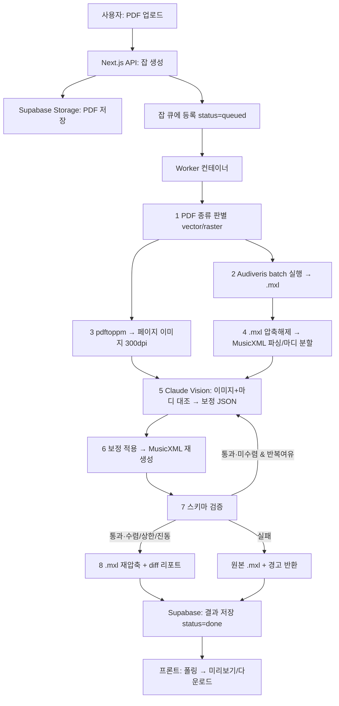

# PDF 악보 → MXL 변환 웹앱 · 바이브코딩 프롬프트 설계서

> Audiveris(구조 OMR) + Claude Vision(의미 보정) 하이브리드 파이프라인으로
> "가장 정확한 PDF→MXL 변환 웹앱"을 단계적으로 만드는 프롬프트 패키지.
> Claude Code / Cursor / Windsurf에 **Phase 단위로 붙여넣어** 진행하세요.

---

## 0. 이 문서를 쓰는 법

- 각 Phase에는 **붙여넣기용 프롬프트 블록**, **산출물(파일)**, **완료 판정 기준**이 있습니다.
- 한 Phase가 판정 기준을 통과하기 전에 다음 Phase로 넘어가지 마세요. (특히 Phase 0·1)
- AI 코딩 도구는 인프라를 건너뛰고 UI부터 만들려는 경향이 강합니다. 이 앱은 **인프라가 가장 어려운 부분**이라 순서를 반드시 지킵니다.

---

## 1. 왜 이 앱이 "단순 OMR 래퍼"가 아닌가 (먼저 이해할 것)

이 전제를 AI가 이해하지 못하면 동작하지 않는 코드를 만듭니다. 프롬프트 상단에 항상 포함시키세요.

1. **Audiveris는 Java(JVM) 앱이다.** npm 라이브러리가 아니다. 브라우저에서 절대 못 돈다. **서버에서 CLI subprocess로 실행**해야 한다.
2. **Audiveris는 Tesseract OCR과 poppler에 의존한다.** 가사·텍스트 인식에 Tesseract가 필요하다. → Docker 컨테이너가 사실상 필수.
3. **OMR은 느리다.** 페이지당 수십 초~수 분. → 동기 요청으로 처리 불가. **잡 큐 + 상태 폴링**이 필요하다.
4. **OMR → MusicXML 변환은 lossy다.** Audiveris도 공식적으로 export가 손실 변환임을 명시한다. 그래서 Claude Vision **보정 레이어**가 핵심 차별점이다.
5. **Claude Vision은 Audiveris를 대체하지 않는다.** Claude는 정밀 음표 OMR보다 *추론·대조*에 강하다. 역할 분담:
   - **Audiveris** = 음표/마디/박자/조표 등 **구조 뼈대** 추출 (baseline)
   - **Claude Vision** = 원본 이미지와 대조해 **코드 기호·가사·명백한 오인식 음표** 교정 (correction layer)
6. **결과물은 .mxl 파일이다.** Claude가 찾은 "오류"를 사람이 보기 좋은 리포트로 끝내면 안 되고, **MusicXML에 다시 반영해 .mxl로 재압축**해야 진짜 변환 앱이다.

---

## 2. 핵심 아키텍처 결정 (AI가 반드시 지킬 제약)

```
[ 절대 규칙 ]
- Audiveris는 서버 사이드 subprocess로만 실행한다. 브라우저/Edge/서버리스 함수에서 직접 실행 금지.
- OMR 처리는 비동기 잡으로만 한다. HTTP 요청 핸들러 안에서 동기 실행 금지.
- Claude API 키는 서버에만 둔다. 프론트엔드 번들에 절대 노출 금지.
- 최종 .mxl는 반드시 MusicXML 스키마 검증을 통과해야 사용자에게 노출한다.
- 보정 실패(검증 깨짐) 시: 보정을 버리고 Audiveris 원본 .mxl + 경고를 반환한다. (잘못된 보정 > 무보정)
```

### 기술 스택 (정당화 포함)

| 영역 | 선택 | 이유 |
|---|---|---|
| 프론트엔드 | **Next.js 15 (App Router) + TypeScript** | 기존 워크플로우와 일치, 업로드/폴링 UI에 적합 |
| 악보 미리보기 | **OpenSheetMusicDisplay (OSMD)** | MusicXML을 브라우저에서 렌더 (내부적으로 VexFlow 사용) |
| OMR 엔진 | **Audiveris 5.4 (CLI, batch 모드)** | 무료/오픈소스, PDF·이미지 직접 입력, .mxl(MusicXML 3.0) 출력 |
| OCR 의존성 | **Tesseract + 언어팩(eng, 필요시 추가)** | Audiveris 텍스트/가사 인식에 필요 |
| PDF→이미지 | **poppler-utils (pdftoppm)** | 300dpi 페이지 렌더 — Claude Vision 대조용 |
| 보정 AI | **Claude API (Messages, 이미지 입력)** | sonnet 기본, 저신뢰 페이지만 opus로 재검증 |
| 잡 큐 | **BullMQ + Redis** (또는 1차 버전은 Supabase 폴링) | OMR 비동기 처리 |
| 저장소/DB | **Supabase (Storage + Postgres)** | 기존 스택, 파일·잡 상태 관리 |
| 실행 환경 | **Docker (JDK 21 + Audiveris + Tesseract + poppler)** | 위 네이티브 의존성을 한 번에 패키징 |

> **MusicXML 편집 라이브러리는 없다.** npm에 신뢰할 만한 MusicXML *편집* 라이브러리가 없으므로, 보정 적용은 `fast-xml-parser` 등으로 **raw XML을 직접 조작**하는 방식으로 간다. 이 점을 AI에 명시할 것.

---

## 3. 시스템 아키텍처



### 파이프라인 단계 요약

1. **판별** — PDF가 벡터(노테이션 프로그램 출력)인지 래스터(스캔/사진)인지 검사. 벡터면 정확도 기대치 ↑, 사용자에게 안내.
2. **Audiveris** — `-batch -export`로 .mxl 생성.
3. **렌더** — 각 페이지를 300dpi PNG로 (Claude 대조용).
4. **파싱** — .mxl(zip) 해제 → MusicXML → part/measure 단위로 인덱싱.
5. **검증(Vision)** — 페이지 이미지 + 해당 페이지 마디 데이터를 Claude에 보내 누락 코드/가사/오인식 음표를 JSON으로 회수.
6. **보정 적용** — JSON을 MusicXML에 반영.
7. **스키마 검증** — MusicXML DTD/XSD 검증. 깨지면 보정 롤백.
   - **(선택) 반복 루프**: 검증 통과 후 아직 수렴 안 했고 반복 여유가 있으면 5~7을 다시 수행. 수렴/상한/진동 시 종료. (Phase 4.5)
8. **재압축** — 검증 통과 MusicXML을 .mxl로 재압축, diff 리포트 동봉.

---

## 4. 데이터 모델 & 폴더 구조

### Supabase 테이블 (Postgres)

```sql
-- jobs
id              uuid primary key default gen_random_uuid()
created_at      timestamptz default now()
status          text not null default 'queued'   -- queued|processing|done|failed
stage           text                              -- audiveris|render|vision|apply|validate
source_path     text not null                     -- storage 경로 (원본 PDF)
result_mxl_path text                              -- storage 경로 (최종 .mxl)
pdf_kind        text                              -- vector|raster|unknown
page_count      int
report          jsonb                             -- diff 리포트 (페이지별 보정 내역)
error           text
cost_usd        numeric                           -- Claude 호출 누적 비용 추정
```

### 컨테이너 내부 작업 폴더 (잡당 격리)

```
/work/<jobId>/
  input.pdf
  audiveris-out/
    input/                # Audiveris가 입력 radix로 만드는 book 폴더
      input.mxl           # ← 목표 산출물 (movement 분할 시 여러 개 주의)
      input.omr           # Audiveris 프로젝트 파일
  pages/
    page-01.png           # 300dpi 렌더
    page-02.png
  parsed/
    score.musicxml        # .mxl 해제본
  corrected/
    score.musicxml        # 보정 반영본
    score.mxl             # 최종 재압축
  report.json
```

---

## 5. 단계별 빌드 (Phase 0 → 7)

각 Phase의 프롬프트 블록을 그대로 복사해 AI 코딩 도구에 붙여넣으세요. 맨 위
"왜 이 앱이 단순 OMR 래퍼가 아닌가"(§1)와 "절대 규칙"(§2)을 첫 Phase에서 함께 전달하면 일관성이 좋아집니다.

---

### Phase 0 — 인프라: Audiveris 실행 컨테이너 (최우선)

> 이게 안 되면 나머지는 전부 무의미합니다. 가장 먼저, 단독으로 통과시키세요.

```text
[프롬프트 — Phase 0]

목표: Audiveris 5.4 CLI가 동작하는 Docker 환경을 만든다. 다른 코드는 아직 만들지 마라.

요구사항:
- 베이스 이미지: eclipse-temurin:21-jdk (JDK 21)
- 설치: git, tesseract-ocr, tesseract-ocr-eng, poppler-utils, fontconfig, libfreetype6
- Audiveris 5.4를 소스에서 빌드하거나 공식 릴리스 배포본을 받아 /opt/audiveris 에 설치하고,
  `audiveris` 명령이 PATH에서 batch 모드로 실행되도록 래퍼 스크립트를 만든다.
- 컨테이너 안에서 다음이 성공해야 한다:
    audiveris -help
    audiveris -batch -export -output /tmp/out -- /samples/sample.pdf
  → /tmp/out/sample/sample.mxl 이 생성되는지 확인하는 검증 스텝을 Dockerfile 빌드 후
    docker run 으로 돌려보는 README 절차를 작성한다.
- Tesseract 언어 데이터 경로(TESSDATA_PREFIX)를 올바르게 설정한다.

산출물:
- /docker/Dockerfile.audiveris
- /docker/run-audiveris.sh   (입력 PDF 경로, 출력 폴더를 받는 래퍼)
- /samples/sample.pdf 자리표시 안내 (직접 넣을 단순 1~2페이지 악보)
- README: 빌드/실행/검증 명령

주의:
- Audiveris는 AGPL v3 라이선스다. 코드를 라이브러리로 링크하지 말고, 독립 실행 바이너리를 subprocess로만 호출하는 구조로 간다. (배포 시 라이선스 영향은 별도 검토 필요)
- GUI 의존(java.awt) 때문에 headless 환경에서 폰트/디스플레이 오류가 날 수 있으니
  fontconfig와 -Djava.awt.headless=true 를 고려하라.
```

**완료 판정**
- `docker build` 성공
- 컨테이너 내부에서 `sample.pdf` → `sample.mxl` 생성 확인
- 생성된 .mxl을 호스트로 꺼내 MuseScore에서 열림 확인

---

### Phase 1 — Audiveris 코어 래퍼 (백엔드, UI 없음)

```text
[프롬프트 — Phase 1]

목표: "PDF 경로를 받아 .mxl 경로를 반환하는" Node.js(TypeScript) 모듈을 만든다. 프론트엔드는 아직 만들지 마라.

요구사항:
- runAudiveris(inputPdfPath, jobDir) 함수
  - child_process.spawn 으로 audiveris -batch -export -output <jobDir>/audiveris-out -- <inputPdfPath> 실행
  - stdout/stderr를 로그로 수집, 종료 코드 확인
  - 출력 폴더에서 생성된 .mxl 파일들을 찾아 경로 배열로 반환
- **핵심 함정 처리**: Audiveris는 멀티 페이지를 종종 별도 movement로 쪼개 .mxl을 여러 개 만든다.
  - .mxl이 2개 이상이면 로그에 경고하고, 1차 버전은 "첫 번째(또는 가장 큰) .mxl"을 대표로 반환하되
    전체 목록도 반환해 상위 레이어가 병합 여부를 결정할 수 있게 한다.
- 타임아웃(예: 페이지당 120초 × 페이지 수, 상한 있음)과 실패 시 명확한 에러를 던진다.
- 단위 테스트: samples/sample.pdf 로 .mxl 생성 → zip 시그니처(PK) 확인.

산출물:
- /worker/src/audiveris.ts
- /worker/src/audiveris.test.ts
- 로컬에서 컨테이너 경유로 실행하는 스크립트 (npm run omr -- <pdf>)
```

**완료 판정**
- `npm run omr -- samples/sample.pdf` → 유효한 .mxl 경로 반환
- 멀티 movement 케이스에서 크래시 없이 목록 반환

---

### Phase 2 — PDF→이미지 렌더 + MusicXML 파싱/마디 분할

```text
[프롬프트 — Phase 2]

목표: (a) PDF를 300dpi 페이지 PNG로 렌더하고, (b) .mxl을 해제해 MusicXML을 part/measure 단위로 인덱싱한다.

요구사항:
(a) 렌더
  - pdftoppm(poppler)로 inputPdf → pages/page-%02d.png (300dpi)
  - 페이지 수를 세어 jobs.page_count에 쓸 수 있게 반환
  - 음표가 작은 악보 대비: 페이지 PNG가 한 변 2000px를 넘으면 Claude 입력용으로는 2000px 이하로 리사이즈한
    사본을 따로 만든다(원본 고해상도는 보관). 가로/세로 1568px 권장값도 옵션으로 둔다.

(b) 파싱
  - .mxl은 zip이다. 해제해 내부 .musicxml(또는 META-INF/container.xml이 가리키는 rootfile)을 읽는다.
  - fast-xml-parser로 파싱해 다음 구조로 인덱싱:
      parts[].measures[] = { measureNumber, partId, 대략적 위치, 원시 XML 노드 참조 }
  - 목표: 나중에 Claude가 "measure 12의 코드 누락"이라고 하면 해당 노드를 찾아갈 수 있어야 한다.
  - MusicXML의 페이지/시스템 경계 정보(<print new-page>, <print new-system>)를 이용해
    "각 페이지 PNG ↔ 그 페이지의 measure 범위"를 매핑하는 함수를 만든다. (대조 단계의 핵심)

산출물:
- /worker/src/render.ts
- /worker/src/musicxml.ts   (해제/파싱/마디 인덱싱/페이지-마디 매핑)
- 테스트: sample 기준 part 수·measure 수가 0이 아님, 페이지-마디 매핑이 비지 않음
```

**완료 판정**
- `pages/`에 페이지별 PNG 생성
- MusicXML에서 part/measure 추출, 페이지↔마디 매핑 동작

---

### Phase 3 — Claude Vision 보정 레이어

```text
[프롬프트 — Phase 3]

목표: "페이지 이미지 + 그 페이지의 마디 데이터"를 Claude에 보내, 누락 코드/가사/오인식 음표를 구조화 JSON으로 회수한다.

요구사항:
- @anthropic-ai/sdk 사용. API 키는 서버 환경변수(ANTHROPIC_API_KEY)에서만 읽는다.
- verifyPage(pageImagePath, measuresJsonForThatPage, model) 구현:
  - content 배열에 [이미지 블록, 텍스트 프롬프트] 순서로 넣는다(이미지 먼저가 권장).
  - 프롬프트는 "설명 금지, 아래 JSON 스키마만 출력"으로 강제:
      {
        "missing_chords":  [{ "measure": 0, "chord": "" }],
        "missing_lyrics":  [{ "measure": 0, "text": "" }],
        "wrong_notes":     [{ "measure": 0, "expected": "", "got": "" }],
        "confidence": "high|medium|low"
      }
  - 응답에서 type==="text" 블록만 모아 ```json 펜스 제거 후 JSON.parse. 실패 시 raw 보관·플래그.
- 모델 티어링:
  - 기본 claude-sonnet-4-6 로 전 페이지 1차 처리
  - confidence가 "low"이거나 wrong_notes가 임계치 이상인 페이지만 claude-opus-4-8 로 재검증
- 비용 가드:
  - 페이지당/잡당 호출 상한, 누적 추정 비용을 jobs.cost_usd에 기록
  - 동일 페이지 재시도는 최대 N회
- 여러 페이지는 순차 처리하되, 페이지마다 "Image:" 라벨을 붙여 후속 참조가 가능하게 한다.

산출물:
- /worker/src/vision.ts
- /worker/src/prompts/verify-page.ts   (프롬프트 템플릿 분리)
- 테스트(모킹): SDK 응답을 목으로 주입해 파싱/티어링/비용집계 로직 검증
```

> 참고: 이전에 만든 `claude-vision-omr-verify.js`가 이 Phase의 출발점입니다. 그 파일을 TypeScript로 옮기고 위 티어링·비용 가드를 추가하세요.

**완료 판정**
- 실제 페이지 1장으로 호출 시 스키마에 맞는 JSON 회수
- low-confidence 페이지가 opus로 승격되는지 로그 확인

---

### Phase 4 — 보정 적용 + MXL 재생성 + 검증

```text
[프롬프트 — Phase 4]

목표: Claude의 보정 JSON을 MusicXML에 반영하고, 스키마 검증 후 .mxl로 재압축한다.

요구사항:
- 두 가지 모드:
  1) REPORT 모드(기본/안전): MusicXML은 건드리지 않고, 보정 사항을 diff 리포트(report.json)로만 남긴다.
     사용자가 MuseScore에서 직접 고치도록 안내. → 항상 깨지지 않는 .mxl 보장.
  2) AUTO_PATCH 모드(옵션): 보정을 MusicXML 노드에 직접 반영.
     - missing_chords: 해당 measure에 <harmony> 요소 삽입
     - missing_lyrics: 해당 note에 <lyric><text> 삽입
     - wrong_notes: 해당 note의 <pitch> 교체
     - raw XML을 직접 조작(fast-xml-parser build) — 신뢰할 MusicXML 편집 라이브러리는 없다고 가정.
- 검증:
  - 재생성 MusicXML을 MusicXML 4.0 XSD(또는 3.x DTD)로 검증한다(libxml/xsd 검증 도구).
  - **검증 실패 시 AUTO_PATCH 결과를 폐기**하고 원본 .mxl + 경고를 반환한다(절대 규칙).
- 재압축:
  - 검증 통과 MusicXML을 표준 .mxl 구조(META-INF/container.xml + score .musicxml)로 zip 압축.
  - 압축 후 OSMD로 파싱 가능한지 헤드리스 스모크 테스트.
- report.json 스키마: 페이지별 적용/미적용 항목, 사유, 신뢰도, 최종 모드.

산출물:
- /worker/src/apply.ts        (보정 적용)
- /worker/src/mxl.ts          (재압축)
- /worker/src/validate.ts     (XSD/DTD 검증 + 롤백)
- 테스트: 의도적으로 깨지는 패치 → 롤백되어 원본 반환되는지
```

**완료 판정**
- REPORT 모드: 항상 유효한 .mxl + 리포트
- AUTO_PATCH 모드: 검증 통과 시 보정본, 실패 시 원본으로 안전 롤백

---

### Phase 4.5 — 반복 교정 루프 (수렴 제어) · 선택

> "원본과 같아질 때까지 반복"을 원한다면 이 Phase. 단, **무한 수렴은 보장되지 않습니다.**
> 심판 역할인 Claude Vision이 완벽한 기준점이 아니라서, 안전장치 없이 돌리면 같은 마디를
> 고쳤다 되돌렸다 **진동**하거나 멀쩡한 부분을 **환각으로 망가뜨릴** 수 있습니다.
> 그래서 이 루프의 목표는 "100% 픽셀 동일"이 아니라 **"음악적 동치(음표·박자·코드·가사 일치)에
> 최대한 근접 + 남는 불확실 부분은 사람에게 플래그"** 입니다.

```text
[프롬프트 — Phase 4.5]

목표: Phase 3(대조)→Phase 4(적용·검증)를 여러 번 반복해 정확도를 끌어올리되,
      수렴/진동/발산을 제어하는 안전장치를 갖춘 refine 루프를 만든다.
      Phase 4까지 통과한 뒤에만 착수한다.

전제(반드시 반영):
- Claude Vision은 완벽한 심판이 아니다. "차이 0"이라는 판정 자체가 틀릴 수 있다.
- OMR→MusicXML은 본질적으로 lossy다. 반복으로 메울 수 없는 손실이 존재한다.
- 따라서 루프는 "완벽 도달"이 아니라 "더 나빠지지 않으면서 개선되는 동안만" 돈다.

요구사항 — 다음 5개 수렴 조건을 모두 구현한다:

1) 최대 반복 횟수 상한
   - MAX_REFINE_ITERATIONS (기본 3). 초과 시 종료. 그 이상은 비용만 늘고 개선폭 급감.

2) 수렴 판정 (정상 종료)
   - 한 패스에서 "새로 채택된 보정 수"를 센다.
   - 연속 종료 조건: 이번 패스의 신규 채택이 0이거나 임계치(CONVERGE_THRESHOLD, 예: 1) 이하면 종료.

3) 진동 감지 (같은 마디 뒤집기 차단)
   - measure 단위로 변경 이력을 해시로 기록한다(예: partId+measureNumber → 직전 N개 상태 해시).
   - 동일 마디가 이전 상태로 되돌아가는 패턴이 2회 이상 감지되면:
     그 마디는 루프 대상에서 제외하고 "needs_human" 플래그를 붙여 report에 남긴다.

4) 단조 개선 가드 (절대 나빠지지 않게)
   - 매 패스 결과는 반드시 Phase 4의 스키마 검증을 통과해야 채택한다.
   - 패스 단위 "품질 점수"를 정의한다(예: 총 미해결 플래그 수 ↓, 평균 confidence ↑).
   - 새 패스의 품질 점수가 직전보다 나빠지면: 그 패스를 폐기하고 직전 상태로 롤백 후 루프 종료.
   - 즉, 채택은 "검증 통과 AND 점수 비악화"일 때만.

5) 대상 좁히기 (효율·비용)
   - 매 패스 전체 페이지를 다시 돌리지 않는다.
   - 직전 패스에서 (a) 변경이 있었던 페이지 또는 (b) confidence가 medium/low인 페이지만 재대조 대상.
   - 이미 high-confidence이고 변경 없던 페이지는 건너뛴다.

루프 구조(의사코드):
   prev = audiverisBaseline
   bestScore = score(prev)
   for i in 1..MAX_REFINE_ITERATIONS:
     targets = pagesNeedingWork(prev)          # 조건 5
     if targets is empty: break                # 조건 2 (할 일 없음)
     findings = vision(targets)                # Phase 3
     candidate = applyAndValidate(prev, findings)  # Phase 4 (+조건 4 검증)
     if candidate invalid: break               # 검증 실패 → 직전 유지하고 종료
     if oscillating(candidate): freezeOscillatingMeasures(); continue  # 조건 3
     newScore = score(candidate)
     if newScore worse than bestScore: break   # 조건 4 (비악화 위반)
     accepted = countNewlyAccepted(prev, candidate)
     prev = candidate; bestScore = newScore
     if accepted <= CONVERGE_THRESHOLD: break  # 조건 2 (수렴)
   final = prev

산출물:
- /worker/src/refine.ts        (루프 + 5개 조건)
- /worker/src/score.ts         (패스 품질 점수)
- /worker/src/oscillation.ts   (마디 상태 해시 이력·진동 감지)
- report.json 확장: 패스별 (채택 수, 품질 점수, 종료 사유), 마디별 needs_human 목록
- 테스트:
  - 인위적 진동 케이스 → freeze 후 needs_human 플래그
  - 품질 악화 패스 → 롤백·종료
  - 정상 케이스 → 1~3패스 내 종료, 패스마다 점수 비악화

UI 연동(Phase 6에서 표시):
- 결과 화면에 "교정 N회 수행, 종료 사유: 수렴/상한/진동/검증실패" 배지
- needs_human 마디는 별도 강조 + "여기는 MuseScore에서 직접 확인하세요" 안내
```

**완료 판정**
- 정상 악보: 1~3패스 내 수렴 종료, 매 패스 품질 비악화
- 진동 유발 케이스: 무한 반복 없이 해당 마디 freeze + needs_human 플래그
- 어떤 경우에도 최종 .mxl은 스키마 검증 통과 + 직전 best 상태 이상 품질

> **정직한 한계 명시**: 이 루프로 보통 95~99%까지 자동 도달하고, 남는 1~5%는 "확신 없음"으로
> 표시됩니다. "사람 개입 없이 원본과 100% 동일"은 심판의 불완전성과 포맷 손실 때문에 약속하지 않습니다.
> 마지막 1%는 결국 사람 검수 영역입니다 — 그걸 숨기지 말고 needs_human으로 드러내는 게 더 신뢰 가는 UX입니다.

---

### Phase 5 — 비동기 잡 큐 + 파이프라인 오케스트레이션

```text
[프롬프트 — Phase 5]

목표: 업로드→처리→완료를 비동기 잡으로 묶는다.

요구사항:
- BullMQ + Redis로 큐 구성(로컬은 docker-compose에 redis 추가). 1차 대안: Supabase 폴링 워커.
- 잡 생성 API(POST /api/jobs):
  - PDF를 Supabase Storage에 저장, jobs 레코드 생성(status=queued), 큐에 등록, jobId 반환.
- 워커 프로세스:
  - 잡을 집어 stage를 갱신하며 파이프라인 실행:
    판별 → audiveris(P1) → render(P2) → parse(P2) → [refine 루프: vision(P3) → apply+validate(P4) 반복(P4.5)] → 재압축(P4)
  - refine 루프를 끄면(REFINE_ENABLED=false) vision→apply+validate 1회만 수행한다.
  - 각 stage 전후로 jobs.stage / status 업데이트, 실패 시 status=failed + error 기록.
  - 결과 .mxl과 report.json을 Storage에 올리고 result_mxl_path 기록.
- 상태 조회 API(GET /api/jobs/:id): status, stage, page_count, cost_usd, report 요약 반환.
- 동시성: 워커 concurrency 제한(OMR은 CPU·메모리 무거움). 잡당 작업 폴더 격리·종료 후 정리.

산출물:
- /app/api/jobs/route.ts, /app/api/jobs/[id]/route.ts
- /worker/src/pipeline.ts   (단계 오케스트레이션)
- /worker/src/queue.ts
- docker-compose.yml (web, worker, redis)
```

**완료 판정**
- PDF 업로드 → jobId 수신 → 폴링으로 stage 진행 관찰 → done 시 .mxl 다운로드 경로 확보

---

### Phase 6 — Next.js 프론트엔드 (업로드 · 진행 · 미리보기 · 다운로드)

```text
[프롬프트 — Phase 6]

목표: 사용자용 화면을 만든다. 디자인은 깔끔하고 따뜻한 톤(부드러운 그라데이션, 둥근 모서리, 넉넉한 여백).

요구사항:
- 업로드 화면:
  - PDF 드래그앤드롭 + 파일 선택. 업로드 즉시 POST /api/jobs 호출, jobId로 진행 화면 전환.
  - 벡터/래스터 판별 결과를 배지로 보여주고, 래스터면 "스캔 품질에 따라 보정이 필요할 수 있어요" 안내.
- 진행 화면:
  - stage별 스텝 인디케이터(판별→OMR→렌더→AI 대조→보정→검증→완료).
  - 폴링(GET /api/jobs/:id)으로 실시간 갱신, 페이지 수·예상 시간·누적 비용(옵션) 표시.
- 결과 화면:
  - OSMD로 .mxl 미리보기 렌더(브라우저에서 악보 표시).
  - diff 리포트: 페이지별로 "AI가 보정/플래그한 항목"을 접이식 카드로 표시.
  - 다운로드 버튼: .mxl (그리고 원하면 MIDI 변환 옵션 안내 — MIDV는 별도).
  - "MuseScore에서 열기" 안내 + REPORT 모드일 때 직접 수정 가이드 링크.
- 상태 관리: 서버 상태는 폴링 결과로, UI 상태는 컴포넌트 로컬 상태로. (브라우저 스토리지 사용 금지)

산출물:
- /app/page.tsx, /app/jobs/[id]/page.tsx
- /components/Uploader.tsx, /components/ProgressSteps.tsx, /components/ScorePreview.tsx, /components/DiffReport.tsx
- OSMD 통합 컴포넌트 (동적 import, SSR 비활성)
```

**완료 판정**
- 처음부터 끝까지: PDF 올림 → 진행 보임 → 악보 미리보기 + .mxl 다운로드

---

### Phase 7 — 정확도·견고성·운영 마감

```text
[프롬프트 — Phase 7]

목표: 정확도 체감과 안정성을 끌어올린다.

요구사항:
- 벡터/래스터 판별 정교화:
  - PDF에 텍스트/벡터 그래픽 객체가 있으면 vector로 표시하고 기대 정확도를 높게 안내.
  - (확장 아이디어) 순수 벡터 PDF는 Audiveris 대신/병행으로 PDFtoMusic류 경로를 둘 수 있음 — 단, 별도 도구.
- 페이지별 신뢰도 시각화: confidence와 보정 건수를 페이지 카드에 색으로 표시.
- 멀티 movement 병합: Audiveris가 페이지를 movement로 쪼갠 경우 .mxl들을 하나의 스코어로 병합하는 옵션.
- 에러 UX: OMR 실패/타임아웃/AGPL·용량 한계 등 사용자에게 친절한 메시지.
- 레이트리밋·비용 대시보드: 잡당/일자별 Claude 비용 추정 집계.
- 회귀 세트: 대표 악보 5종(벡터 1, 깨끗한 스캔 2, 가사+코드 1, 다성부 1)으로 변환 품질 스냅샷 비교 스크립트.

산출물:
- /worker/src/pdfKind.ts
- /worker/src/merge.ts
- /app/(admin)/cost/page.tsx (선택)
- /eval/ 회귀 비교 스크립트 + 기준 결과
```

**완료 판정**
- 회귀 세트 5종이 크래시 없이 .mxl 생성
- 래스터/벡터에 따라 다른 안내가 나오고, 페이지별 신뢰도가 보임

---

## 6. 알려진 함정 (Gotchas) — AI에 미리 알려줄 것

1. **멀티 movement 분할**: Audiveris batch가 멀티 페이지를 페이지마다 별도 movement(.mxl 여러 개)로 쪼개는 사례가 보고됨. 항상 .mxl 개수를 확인하고 병합 전략을 둘 것.
2. **출력 경로 규칙**: 출력은 `<output>/<입력파일명radix>/<radix>.mxl`. 파일명에 공백/한글이 있으면 경로 처리 주의.
3. **headless 폰트 문제**: java.awt가 폰트를 못 찾으면 실패. fontconfig 설치 + `-Djava.awt.headless=true`.
4. **OMR은 lossy**: Audiveris 공식 문서가 export 손실을 명시. .omr 프로젝트 파일은 보관해 두면 재내보내기/디버깅에 유용.
5. **Claude는 정밀 음표 카운팅에 약함**: 작은 음표가 빽빽한 페이지는 페이지 전체보다 **시스템(줄) 단위로 잘라** 보내면 대조 정확도가 오름.
6. **이미지 크기**: Claude 입력 이미지는 한 변 2000px 초과 시 제약·리사이즈. 토큰/속도엔 1568px 권장. 단, 너무 줄이면 음표가 뭉개지니 원본 고해상도는 따로 보관.
7. **MusicXML 직접 편집의 위험**: AUTO_PATCH는 XML을 깨기 쉽다. **항상 스키마 검증 + 롤백**. 기본은 REPORT 모드.
8. **브라우저 스토리지 금지**: 프론트는 localStorage/sessionStorage 쓰지 말 것(아티팩트/일부 환경에서 동작 안 함). 상태는 폴링+로컬 컴포넌트 상태로.
9. **OSMD는 동적 import**: SSR에서 깨지므로 클라이언트 전용으로 로드.
10. **반복 루프의 진동·발산**: refine 루프(P4.5)에서 심판(Claude)이 흔들리면 같은 마디를 무한히 뒤집거나 멀쩡한 부분을 망친다. **반드시** 최대 횟수·수렴 판정·진동 감지·단조 개선 가드를 함께 건다. 루프는 "더 나빠지지 않을 때만" 돌아야 한다. "원본과 100% 동일 자동 수렴"은 약속하지 말 것.

---

## 7. 비용 · 성능 · 라이선스

- **성능**: OMR이 병목. 워커 concurrency를 낮게(1~2) 두고, 페이지 많은 잡은 진행률을 잘게 보여줘 체감 대기 완화.
- **비용**: Claude는 페이지×모델 단가로 과금. 전 페이지 sonnet → 저신뢰 페이지만 opus 티어링으로 비용 최적화. 잡당 상한·일일 상한·추정 집계 필수.
- **라이선스(중요)**: Audiveris는 **AGPL v3**. 독립 바이너리를 subprocess로 호출하는 사용은 일반적으로 "이용"에 해당하지만, AGPL은 **네트워크를 통한 이용 시 소스 제공 의무**가 핵심 조항입니다. 협회 차원에서 배포/서비스화한다면 라이선스 적용 범위를 반드시 별도로 확인하세요(법률 자문 권장). 저는 변호사가 아니므로 이 부분은 참고용 안내입니다.
- **개인정보/보관**: 업로드 PDF·중간 이미지·결과는 잡 종료 후 일정 시간 뒤 자동 삭제 정책을 두면 좋음.

---

## 8. 부록

### 환경변수

```
ANTHROPIC_API_KEY=        # 서버 전용
SUPABASE_URL=
SUPABASE_SERVICE_ROLE_KEY=
REDIS_URL=
AUDIVERIS_BIN=audiveris    # 컨테이너 내 경로
TESSDATA_PREFIX=/usr/share/tesseract-ocr/5/tessdata
MAX_PAGES_PER_JOB=30
VISION_MODEL_DEFAULT=claude-sonnet-4-6
VISION_MODEL_ESCALATE=claude-opus-4-8
JOB_COST_LIMIT_USD=2.00
REFINE_ENABLED=true        # Phase 4.5 반복 루프 on/off
MAX_REFINE_ITERATIONS=3    # 반복 상한
CONVERGE_THRESHOLD=1       # 신규 채택 ≤ 이 값이면 수렴 종료
```

### 핵심 Audiveris 명령(레퍼런스)

```bash
# 기본 변환 (PDF → .mxl)
audiveris -batch -export -output /work/<jobId>/audiveris-out -- /work/<jobId>/input.pdf

# 특정 시트만
audiveris -batch -export -sheets 1-3 -output <out> -- <input.pdf>

# 도움말
audiveris -help
```

### 진행 체크리스트

- [ ] Phase 0: 컨테이너에서 sample.pdf → sample.mxl, MuseScore에서 열림
- [ ] Phase 1: `npm run omr` 로 유효 .mxl 반환, 멀티 movement 안전 처리
- [ ] Phase 2: 페이지 PNG 생성 + 페이지↔마디 매핑
- [ ] Phase 3: 페이지 1장 → 스키마 JSON, 저신뢰 페이지 opus 승격
- [ ] Phase 4: REPORT 항상 유효 / AUTO_PATCH 검증·롤백
- [ ] Phase 4.5: 정상 1~3패스 수렴 / 진동 케이스 freeze+needs_human / 매 패스 비악화
- [ ] Phase 5: 업로드→폴링→done→다운로드 (백엔드)
- [ ] Phase 6: 전체 UI 흐름 + OSMD 미리보기
- [ ] Phase 7: 회귀 5종 통과 + 신뢰도 시각화

---

> **추천 진행 순서**: Phase 0과 1을 먼저 *완전히* 통과시킨 뒤(여기서 90%의 리스크가 해소됩니다),
> 2~4는 백엔드로 묶어 한 번에, 5~6은 흐름을 잇고, 7로 다듬으세요.
> 막히면 "어느 Phase의 어느 판정 기준에서 막혔는지"를 기준으로 좁혀서 다시 프롬프트하면 효율적입니다.
