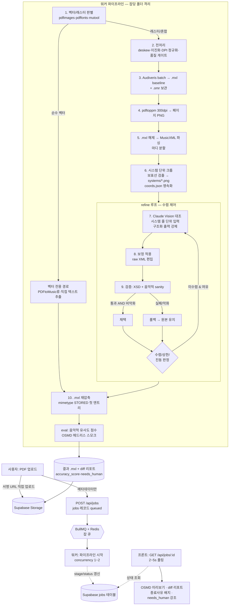

> 📌 **먼저 붙여넣기** — 모든 Phase의 공통 전제입니다. 첫 Phase 프롬프트와 함께 이 파일 전체를 AI에 한 번 전달하면 일관성이 좋아집니다.

# PDF 악보 → MXL 변환 웹앱 · 바이브코딩 프롬프트 설계서 **v2 (정확도 강화판)**

> 원본 설계서를 토대로 **변환 정확도**를 끌어올리는 데 초점을 맞춰 더 구체적·단계적으로 재설계한 v2입니다.
> Audiveris(구조 OMR) + Claude Vision(의미 보정) 하이브리드에 **① PDF 전처리 ② 시스템(보표 줄) 단위 대조 ③ 2단계 검증(XSD+음악적 sanity) ④ 평가(eval) 하니스**를 더했습니다.
> Claude Code / Cursor / Windsurf에 **Phase 단위로 붙여넣어** 진행하세요. 본문의 기술 사실(Audiveris CLI·Claude Vision API·MusicXML 검증·OMR 정확도 기법)은 2026-06 기준 공식 문서로 교차검증했습니다.
> 무엇이 새로 강화됐는지는 바로 아래 **§0**에 표로 요약돼 있습니다.

---

## 0. 이 설계서 사용법 + v2(정확도 강화판)에서 달라진 점

이 설계서는 **읽고 끝내는 문서가 아니라, Phase 단위로 잘라서 AI 코딩 도구(Claude Code / Cursor / Windsurf)에 그대로 붙여넣는 작업 지시서**다. 사용 규칙은 단호하게 지킬수록 결과가 좋다.

**문서 사용법 (4원칙)**

1. **Phase 단위 복붙.** 각 Phase의 `[프롬프트 — Phase N]` 블록을 통째로 복사해 AI 도구에 붙여넣는다. 한 번에 여러 Phase를 몰아 넣지 않는다. 컨텍스트가 흐려지고 검증 불가능한 큰 덩어리가 나온다.
2. **완료 판정 통과 전 다음 Phase 금지.** 각 Phase 끝의 **완료 판정** 체크리스트가 전부 통과해야 다음으로 넘어간다. "대충 돌아가는 것 같다"는 통과가 아니다. 판정은 `docker build 성공`, `테스트 green`처럼 눈으로 확인 가능한 기준만 둔다.
3. **인프라부터.** 반드시 **Phase 0(도커/Audiveris) → Phase 0.5(전처리) → ...** 순서로 간다. UI(Phase 6)를 먼저 만들고 싶은 유혹을 참아라. 변환 엔진이 없는 화면은 데모일 뿐 앱이 아니다.
4. **불확실은 불확실로 둔다.** 이 문서는 리서치로 교차검증된 사실만 단정한다. CLI 플래그/버전처럼 "공식 문서에서 확인" 주석이 달린 항목은, AI에게 시킬 때도 **"공식 문서로 확인 후 적용"**을 같이 지시한다.

**v2(정확도 강화판)에서 신규/강화된 점**

원본은 "Audiveris + Claude Vision 하이브리드"라는 골격은 옳았지만, **정확도를 좌우하는 디테일이 비어 있었다.** v2는 그 빈틈을 메운다. 핵심은 *"입력 품질을 끌어올리고, Claude에게 더 작은 단위로 보여주고, 모든 보정을 측정·검증한다"* 세 가지다.

| # | 항목 | 신규/강화 | 한 줄 효과 |
|---|------|:---:|------|
| G1 | **전처리 Phase 0.5 신설** | 신규 | 스캔본 deskew·이진화·DPI 정규화로 **OMR 입력 품질 자체**를 올려 정확도 상한을 끌어올림 |
| G2 | **벡터/래스터 판별을 맨 앞으로** | 강화 | 순수 벡터 PDF는 OMR을 건너뛰고 전용 경로로 분기 → 불필요한 OMR 오류를 원천 차단 |
| G3 | **Audiveris 파라미터 튜닝 명시** | 강화 | interline 20px·grayscale·OCR 언어 등 검증된 설정으로 OMR baseline 자체를 개선 |
| G4 | **시스템(보표 줄) 단위 슬라이싱** | 신규·핵심 | Claude에 페이지 전체가 아닌 **한 줄씩** 크롭해 입력 → 작은 음표 대조 정확도 급상승 |
| G5 | **좌표 기반 매핑 자료구조** | 신규 | `픽셀 bbox ↔ partId+measureNumber`를 명시 자료구조로 영속화 → 대조 정확도의 기반 |
| G6 | **구조화 출력 + 캐싱 + 배치** | 강화 | tool use/JSON schema 강제로 파싱 실패 제거, prompt caching·Message Batches로 비용 절감 |
| G7 | **검증 강화(XSD + 음악적 sanity)** | 강화 | 스키마 통과뿐 아니라 **마디 수·박자 합·파트 수 보존**까지 이중 확인 → 보정이 구조를 깨면 롤백 |
| G8 | **eval 하니스(음악적 유사도 지표)** | 신규 | "크래시 없음"을 넘어 MV2H·TEDn·OMR-NED로 정확도를 **수치화** + 회귀 스냅샷 |
| G9 | **실패 모드 트리아지 표** | 신규 | 증상→원인→조치 표 + 자가 점검 체크리스트로 디버깅 시간 단축 |
| G10 | **Phase별 "정확도 영향" + "검증 명령"** | 강화 | 각 Phase에 복붙 가능한 검증 셸/테스트를 붙여 막연함 제거 |

> **정직한 한계 (원본 계승):** 이 파이프라인의 목표는 "보통 95~99% 자동, 남는 1~5%는 `needs_human`으로 정직하게 노출"이다. **100% 동일한 자동 수렴은 약속하지 않는다.** OMR도 Claude Vision도 완벽한 심판이 아니기 때문이다(근거: Audiveris는 손글씨·복잡 악보에 약하고, Claude Vision은 공식 문서에서 "작은 객체 다수의 정확한 카운팅"이 약점임을 명시).

---

## 1. 왜 이 앱이 "단순 OMR 래퍼"가 아닌가

원본의 6대 전제를 계승하되, **각 전제를 무시했을 때 실제로 터지는 실패**를 한 줄씩 붙였다. 이 표가 "왜 굳이 이렇게 복잡하게 만드는가"에 대한 답이다.

| # | 전제 (검증됨) | 무시하면 생기는 구체적 실패 |
|---|------|------|
| 1 | **Audiveris는 Java(JVM) 앱.** npm 라이브러리가 아니고 브라우저에서 못 돈다. 서버에서 CLI subprocess로 실행한다. (5.5+ 설치본은 JRE를 번들로 포함) | 프론트엔드에서 `import audiveris` 하려다 막히고, "왜 안 되지"로 며칠을 태운다. 결국 서버 subprocess 구조로 전면 재작성. |
| 2 | **Audiveris는 Tesseract OCR을 라이브러리로 호출**(가사/텍스트 인식). 언어 데이터(tessdata)와 `TESSDATA_PREFIX` 경로가 핵심. 그래서 Docker가 사실상 필수. | tessdata 누락 시 `"No OCR is available"` 빌드/런타임 오류(실제 다수 보고: issue #698/#675/#628). 가사가 통째로 비거나 변환이 죽는다. |
| 3 | **OMR은 느리다**(페이지당 수십 초~분, CPU·JVM 힙 집약). 동기 HTTP 요청 안에서 못 돌린다 → 잡 큐 + 상태 폴링 필수. | HTTP 핸들러 안에서 동기 실행하면 게이트웨이 타임아웃(504), 서버리스 함수 시간 제한 초과, 동시 요청 몇 개에 서버가 멈춘다. |
| 4 | **OMR→MusicXML은 손실(lossy) 변환.** ⚠️*"lossy"라는 공식 문구는 미확인이나*, Audiveris의 full-fidelity 표현은 `.omr` 프로젝트 파일이고 MusicXML은 export 포맷이다 → 그래서 `.omr`을 보관하고 Claude 보정 레이어를 둔다. | 보정 없이 OMR 출력을 그대로 내보내면 코드기호·가사·오인식 음표가 그대로 남아 "쓸 수 없는 MXL"이 된다. 차별점이 사라진다. |
| 5 | **Claude Vision은 Audiveris의 대체가 아니다.** 역할 분담: **Audiveris = 음표·마디·박자·조표 등 구조 뼈대(baseline)**, **Claude Vision = 원본 이미지 대조로 코드/가사/명백한 오인식 교정(correction layer).** | Claude에게 백지에서 악보를 받아쓰게 시키면 음표 카운팅이 어긋난다(공식: 작은 객체 다수 카운팅은 부정확). 구조는 OMR이, 의미 보정만 Claude가 해야 한다. |
| 6 | **결과물은 `.mxl` 파일이다.** Claude가 찾은 오류를 사람용 리포트로 끝내면 안 되고, **MusicXML에 반영해 `.mxl`로 재압축**해야 진짜 변환 앱이다. | 리포트만 뽑으면 "오류 목록을 손으로 고치세요" 앱이 된다. 사용자는 고친 `.mxl`을 기대하고 왔다. |

**한 문장 요약:** 단순 OMR 래퍼는 위 6개 중 하나만 어겨도 "데모는 되는데 실무엔 못 쓰는 앱"이 된다. 이 설계서는 6개를 모두 지키는 구조를 강제한다.

---

## 2. 정확도-우선 설계 원칙 (v2 핵심)

정확도는 우연히 좋아지지 않는다. 아래 9개 원칙을 구조로 못 박아야 올라간다. 각 원칙은 리서치로 확인된 근거에 기반한다.

1. **입력 품질이 곧 정확도 상한이다 → 전처리를 가장 먼저.**
   OMR 정확도는 입력 이미지에서 이미 결정된다. **두 보표선 간격(interline)이 약 20px**, **300DPI(작은 기호는 400DPI)**, **흑백 이진화보다 grayscale**가 검증된 최적값이다(Audiveris 공식). 흐릿하거나 200DPI 미만이면 뒤에서 무슨 보정을 해도 한계가 낮다.

2. **역할 분리를 엄수한다 — Audiveris=구조, Claude=대조.**
   Audiveris는 전통 CV + ML 파이프라인으로 음표·마디·박자의 *구조 뼈대*를 잘 잡는다. Claude Vision은 *원본 이미지와의 의미 대조*(코드기호 누락, 가사, 명백한 오인식)에 강하다. 이 경계를 흐리면(예: Claude에게 음표를 새로 세게 함) 둘 다 잘하는 영역을 버리고 둘 다 약한 영역으로 들어간다.

3. **Claude에는 페이지가 아니라 "시스템(보표 줄)" 단위로 보낸다.**
   공식 문서가 "작은 객체 다수의 정확한 카운팅은 부정확할 수 있다"고 명시한다. 한 페이지를 통째로 보내면 음표가 뭉개진다. **한 줄(system)씩 크롭**해 밀집도를 낮추면 대조 정확도가 급상승한다. 이것이 v2의 단일 최대 정확도 레버다.

4. **해상도 티어를 의식해 모델을 고른다.**
   `claude-sonnet-4-6`은 standard 티어로 long edge가 **1568px로 자동 다운스케일**된다 → 빽빽한 악보에서 가독성 손실. 1차 대조는 sonnet으로 전 페이지, **저신뢰·고밀도 줄만** high-res 티어(**2576px**)인 `claude-opus-4-8`로 승격한다. 크롭(원칙 3)을 함께 쓰면 sonnet에서도 다운스케일 손실을 줄일 수 있다.

5. **모든 보정은 검증 + 롤백을 통과한 뒤에만 채택한다.**
   MusicXML raw 편집은 위험하다(요소 순서 고정, harmony/lyric 삽입 위치 규칙). 보정 적용 후 **MusicXML 4.0 XSD 검증 + 음악적 sanity 체크**를 모두 통과해야 채택하고, 깨지면 **보정을 버리고 Audiveris 원본 + 경고**를 반환한다. 잘못된 보정 > 무보정.

6. **더 나빠지지 않을 때만 반복한다(단조 개선 가드).**
   refine 루프는 무한 수렴이 보장되지 않고 Claude는 완벽한 심판이 아니다. **검증 통과 AND 품질 점수 비악화일 때만** 새 보정을 채택하고, 악화하면 롤백 후 종료한다. 진동(되돌림 2회)이 감지되면 해당 마디를 freeze하고 `needs_human`으로 넘긴다.

7. **정확도는 측정한다(eval).**
   "크래시 없음"은 정확도가 아니다. **MV2H / TEDn / OMR-NED** 같은 음악적 유사도 지표로 ground-truth 대비 점수를 내고, 회귀 세트(벡터1·깨끗한 스캔2·가사+코드1·다성부1)로 스냅샷을 비교한다. 측정하지 않으면 "고쳤다"가 환상일 수 있다.

8. **구조화 출력을 강제한다(파싱 실패 = 정확도 손실).**
   "JSON만 출력하라"는 system 프롬프트 지시는 가장 약하다(모델이 preamble을 붙일 수 있음). **Structured Outputs(`output_config.format`) 또는 strict tool use**로 스키마를 강제하면 파싱 단계에서 새는 보정이 사라진다.

9. **불확실은 숨기지 말고 `needs_human`으로 노출한다.**
   Claude Vision의 좌표/카운팅은 근사값이고, OMR도 손글씨·다성에 약하다. 신뢰도 `low`·진동·검증 실패는 자동 채택하지 말고 **UI에 종료 사유 배지와 함께 강조 표시**한다. 정직한 95~99% 자동 + 1~5% 사람 검수가 100% 자동 약속보다 낫다.

---

## 3. 절대 규칙 & 기술 스택

### 절대 규칙 (위반 시 정확도/보안이 깨진다)

```text
[원본 절대 규칙 — 계승]
1. Audiveris는 서버 사이드 subprocess로만 실행한다.
   (브라우저/Edge/서버리스 직접 실행 금지. JVM 앱이라 브라우저 불가.)
2. OMR은 비동기 잡으로만 처리한다.
   (HTTP 핸들러 안에서 동기 실행 금지 → 타임아웃·서버 멈춤.)
3. Claude API 키(ANTHROPIC_API_KEY)는 서버에만 둔다.
   (프론트 번들 노출 절대 금지.)
4. 최종 .mxl는 MusicXML 4.0 XSD 검증을 통과해야 사용자에게 노출한다.
5. 보정 실패(검증 깨짐) 시: 보정을 버리고 Audiveris 원본 .mxl + 경고를 반환한다.
   (잘못된 보정 > 무보정.)
6. MusicXML 편집 전용 라이브러리는 없다고 가정한다.
   → fast-xml-parser 등으로 raw XML을 직접 조작하되 preserveOrder:true 필수.

[v2 추가 규칙 — 정확도 강화]
7. 전처리 산출물도 보관한다.
   (preprocessed/ 의 deskew·이진화 결과를 잡 폴더에 영속화 — 재현·디버깅·eval용.)
8. 시스템(보표 줄) 크롭 좌표는 자료구조로 영속화한다.
   (coords.json: 픽셀 bbox ↔ partId+measureNumber. 휘발시키지 말 것 — 대조 정확도의 기반.)
9. Claude 구조화 출력은 system 프롬프트가 아니라 tool use / JSON schema로 강제한다.
   ("JSON-only" 지시 방식 채택 금지 — 가장 약함.)
10. 음악적 sanity 체크 통과도 "검증"의 일부다.
    (XSD 통과 + 마디 수·박자 합·파트 수 보존을 모두 만족해야 채택.)
11. 원본 고해상도 이미지를 항상 보관한다.
    (Claude 입력용 리사이즈/크롭은 사본으로. 원본 고해상도는 pages/page-NN.png(300dpi)로 보관해 systems/ 크롭의 소스로 삼는다.)
12. .mxl 재압축 시 mimetype을 STORED(비압축)·extra-field 없이 첫 엔트리로 둔다.
    (W3C 규약. yazl은 compress:false, Python zipfile은 ZIP_STORED.)
```

### 기술 스택 (원본 + v2 추가행)

> ⚠️ **버전 주의:** 리서치 시점(2026-06) Audiveris **안정 버전은 5.10.2**다. 원본의 "5.4" 전제는 구버전이며, **5.5+ 설치본은 JRE 번들 포함**이다. 도커 베이스 JDK 버전은 빌드 방식에 따라 다르니(5.7+는 Java 24, 5.8.1+는 Java 25) **채택 직전 릴리스 노트로 재확인**한다.

| 레이어 | 선택 | 이유 / 검증된 주의 |
|------|------|------|
| 프론트 | **Next.js 15 App Router + TypeScript** | App Router Route Handler는 **본문 크기 한계 설정 불가** → 대용량 PDF는 Next를 거치지 말고 Supabase 서명 URL로 직접 업로드. |
| 미리보기 | **OpenSheetMusicDisplay (OSMD, 내부 VexFlow)** | `ssr:false` 동적 import 필수. **`.mxl`(Blob) 직접 `osmd.load()` 가능** → 수동 unzip 불필요. |
| OMR 엔진 | **Audiveris 5.10.x CLI batch** | `-batch -transcribe -export -output <dir>`. `-export`는 `-transcribe`를 암시. 멀티 movement면 **.mxl이 여러 개** 나옴(주의). |
| OCR | **Tesseract (Audiveris가 라이브러리로 호출) + 언어팩** | 별도 실행파일 불필요. 핵심은 **tessdata + TESSDATA_PREFIX**. 언어 추가: `-constant org.audiveris.omr.text.Language.defaultSpecification=eng+...`. (버전 4.x/5.x 혼재 — build.gradle로 확인) |
| PDF→이미지 | **poppler-utils (`pdftoppm`) 300dpi** | 작은 기호 많으면 400dpi. ⚠️*Audiveris의 PDF용 poppler/ghostscript 의존 공식 문구는 미확인*이나 PDF 직접 입력은 지원됨. |
| **전처리 (G1)** | **OpenCV / ImageMagick / ScanTailor Advanced / unpaper** | **v2 추가.** deskew·적응형 이진화(Sauvola/Wolf)·노이즈 제거·DPI 정규화. `--without-deskew`처럼 **전처리가 오히려 해가 될 때**도 있으니 토글 가능하게. |
| **벡터/래스터 판별 (G2)** | **pdfimages / pdffonts / mutool** | **v2 추가.** `pdfimages -list`로 임베드 이미지 0개면 순수 벡터 확정. 순수 벡터는 **PDFtoMusic Pro류 별도 경로**(스캔 PDF엔 작동 안 함, Pro만 MusicXML). |
| 보정 AI | **Claude API (Messages, 이미지 입력)** | 기본 `claude-sonnet-4-6`($3/$15, standard 1568px), 승격 `claude-opus-4-8`($5/$25, high-res 2576px). **모델 ID는 이 두 개만**, 추측 금지. |
| 구조화 출력 (G6) | **Structured Outputs / strict tool use** | **v2 강화.** `output_config.format` 또는 `strict:true` tool. ⚠️`output_config.format`은 Citations·prefill과 비호환(400). |
| 비용 절감 (G6) | **Prompt Caching + Message Batches** | **v2 강화.** 안정 접두부(시스템·스키마) 캐시 ≈ input의 0.1×. Batches는 **표준가 50% 할인**(단 1P Claude API만, Bedrock/Vertex 미지원). |
| **XSD 검증 (G7)** | **xmllint --schema (MusicXML 4.0 XSD)** | **v2 추가.** 배포 XSD의 `xml.xsd` import를 **로컬로 패치**하면 ~15s→~0.04s. 오프라인은 `--nonet`. DTD는 4.0부터 deprecated. |
| sanity/시맨틱 검증 (G7) | **music21 파싱 라운드트립** | **v2 추가.** XSD가 못 잡는 박자 합·마디 수 보존을 파싱→재내보내기로 점검. |
| **eval (G8)** | **MV2H / TEDn(olimpic-icdar24) / OMR-NED / MusicDiff** | **v2 추가.** 음악적 유사도 수치화 + 회귀 스냅샷. ground-truth는 MusicXML/**kern으로 확보. |
| 잡 큐 | **BullMQ + Redis** (1차 대안: Supabase 폴링) | **CPU 바운드라 concurrency 낮게(1~2) + 샌드박스 프로세서 + 워커 수평 확장**. `attempts` + exponential backoff. |
| 저장/DB | **Supabase (Storage + Postgres)** | `service_role` 키는 **워커 전용**(클라이언트 노출 금지). 업로드는 `createSignedUploadUrl`, 결과는 `createSignedUrl`(만료 지정). |
| 진행률 | **저빈도(2~5s) 폴링** (후속 최적화로 SSE) | OMR은 수십 초~분 단위라 폴링이 인프라 단순·서버리스 친화적. SSE는 체감 지연 줄이는 후속. |
| 실행 | **Docker (JDK + Audiveris + Tesseract + poppler)** | **Audiveris(Java)는 Node 워커와 이미지 분리** 또는 멀티스테이지로 Java 동봉. 공유 볼륨으로 PDF/.mxl 교환. |

---

## 4. 시스템 아키텍처



**파이프라인 단계 요약 (v2 — 10단계)**

| 단계 | 이름 | 하는 일 | 정확도 영향 |
|---|------|------|------|
| 1 | **판별** | 벡터/래스터/혼합 판별, 순수 벡터는 전용 경로 분기 | 잘못된 OMR 경로를 원천 차단(G2) |
| 2 | **전처리** | deskew·적응형 이진화·노이즈 제거·DPI 정규화 + 품질 게이트(너무 흐릿하면 경고) | **입력 품질 = 정확도 상한**(G1) |
| 3 | **Audiveris OMR** | batch로 구조 baseline `.mxl` 생성, `.omr` 보관 | 음표·마디·박자 뼈대의 정확도 |
| 4 | **렌더** | `pdftoppm` 300dpi 페이지 PNG(원본 보관) | Claude 대조용 시각 소스 품질 |
| 5 | **파싱** | `.mxl` 해제 → fast-xml-parser 파싱 → 마디 분할 | 보정 적용의 정확한 타깃 확보 |
| 6 | **시스템 크롭** | 보표선 검출 → 줄 단위 PNG + `coords.json`(bbox↔measure) | **Claude 대조 정확도의 핵심 레버**(G4·G5) |
| 7 | **Vision 대조** | 시스템 줄 단위 입력, 구조화 출력으로 보정 JSON | 작은 음표 대조 정확도↑(G3·G6) |
| 8 | **적용** | missing_chords/lyrics/wrong_notes를 raw XML에 반영 | 리포트가 아닌 실제 보정 |
| 9 | **검증** | XSD 4.0 + 음악적 sanity(마디·박자·파트 보존), 실패시 롤백 | 보정이 구조를 깨면 무효화(G7) |
| 10 | **재압축 + eval** | 표준 `.mxl` 재압축, OSMD 스모크, 음악적 유사도 점수 기록 | 출력 무결성 + 정확도 측정(G8) |

> 7~9는 **refine 루프**로 반복될 수 있다(수렴/상한/진동/검증실패 중 하나로 종료). 순수 벡터 경로는 2~9를 건너뛰고 10으로 직행한다.

---

## 5. 데이터 모델 & 폴더 구조

### Supabase `jobs` 테이블 (원본 + v2 컬럼)

```sql
create table public.jobs (
  -- 원본 컬럼
  id                uuid primary key default gen_random_uuid(),
  created_at        timestamptz not null default now(),
  status            text not null default 'queued'
                      check (status in ('queued','processing','done','failed')),
  stage             text
                      check (stage in ('detect','preprocess','audiveris',
                                       'render','crop','vision','apply',
                                       'validate','repack','eval')),
  source_path       text not null,            -- Storage 내 input.pdf 경로
  result_mxl_path   text,                     -- 최종 .mxl Storage 경로
  pdf_kind          text default 'unknown'
                      check (pdf_kind in ('vector','raster','mixed','unknown')),
  page_count        int,
  report            jsonb,                    -- diff 리포트(채택/롤백/needs_human)
  error             text,
  cost_usd          numeric(10,4) default 0,  -- 누적 Claude 비용

  -- v2 추가 컬럼
  preprocess        jsonb,                    -- 전처리 메타: deskew각, 이진화법,
                                              --   입력/정규화 DPI, interline_px,
                                              --   품질게이트 통과여부·경고
  accuracy_score    numeric(5,4),             -- eval 점수(예: 1 - OMR_NED, 0~1)
  needs_human_count int default 0,            -- 사람 검수 필요 마디 수
  engine            text default 'audiveris'  -- 사용 엔진/경로
                      check (engine in ('audiveris','pdftomusic','oemer','homr'))
);

-- 워커는 service_role로 갱신, 클라이언트는 RLS로 자기 잡만 조회
alter table public.jobs enable row level security;
-- (예시 RLS: user_id 컬럼을 둘 경우 using (user_id = auth.uid()))
```

> **주의:** 위 `stage` enum은 §4의 10단계와 정렬했다(원본 5종보다 세분화). `accuracy_score`의 정의(1−OMR_NED 등)는 eval 구현(Phase 7)에서 확정하고, ground-truth 없는 실사용 잡에서는 `null`로 둔다.

### 컨테이너 작업 폴더 (잡당 격리, 원본 + v2 추가)

```text
/work/<jobId>/
├── input.pdf                        # 업로드 원본
├── detect.json                      # [v2] 판별 결과(pdf_kind, pdfimages/pdffonts 근거)
│
├── preprocessed/                    # [v2] 전처리 산출물 (영속 — 규칙 7)
│   ├── page-01.deskewed.png         #   deskew + 적응형 이진화 + DPI 정규화 결과
│   ├── page-02.deskewed.png
│   └── preprocess.json              #   deskew각·이진화법·DPI·interline_px·품질게이트·warnings
│
├── original/                        # [v2] 전처리 전 원본 렌더 보관 (Phase 0.5, 규칙 11)
│   ├── page-01.png
│   └── ...
│
├── audiveris-out/
│   └── input/
│       ├── input.mxl                # OMR baseline (멀티 movement면 여러 .mxl)
│       └── input.omr                # full-fidelity 프로젝트 파일 (보관 — 규칙 4)
│
├── pages/                           # pdftoppm 300dpi 페이지 PNG
│   ├── page-01.png                  #   원본 고해상도 (보관 — 규칙 11)
│   └── page-01.claude.png           #   Claude 입력용 리사이즈 사본(필요시)
│
├── systems/                         # [v2] 시스템(보표 줄) 단위 크롭 PNG (G4)
│   ├── p01-sys01.png                #   한 줄씩 — Claude 대조 입력
│   ├── p01-sys02.png
│   └── ...
│
├── coords.json                      # [v2] 좌표 매핑 자료구조 (영속 — 규칙 8, G5)
│                                    #   픽셀 bbox ↔ {partId, measureNumber 범위}
│
├── parsed/
│   └── score.musicxml               # .mxl 해제 + 파싱 대상
│
├── corrected/
│   ├── score.musicxml               # 보정 적용본(검증 통과시)
│   └── score.mxl                    # 최종 재압축(mimetype STORED 첫 엔트리)
│
├── eval/                            # [v2] 평가 산출물 (G8)
│   ├── score.json                   #   MV2H/TEDn/OMR-NED 등 지표값
│   └── snapshot/                    #   회귀 스냅샷(이전 실행 대비 diff)
│
└── report.json                      # diff 리포트(채택/롤백/needs_human/종료사유)
```

> **coords.json 권장 형태(자료구조):**
> ```ts
> interface SystemCrop {
>   page: number;                 // 1-based 페이지 번호
>   systemIndex: number;          // 페이지 내 system 순번
>   bbox: { x: number; y: number; w: number; h: number };  // 원본 PNG 픽셀 좌표
>   imagePath: string;            // systems/p01-sys01.png
>   measures: Array<{ partId: string; measureNumber: number }>;  // 이 줄에 속한 마디들
> }
> type Coords = { dpi: number; systems: SystemCrop[] };
> ```
> bbox는 보표선 검출(수평 투영 프로파일 또는 형태학)로 산출하되, **deskew를 먼저 해야 투영 프로파일이 정확**하다(스큐에 민감). MusicXML의 `<print new-system/new-page>`와 measure `width`로 "어느 마디가 어느 줄"인지 교차 확인한다. 다만 OMR 출력은 `default-x/y`·`width`를 생략하는 경우가 많아, **이미지 처리 기반 bbox를 1순위, MusicXML 좌표를 보조**로 쓰는 편이 견고하다.

---

## 6. 단계별 빌드 (Phase 0 → 7)

아래 각 Phase의 프롬프트 블록을 Claude Code/Cursor/Windsurf에 그대로 복붙해 진행한다. **첫 Phase(Phase 0)를 시작할 때는 §1(전제·절대 규칙), §2(아키텍처·파이프라인), §3(데이터 모델·폴더 구조)을 프롬프트와 함께 한 번에 전달**해 AI가 전체 그림을 갖고 작업하게 한다. 이후 Phase는 직전 산출물이 존재한다는 전제로 이어 붙이면 된다.

> 모델 ID는 본문 전체에서 `claude-sonnet-4-6`(기본 검증), `claude-opus-4-8`(저신뢰 페이지 승격)만 사용한다. 추측 모델명 금지.
